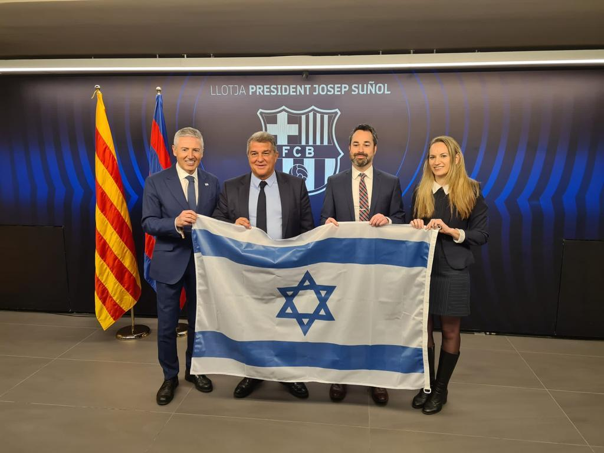
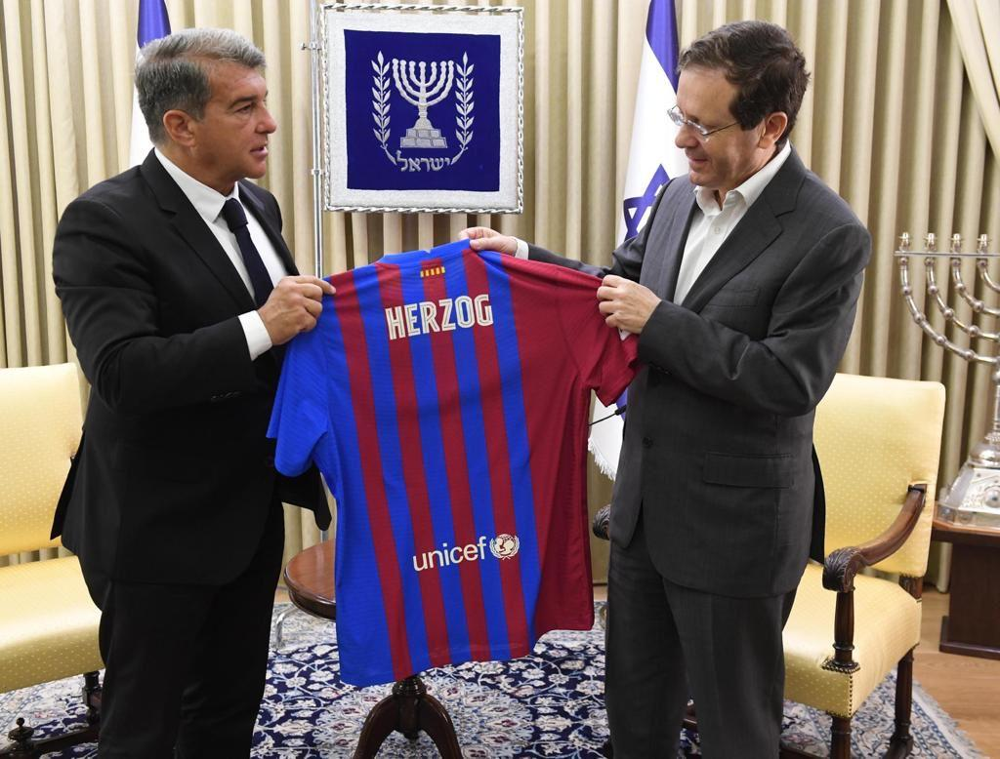

## Claim
Claim: " This image shows the President of FC Barcelona with Israel Embassy Representatives in September 2024 during the ongoing Gaza war."

## Actions
```
image_search("FC Barcelona Israel flag")
image_search("FC Barcelona president Israel embassy")
```

## Evidence
### Evidence from `image_search`
The image shows the President of FC Barcelona with Israel Embassy Representatives holding the Israeli flag. () Another source shows a photo of fans holding an Israeli flag at an FC Barcelona event. () FC Barcelona's president, Joan Laporta, met with Isaac Herzog, the President of Israel. ()

Sources:
*   [https://www.i24news.tv/en/news/israel/diplomacy/1676623454-barcelona-soccer-team-sends-message-of-support-for-israel](https://www.i24news.tv/en/news/israel/diplomacy/1676623454-barcelona-soccer-team-sends-message-of-support-for-israel)
*   [https://www.shutterstock.com/image-photo/barcelona-aug-8-fans-israel-flag-2394390741](https://www.shutterstock.com/image-photo/barcelona-aug-8-fans-israel-flag-2394390741)
*   [https://www.fcbarcelona.com/en/club/news/2192444/joan-laporta-meets-with-isaac-herzog-president-of-israel](https://www.fcbarcelona.com/en/club/news/2192444/joan-laporta-meets-with-isaac-herzog-president-of-israel)


## Elaboration
The evidence confirms that the image shows the President of FC Barcelona with Israel Embassy Representatives holding the Israeli flag. The evidence also shows that FC Barcelona's president, Joan Laporta, met with Isaac Herzog, the President of Israel. However, the evidence does not mention the date of the meeting or the ongoing Gaza war.

Therefore, the claim that the image was taken in September 2024 during the ongoing Gaza war cannot be verified with the provided evidence. More information is needed to confirm the date and the context of the meeting.


## Actions
```
image_search("FC Barcelona Israel meeting date")
image_search("FC Barcelona Gaza war support")
```

## Evidence
### Evidence from `image_search`
Al Jazeera published an article about a Gaza humanitarian flotilla departing from Barcelona. [] The website fcbarcelona.fr shows a photo of FC Barcelona players with Palestinian officials. [] CNN shows a photo of people waving Palestinian flags. []

Links:
*   [https://www.aljazeera.com/news/2025/8/31/gaza-humanitarian-flotilla-departs-barcelona-to-break-israeli-siege](https://www.aljazeera.com/news/2025/8/31/gaza-humanitarian-flotilla-departs-barcelona-to-break-israeli-siege)
*   [https://www.fcbarcelona.fr/fr/actualites/1136738/palestine-goes-wild-for-barca](https://www.fcbarcelona.fr/fr/actualites/1136738/palestine-goes-wild-for-barca)
*   [https://www.cnn.com/2025/08/31/europe/gaza-flotilla-israel-blockade-gaza-latam-intl](https://www.cnn.com/2025/08/31/europe/gaza-flotilla-israel-blockade-gaza-latam-intl)


## Elaboration
The new evidence shows that FC Barcelona has also been involved in events related to Palestine. However, the evidence still does not provide the date of the meeting in the image or confirm that it occurred during the Gaza war. Therefore, the claim remains unverified.


## Actions
```
reverse_search()
```

## Evidence
No new evidence found.

## Elaboration
The claim cannot be verified. While the image shows the President of FC Barcelona with Israel Embassy Representatives holding the Israeli flag, the provided evidence does not confirm the date of the meeting or that it occurred during the ongoing Gaza war.


## Final Judgement
The image shows the President of FC Barcelona with Israel Embassy Representatives holding the Israeli flag. However, the provided evidence does not confirm the date of the meeting or that it occurred during the ongoing Gaza war. Therefore, the claim is not factually accurate. `false`

### Verdict: FALSE

### Justification
The image depicts the President of FC Barcelona with Israel Embassy Representatives holding the Israeli flag. However, the provided evidence does not confirm the date of the meeting or that it occurred during the ongoing Gaza war, making the claim unverified.
