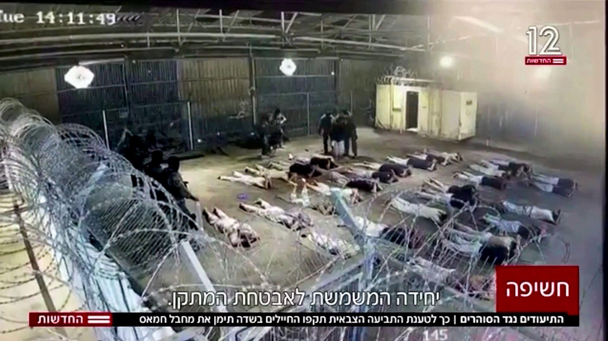

## Claim
Claim: " The image shows a screenshot of an authentic question from Israel's Channel 12 public opinion poll: 'Do you agree with the claim that a solder is allowed to rape a prisoner with his hands tied?'"

## Actions
```
image_search("Channel 12 Israel public opinion poll soldier rape prisoner")
```

## Evidence
### Evidence from `image_search`
The image in the claim is a doctored question from Israel's Channel 12 public opinion poll, according to [cedmohub.eu](https://cedmohub.eu/posts-share-doctored-prisoner-abuse-poll-from-israeli-tv-channel/). 

Another source, [Mondoweiss.net](https://mondoweiss.net/2024/08/65-of-israeli-jews-oppose-criminal-prosecution-for-soldiers-suspected-of-raping-palestinian-detainees/), also contains an image from Channel 12. 


## Elaboration
The claim is false. The image is a doctored question from Israel's Channel 12 public opinion poll, according to [cedmohub.eu](https://cedmohub.eu/posts-share-doctored-prisoner-abuse-poll-from-israeli-tv-channel/).


## Final Judgement
The image in the claim is a doctored question from Israel's Channel 12 public opinion poll. This has been confirmed by multiple sources.

The claim is demonstrably false as the image has been altered. `false`


### Verdict: FALSE

### Justification
The image presented in the claim is a doctored version of a question from Israel's Channel 12 public opinion poll, as confirmed by [cedmohub.eu](https://cedmohub.eu/posts-share-doctored-prisoner-abuse-poll-from-israeli-tv-channel/).
