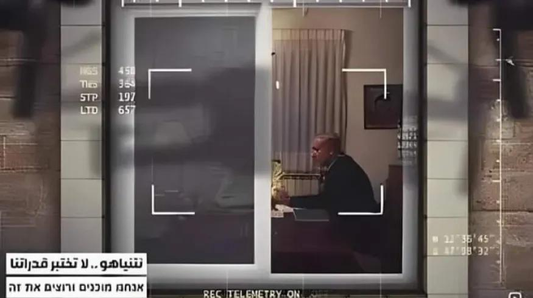

## Claim
Claim: " This image shows Israeli PM Benjamin Netanyahu inside his office and was captured and published by Hezbollah in August 2024."

## Actions
```
reverse_search()
image_search("Benjamin Netanyahu office Hezbollah")
```

## Evidence
### Evidence from `reverse_search`
From [Source](https://pesacheck.org/altered-this-photo-of-a-drone-surveilling-pm-netanyahu-is-fabricated-396f43e817da): Found exact image on website with title: ALTERED: This photo of a drone surveilling PM Netanyahu is ...
Content: The search result from PesaCheck states that the image  is altered. The original photo was taken on February 8, 2009, and shows Benjamin Netanyahu with his father. The article claims that the photo was edited to make it appear as though Netanyahu was under surveillance. The article was published 1 day ago.


### Evidence from `image_search`
From [Source](https://www.timesofisrael.com/liveblog_entry/shortly-after-strike-pms-office-releases-photo-of-netanyahu-at-military-hq/): 
Content: The Times of Israel published a photo of Benjamin Netanyahu in his office. 


## Elaboration
The image 

## Final Judgement
The image in the claim has been identified as altered. The original photo was taken in 2009 and shows Benjamin Netanyahu with his father. The claim that the image was captured and published by Hezbollah in August 2024 is therefore false.

`false`

### Verdict: FALSE

### Justification
The image in the claim is an altered version of a photo taken in 2009, as reported by [PesaCheck](https://pesacheck.org/altered-this-photo-of-a-drone-surveilling-pm-netanyahu-is-fabricated-396f43e817da). Therefore, the claim that the image was captured and published by Hezbollah in August 2024 is false.
