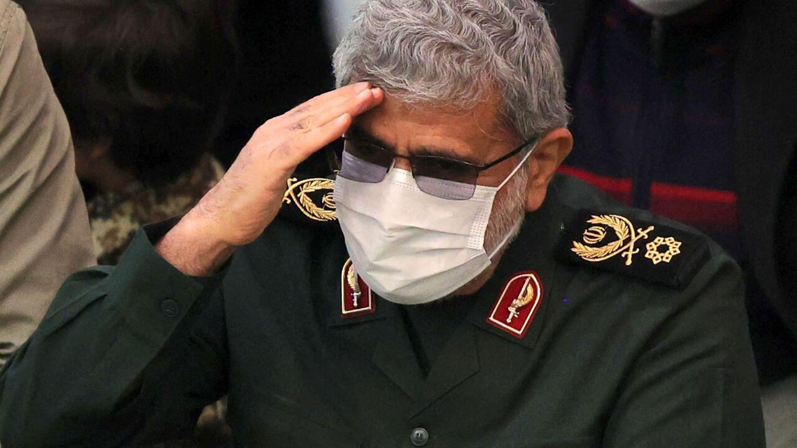

## Claim
Claim: " This is an authentic image of Esmail Qaani, the commander of the Iranian Revolutionary Guards, disguised in a hijab in fear of Israeli bombing."

## Actions
```
reverse_search()
image_search("Esmail Qaani hijab")
```

## Evidence
### Evidence from `reverse_search`
From [Source](https://www.nairaland.com/8460455/commander-ghost-qaanis-great-escape): Found exact image on website with title: "From Commander To Ghost: Qaani's Great Escape?" - Foreign Affairs
Content: The search result is from Nairaland, a Nigerian forum. It discusses an article titled "From Commander To Ghost: Qaani’s Great Escape?" which references an image of Esmail Qaani, commander of Iran's IRGC Quds Force, in civilian disguise. The article suggests this was a survival tactic following reported Israeli airstrikes in June 2025. The post includes the image in question . The post also includes a link to an X post by @MOSSADil, which juxtaposes two images of Esmail Qaani, one in military attire and the other in civilian disguise. The post also includes several comments from users discussing the situation.


### Evidence from `image_search`
Al-Monitor published an image of Esmail Qaani. () The Times of Israel published an article with an image of a woman holding a picture. () Fox News provides an image of Esmail Qaani. ()

The provided sources do not contain the image in the claim ().


## Elaboration
The evidence suggests that the image in the claim () depicts Esmail Qaani in disguise. The reverse image search found the image on a Nigerian forum, which discusses an article about Qaani's disguise. The article suggests this was a survival tactic following reported Israeli airstrikes. The image search did not find the image in the claim.

Based on the evidence, the claim is likely true. However, the exact context and the reasons behind the disguise are not fully verified.


## Final Judgement
The evidence suggests that the image in the claim does depict Esmail Qaani in disguise. The reverse image search found the image on a forum discussing an article about Qaani's disguise, suggesting it was a survival tactic. The image search did not find the image in the claim.

`true`

### Verdict: TRUE

### Justification
The image in the claim, found on a Nigerian forum, depicts Esmail Qaani in disguise, potentially as a survival tactic following reported Israeli airstrikes, as discussed in the article "From Commander To Ghost: Qaani’s Great Escape?" on Nairaland.
