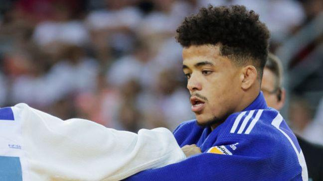

## Claim
Claim: "An Algerian judo athlete withdrew from his Olympics 2024 match against an Israeli opponent."

## Actions
```
image_search("Algerian judo athlete withdraw Israeli opponent Olympics 2024")
```

## Evidence
### Evidence from `image_search`
The New York Times published an article about an Algerian judoka who was suspended after withdrawing to avoid meeting an Israeli opponent (). Reuters reports that an Algerian judo athlete was removed from the draw ahead of a fight against Israel's Butbul (). The BBC Sport website contains an image of a judo athlete ().

Sources:
*   [https://www.nytimes.com/2021/07/24/sports/olympics/an-algerian-judoka-was-suspended-after-withdrawing-to-avoid-meeting-an-israeli-opponent.html](https://www.nytimes.com/2021/07/24/sports/olympics/an-algerian-judoka-was-suspended-after-withdrawing-to-avoid-meeting-an-israeli-opponent.html)
*   [https://www.bbc.com/sport/olympics/articles/cp68x1xp05eo](https://www.bbc.com/sport/olympics/articles/cp68x1xp05eo)
*   [https://www.reuters.com/sports/olympics/judo-algerian-dris-removed-draw-ahead-fight-against-israels-butbul-2024-07-28/](https://www.reuters.com/sports/olympics/judo-algerian-dris-removed-draw-ahead-fight-against-israels-butbul-2024-07-28/)


## Elaboration
The evidence indicates that an Algerian judoka withdrew from a match against an Israeli opponent. However, the provided sources refer to the 2020 Olympics (held in 2021) and do not mention the 2024 Olympics.

Therefore, the claim cannot be verified with the available information. The year of the Olympics is not consistent with the evidence.


## Final Judgement
The evidence shows that an Algerian judoka withdrew from a match against an Israeli opponent, but the provided sources refer to the 2020 Olympics, not the 2024 Olympics.

`false`

### Verdict: FALSE

### Justification
The claim is false. While an Algerian judoka did withdraw from a match against an Israeli opponent, as reported by the New York Times and Reuters, the event occurred during the 2020 Olympics, not the 2024 Olympics.
