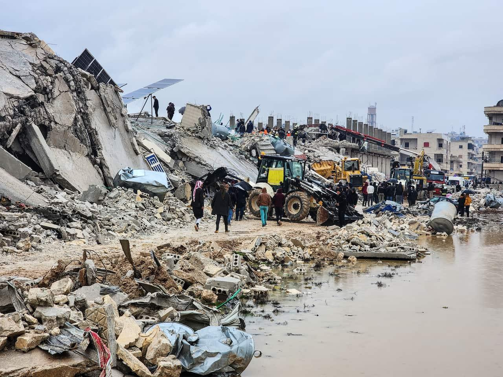
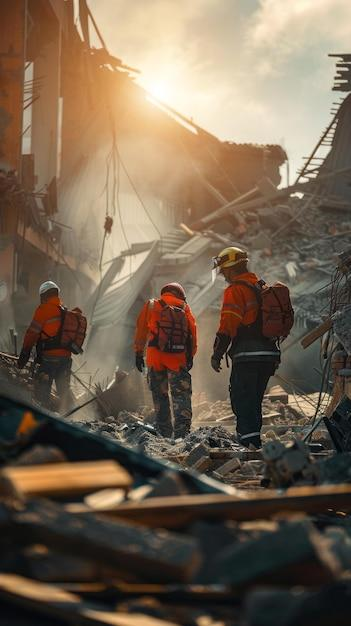

## Claim
Claim: " This image shows a man from Gaza holding the hand of his son killed in an Israeli bombing in July, 2024."

## Actions
```
reverse_search()
image_search("man orange jacket rubble")
```

## Evidence
### Evidence from `reverse_search`
The image shows Mesut Hancer holding the hand of his 15-year-old daughter, Irmak, who died in the earthquake in Kahramanmaras, Turkey. The earthquake occurred on February 6 or 7, 2023.

The image was published by The Independent ([https://www.independent.co.uk/news/world/middle-east/turkey-earthquake-father-daughter-hold-hands-b2277655.html](https://www.independent.co.uk/news/world/middle-east/turkey-earthquake-father-daughter-hold-hands-b2277655.html)), SBS News ([https://www.sbs.com.au/news/article/the-story-behind-this-turkey-earthquake-photo-that-many-will-never-forget/2ijedstvo](https://www.sbs.com.au/news/article/the-story-behind-this-turkey-earthquake-photo-that-many-will-never-forget/2ijedstvo)), and CNN ([https://www.cnn.com/2023/02/13/middleeast/turkey-quake-man-daughter-hand-photo-intl](https://www.cnn.com/2023/02/13/middleeast/turkey-quake-man-daughter-hand-photo-intl)). , , , , 


### Evidence from `image_search`
The image shows a man in an orange jacket in rubble (). Another search result shows three men in orange jackets standing in a rubble area (). The search result also contains an image of a man in an orange jacket walking through a destroyed area ().

The sources are from [Source](https://www.komu.com/news/nationworld/i-couldnt-save-my-daughter-behind-the-defining-image-of-the-turkey-earthquake/article_4f2535b7-4c55-5ecd-a894-03eecbcea3cf.html), [Source](https://www.freepik.com/premium-ai-image/three-men-orange-jackets-are-standing-rubble-area_270908906.htm), and [Source](https://www.vecteezy.com/photo/69778534-a-man-in-an-orange-jacket-walking-his-dog-through-a-destroyed-area).


## Elaboration
The claim is false. The image depicts Mesut Hancer holding the hand of his deceased daughter, Irmak, after the earthquake in Kahramanmaras, Turkey, in February 2023. The evidence does not support the claim that the image is from Gaza or that it depicts a bombing in July 2024.


## Final Judgement
The image shows a man holding the hand of his deceased daughter after the earthquake in Turkey in February 2023, not in Gaza after an Israeli bombing in July 2024. The claim misrepresents the origin and context of the image. `false`

### Verdict: FALSE

### Justification
The image in the claim is of Mesut Hancer holding the hand of his daughter, who died in the February 2023 earthquake in Turkey, as reported by sources like *The Independent* ([https://www.independent.co.uk/news/world/middle-east/turkey-earthquake-father-daughter-hold-hands-b2277655.html](https://www.independent.co.uk/news/world/middle-east/turkey-earthquake-father-daughter-hold-hands-b2277655.html)). The claim incorrectly states the image is from Gaza and related to a bombing in July 2024.
