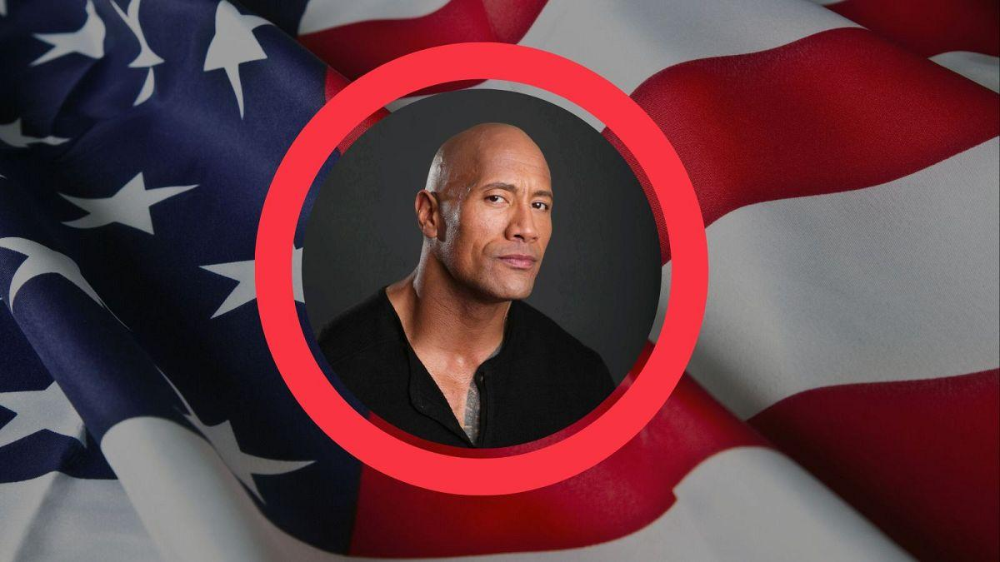

## Claim
Claim: " This is an authentic image of Dwayne Johnson waring the Israeli flag in support of Israel."

## Actions
```
reverse_search()
image_search("Dwayne Johnson Israel flag")
```

## Evidence
### Evidence from `image_search`
The web sources include articles about Dwayne Johnson's reactions to the Israel-Hamas conflict and his potential political aspirations. One article from WIONews ([https://www.wionews.com/entertainment/dwayne-johnson-on-israel-hamas-conflict-im-heartbroken-angry-and-sickened-645300](https://www.wionews.com/entertainment/dwayne-johnson-on-israel-hamas-conflict-im-heartbroken-angry-and-sickened-645300)) features an image of Johnson with a statement about the conflict . Another source from Euronews ([https://www.euronews.com/culture/2023/11/14/dwayne-the-rock-johnson-says-political-parties-asked-him-to-run-for-president](https://www.euronews.com/culture/2023/11/14/dwayne-the-rock-johnson-says-political-parties-asked-him-to-run-for-president)) shows Johnson with the American flag .

Yahoo News ([https://www.yahoo.com/news/articles/fact-check-fake-dwayne-johnson-234700368.html](https://www.yahoo.com/news/articles/fact-check-fake-dwayne-johnson-234700368.html)) fact-checks a fake image of Dwayne Johnson .


## Elaboration
The evidence suggests that the image of Dwayne Johnson with the Israeli flag is likely not authentic. The search results include a fact-check of a fake image of Johnson and articles about his statements on the Israel-Hamas conflict, but no evidence of him posing with the Israeli flag.


## Final Judgement
The search results indicate that the image of Dwayne Johnson with the Israeli flag is likely not authentic. While there are articles about his statements on the Israel-Hamas conflict, there is no evidence to support the claim that he posed with the Israeli flag. A fact-check of a fake image of Johnson was also found.

`false`

### Verdict: FALSE

### Justification
The image of Dwayne Johnson with the Israeli flag is likely not authentic. While Johnson has commented on the Israel-Hamas conflict, there is no evidence to support the claim that he posed with the Israeli flag. A fact-check of a fake image of Johnson was also found ([https://www.yahoo.com/news/articles/fact-check-fake-dwayne-johnson-234700368.html](https://www.yahoo.com/news/articles/fact-check-fake-dwayne-johnson-234700368.html)).
