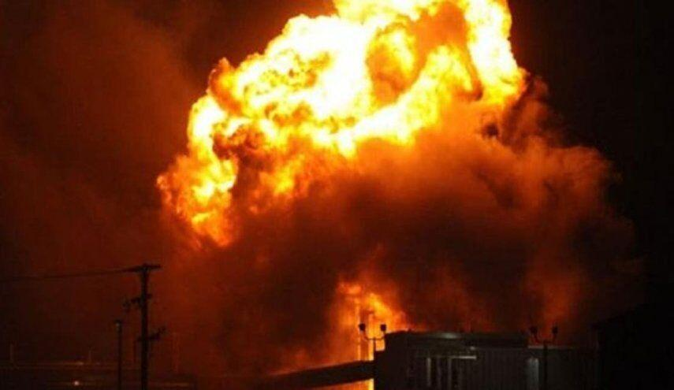

## Claim
Claim: " This image shows a US factility come under attack in Baghdad on September 30, 2024 as the conflict between Israel and the Iran-backed militant group Hezbollah escalated."

## Actions
```
reverse_search()
web_search("Baghdad facility attack September 30 2024")
```

## Evidence
### Evidence from `reverse_search`
The image  is from an article about a fire and explosion at the Linde North America plant in Alpha, New Jersey, as reported by The Express-Times. The fire occurred in an outdoor area used to store chemical and gas containers.

The same image  also appears in an article from the Webangah News Agency, published on July 2, 2025, about a massive explosion in Northern California. The article mentions a fire at a fireworks warehouse in Yolo County.


### Evidence from `web_search`
Reuters ([https://www.reuters.com/world/middle-east/rocket-attack-targets-military-base-hosting-us-forces-baghdad-military-sources-2024-09-30/](https://www.reuters.com/world/middle-east/rocket-attack-targets-military-base-hosting-us-forces-baghdad-military-sources-2024-09-30/)) reports on a rocket attack near Baghdad International Airport on September 30, 2024, targeting a military base hosting U.S. forces. ReliefWeb ([https://reliefweb.int/report/iraq/ishm-september-26-october-3-2024](https://reliefweb.int/report/iraq/ishm-september-26-october-3-2024)) discusses attacks on September 30, including attacks by the "Islamic Resistance in Iraq" on Israeli targets.

The Wikipedia article ([https://en.wikipedia.org/wiki/September_2024_Israeli_attacks_against_Lebanon](https://en.wikipedia.org/wiki/September_2024_Israeli_attacks_against_Lebanon)) discusses the September 2024 Israeli attacks against Lebanon, which were part of the ongoing Israel–Hezbollah conflict. On September 30, 2024, Hezbollah fired rockets into northern Israel and the Golan Heights. 


## Elaboration
The image 

## Final Judgement
The image is not related to the event described in the claim. The image is from a fire at a chemical plant in New Jersey and a fireworks warehouse in California. While there were attacks on September 30, 2024, including a rocket attack near Baghdad International Airport, the image does not depict this event.

`misleading`

### Verdict: MISLEADING

### Justification
The image in the claim is not related to the alleged attack in Baghdad on September 30, 2024. Reverse image searches show the image depicts a fire at a chemical plant in New Jersey and a fireworks warehouse in California. While there were attacks on September 30, 2024, including a rocket attack near Baghdad International Airport ([Reuters](https://www.reuters.com/world/middle-east/rocket-attack-targets-military-base-hosting-us-forces-baghdad-military-sources-2024-09-30/)), the image does not depict this event.
