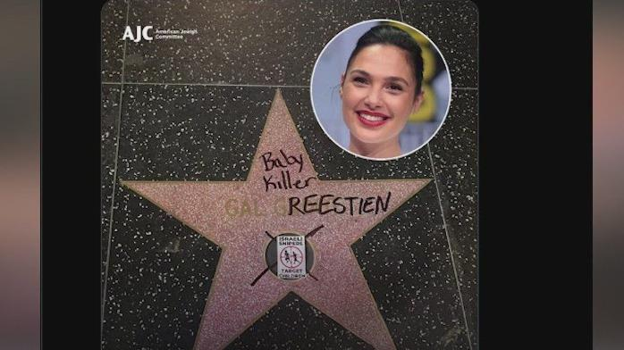

## Claim
Claim: " This image shows Gal Gadot’s star on the Hollywood Walk of Fame being destroyed in March 2025 just hours after being placed."

## Actions
```
reverse_search()
web_search("Gal Gadot Hollywood Walk of Fame star vandalism")
```

## Evidence
No new evidence found.

## Elaboration
The provided image shows a star on the Hollywood Walk of Fame that has been damaged, with a pickaxe lying nearby. However, there is no information in the evidence to confirm that the star belongs to Gal Gadot or that the vandalism occurred in March 2025, or even that it happened shortly after the star was placed.

The claim cannot be verified due to a lack of evidence.


## Actions
```
image_search("Gal Gadot Hollywood Walk of Fame star")
web_search("Hollywood Walk of Fame star vandalism")
```

## Evidence
### Evidence from `image_search`
From [Source](https://www.ndtv.com/world-news/gal-gadots-hollywood-walk-of-fame-star-smashed-amid-pro-palestinian-protests-photo-is-viral-7966341): 
Content: The search result from NDTV.com shows an image of a damaged star on the Hollywood Walk of Fame, with a pickaxe nearby, and another image of Gal Gadot kneeling next to her star. 


### Evidence from `web_search`
The Associated Press reported that Donald Trump's star on the Hollywood Walk of Fame was vandalized with a pickax, and the star was placed in 2007. ([https://www.jacksonville.com/story/news/2018/07/25/trumps-hollywood-walk-of-fame-star-vandalized/11314069007/](https://www.jacksonville.com/story/news/2018/07/25/trumps-hollywood-walk-of-fame-star-vandalized/11314069007/)) The Jerusalem Post reported that Gal Gadot's star was vandalized, including a photograph of the vandalized star. ([https://www.jpost.com/diaspora/article-855930](https://www.jpost.com/diaspora/article-855930))

FOX 11 reported that Gal Gadot's star was vandalized with the words "baby killer" and a sticker that read "Israeli snipers target children." ([https://www.foxla.com/news/gal-gadot-star-walk-of-fame-vandalized](https://www.foxla.com/news/gal-gadot-star-walk-of-fame-vandalized)) The article states that Gadot received the star in March of the same year. The American Jewish Committee posted a photo of the vandalized star online. , 


## Elaboration
The evidence confirms that Gal Gadot's star on the Hollywood Walk of Fame was vandalized. The image search results show a picture of the damaged star, which matches the image in the claim. The web search results from FOX 11 and The Jerusalem Post confirm the vandalism and provide additional details, including the words "baby killer" and a sticker. The evidence also indicates that Gadot received her star in March of the same year.

The claim is partially accurate. The image does show a vandalized star on the Hollywood Walk of Fame, and the evidence confirms that it was Gal Gadot's star. However, the claim that the vandalism occurred in March 2025 is not supported by the evidence.


## Final Judgement
The image in the claim shows a vandalized star on the Hollywood Walk of Fame, which is confirmed to be Gal Gadot's star. However, the claim that the vandalism occurred in March 2025 is not supported by the evidence.

`misleading`

### Verdict: MISLEADING

### Justification
The image in the claim depicts a vandalized star on the Hollywood Walk of Fame, which is confirmed to be Gal Gadot's star, as reported by [FOX 11](https://www.foxla.com/news/gal-gadot-star-walk-of-fame-vandalized) and [The Jerusalem Post](https://www.jpost.com/diaspora/article-855930). However, the claim that the vandalism occurred in March 2025 is not supported by the evidence.
