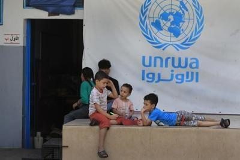

## Claim
Claim: " This image shows a screenshot of the X profile of UNRWA which has placed a black band over its profile photo in mourning for the death of Yahya Sinwar, Hamas leader in the Gaza Strip, in October 2024."

## Actions
```
web_search("UNRWA Yahya Sinwar death")
image_search("UNRWA profile picture mourning")
```

## Evidence
### Evidence from `web_search`
The Wikipedia article discusses the killing of Yahya Sinwar on October 16, 2024, and mentions that an UNRWA teacher's passport was found on his body. ([https://en.wikipedia.org/wiki/Killing_of_Yahya_Sinwar](https://en.wikipedia.org/wiki/Killing_of_Yahya_Sinwar)) The New York Post reports that Israeli forces killed Yahya Sinwar and that an apparent passport belonging to an UNRWA teacher was found on his body. ([https://nypost.com/2024/10/17/us-news/unrwa-teachers-passport-found-on-hamas-leader-sinwars-slain-body-after-israeli-forces-killed-him-photos-show/](https://nypost.com/2024/10/17/us-news/unrwa-teachers-passport-found-on-hamas-leader-sinwars-slain-body-after-israeli-forces-killed-him-photos-show/))

The France 24 article discusses claims that an UNRWA ID was found among Yahya Sinwar's belongings and that one of the bodyguards killed alongside Sinwar worked for UNRWA. ([https://www.france24.com/en/tv-shows/truth-or-fake/20241021-what-we-know-about-the-unrwa-id-allegedly-found-amidst-sinwar-s-belongings](https://www.france24.com/en/tv-shows/truth-or-fake/20241021-what-we-know-about-the-unrwa-id-allegedly-found-amidst-sinwar-s-belongings)) , , , , , 


## Elaboration
The evidence indicates that Yahya Sinwar was killed in October 2024. The New York Post and France 24 report that an UNRWA teacher's passport and an UNRWA ID were found among his belongings. However, the provided evidence does not show that UNRWA placed a black band over its profile photo in mourning for Sinwar.

Therefore, the claim cannot be verified based on the provided evidence.


## Actions
```
web_search("UNRWA X profile mourning Sinwar")
```

## Evidence
### Evidence from `web_search`
The claim that UNRWA placed a black band over its profile photo in mourning for Yahya Sinwar's death is false. Fact-checks by DW ([https://www.dw.com/en/fact-check-black-ribbon-on-unrwa-logo-does-not-show-mourning-for-sinwar/a-70532996](https://www.dw.com/en/fact-check-black-ribbon-on-unrwa-logo-does-not-show-mourning-for-sinwar/a-70532996)), The Canadian Press News ([https://www.thecanadianpressnews.ca/fact_checking/black-band-on-unrwas-social-media-profiles-appeared-before-yahya-sinwars-death/article_33032eb2-f64b-55c6-8a57-3289e6a014cf.html](https://www.thecanadianpressnews.ca/fact_checking/black-band-on-unrwas-social-media-profiles-appeared-before-yahya-sinwars-death/article_33032eb2-f64b-55c6-8a57-3289e6a014cf.html)) and PesaCheck ([https://pesacheck.org/false-unrwa-didnt-update-its-profile-photo-to-mourn-the-death-of-hamas-leader-yahya-sinwar-f8219db942b5](https://pesacheck.org/false-unrwa-didnt-update-its-profile-photo-to-mourn-the-death-of-hamas-leader-yahya-sinwar-f8219db942b5)) confirm that the black band was added before Sinwar's death and is a tribute to UNRWA team members killed in Gaza. The Canadian Press News article includes screenshots of UNRWA's X profile with the black band. , 


## Elaboration
The claim is false. Fact-checks from DW, The Canadian Press News, and PesaCheck confirm that the black band on UNRWA's profile was added before Yahya Sinwar's death and is a tribute to UNRWA team members killed in Gaza.


## Final Judgement
The claim is demonstrably false. Multiple fact-checking sources confirm that the black band on UNRWA's profile was added before Yahya Sinwar's death and was not in mourning for him.

`false`

### Verdict: FALSE

### Justification
The claim is demonstrably false. Multiple fact-checking sources, including DW ([https://www.dw.com/en/fact-check-black-ribbon-on-unrwa-logo-does-not-show-mourning-for-sinwar/a-70532996](https://www.dw.com/en/fact-check-black-ribbon-on-unrwa-logo-does-not-show-mourning-for-sinwar/a-70532996)), The Canadian Press News ([https://www.thecanadianpressnews.ca/fact_checking/black-band-on-unrwas-social-media-profiles-appeared-before-yahya-sinwars-death/article_33032eb2-f64b-55c6-8a57-3289e6a014cf.html](https://www.thecanadianpressnews.ca/fact_checking/black-band-on-unrwas-social-media-profiles-appeared-before-yahya-sinwars-death/article_33032eb2-f64b-55c6-8a57-3289e6a014cf.html)), and PesaCheck ([https://pesacheck.org/false-unrwa-didnt-update-its-profile-photo-to-mourn-the-death-of-hamas-leader-yahya-sinwar-f8219db942b5](https://pesacheck.org/false-unrwa-didnt-update-its-profile-photo-to-mourn-the-death-of-hamas-leader-yahya-sinwar-f8219db942b5)), confirm that the black band on UNRWA's profile was added before Yahya Sinwar's death and was not in mourning for him.
