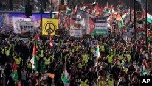
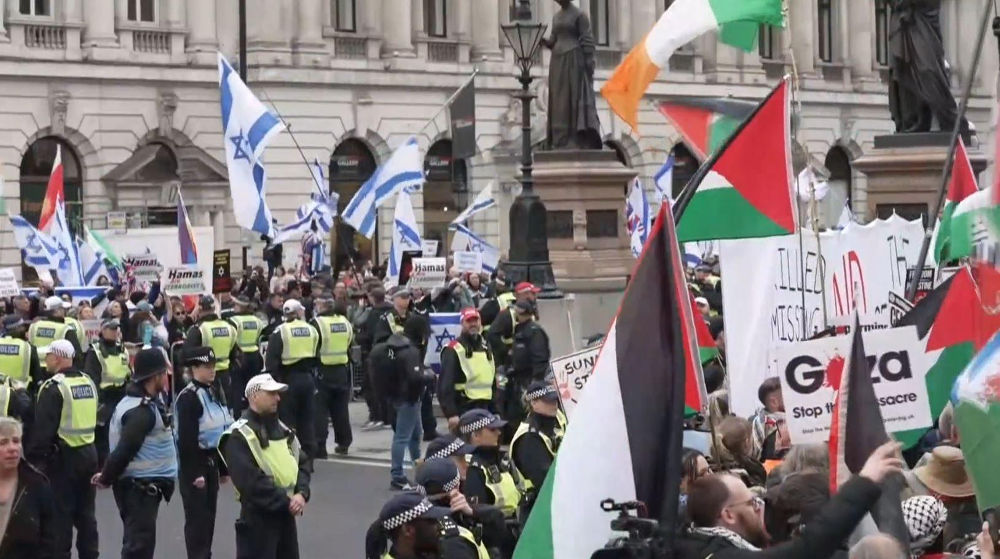
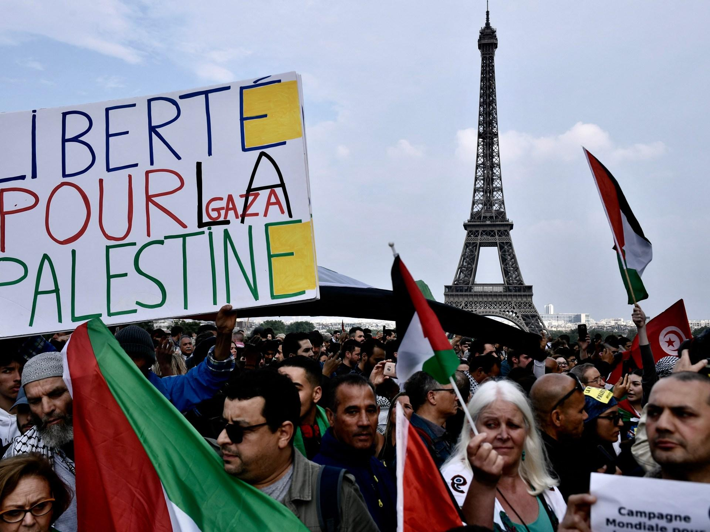
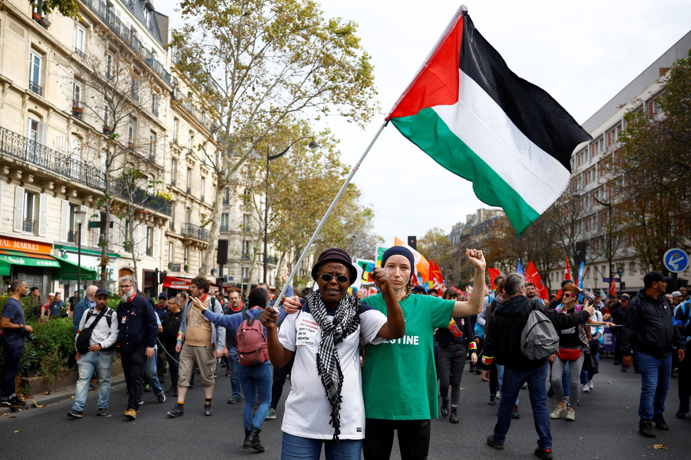

## Claim
Claim: " This image shows the 'French' Left who is rioting against Le Pen's victory in the first round of the French parliamentary elections in 2024."

## Actions
```
web_search("protest swastika palestine france")
image_search("protest palestine france")
geolocate()
reverse_search()
```

## Evidence
### Evidence from `web_search`
The web sources discuss protests in France and other European cities. One article from FRANCE 24 ([https://www.france24.com/en/europe/20250322-tens-of-thousands-in-france-join-protests-against-racism-and-far-right](https://www.france24.com/en/europe/20250322-tens-of-thousands-in-france-join-protests-against-racism-and-far-right)) mentions protests against racism and the far right in multiple cities, including Paris, with some protesters carrying Palestinian flags. Voice of America ([https://www.voanews.com/a/tens-of-thousands-march-in-europe-call-for-permanent-cease-fire-in-gaza-/7370219.html](https://www.voanews.com/a/tens-of-thousands-march-in-europe-call-for-permanent-cease-fire-in-gaza-/7370219.html)) reports on pro-Palestinian marches in Europe, including Paris, and mentions an arrest in London for carrying a placard with Nazi symbols.

Channel 4 News ([https://www.channel4.com/news/israel-gaza-war-continues-to-fuel-protests-and-division-in-us-france-and-uk](https://www.channel4.com/news/israel-gaza-war-continues-to-fuel-protests-and-division-in-us-france-and-uk)) also reports on pro-Palestine marches in London, mentioning the arrest related to a swastika. <image:0>, , , 


### Evidence from `image_search`
Al Jazeera published an article about a pro-Palestinian protest in Paris, with an image showing the Eiffel Tower in the background (). Reuters reported on a French court upholding a ban on pro-Palestine protests, including an image of a protest in France ().

The provided sources do not contain information about the claim.
*   [https://www.aljazeera.com/news/2021/5/13/france-asks-police-to-ban-pro-palestinian-protest-in-paris](https://www.aljazeera.com/news/2021/5/13/france-asks-police-to-ban-pro-palestinian-protest-in-paris)
*   [https://www.reuters.com/world/europe/french-court-upholds-government-instruction-ban-all-pro-palestine-protests-2023-10-18/](https://www.reuters.com/world/europe/french-court-upholds-government-instruction-ban-all-pro-palestine-protests-2023-10-18/)


### Evidence from `geolocate`
The most likely countries where the image was taken are: {'Palestine': 0.38, 'France': 0.31, 'Germany': 0.1, 'Tunisia': 0.05, 'Belgium': 0.03, 'Sweden': 0.03, 'Israel': 0.02, 'Jordan': 0.02, 'Hungary': 0.01, 'Italy': 0.01}

### Evidence from `reverse_search`
The image () appears in a Vanity Fair article from July 2015, titled "Anti-Semitism in France: How Fast Is the Tide Rising?" which discusses rising anti-Semitism in France, including a 2014 pro-Palestinian demonstration in Paris where a swastika was painted on a statue. The same image is also found in a New York Times article from August 2, 2014, titled "Anti-Semitism Rises in Europe Amid Israel-Gaza Conflict", which discusses a rise in anti-Semitic incidents across Europe. The image is also found on the American Jewish Committee (AJC) website, discussing the Durban Diaries, an account of the 2001 World Conference against Racism in Durban, South Africa.

*   [https://www.ajc.org/news/the-durban-diaries-with-an-introduction-by-ajcs-simone-rodan-benzaquen](https://www.ajc.org/news/the-durban-diaries-with-an-introduction-by-ajcs-simone-rodan-benzaquen)
*   [https://www.vanityfair.com/news/2015/07/anti-semitism-france-hostage-hyper-cacher-kosher-market](https://www.vanityfair.com/news/2015/07/anti-semitism-france-hostage-hyper-cacher-kosher-market)
*   [https://www.nytimes.com/2014/08/02/world/europe/anger-in-europe-over-the-israeli-gaza-conflict-reverberates-as-anti-semitism.html](https://www.nytimes.com/2014/08/02/world/europe/anger-in-europe-over-the-israeli-gaza-conflict-reverberates-as-anti-semitism.html)


## Elaboration
The image is from a 2014 pro-Palestinian demonstration in Paris, not a 2024 protest against Le Pen's victory. The presence of a swastika in the image is noted in multiple sources, including the New York Times and Vanity Fair. The claim is therefore demonstrably false.


## Final Judgement
The image is from a 2014 pro-Palestinian demonstration in Paris, not a 2024 protest against Le Pen's victory. The claim misrepresents the context and time of the event.

`misleading`

### Verdict: MISLEADING

### Justification
The image depicts a 2014 pro-Palestinian demonstration in Paris, as confirmed by a reverse image search, which contradicts the claim that it shows a 2024 protest against Le Pen's victory. The presence of a swastika in the image is also noted in multiple sources, including the New York Times and Vanity Fair ([https://www.nytimes.com/2014/08/02/world/europe/anger-in-europe-over-the-israeli-gaza-conflict-reverberates-as-anti-semitism.html](https://www.nytimes.com/2014/08/02/world/europe/anger-in-europe-over-the-israeli-gaza-conflict-reverberates-as-anti-semitism.html), [https://www.vanityfair.com/news/2015/07/anti-semitism-france-hostage-hyper-cacher-kosher-market](https://www.vanityfair.com/news/2015/07/anti-semitism-france-hostage-hyper-cacher-kosher-market)).
