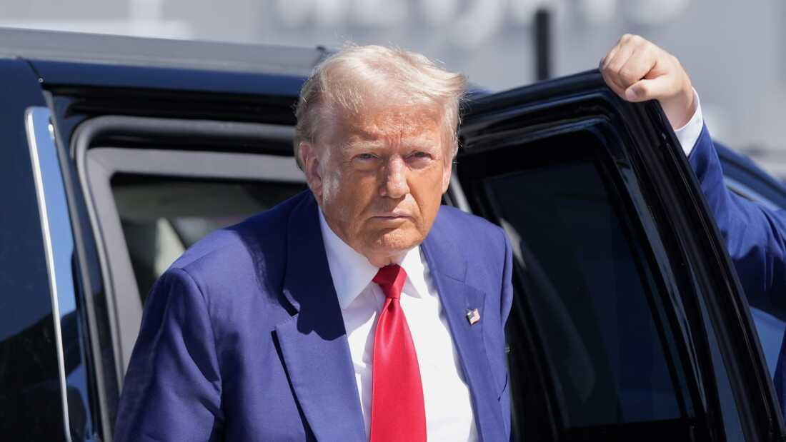

## Claim
Claim: "The assassination plot to kill Donald Trump in 2024 was orchestrated by two Jewish Americans. Israel wants war with Iran but wants American money to fund it and American servicemen to fight it."

## Actions
```
web_search("assassination plot Donald Trump 2024")
web_search("Israel war Iran American money")
```

## Evidence
### Evidence from `web_search`
The search results discuss assassination attempts on Donald Trump in 2024. One attempt occurred in Pennsylvania, where Thomas Matthew Crooks fired an AR-15-style rifle, killing one person and injuring others. The Secret Service had increased Trump's security due to intelligence suggesting Iran was plotting to assassinate him. A congressional task force investigated the attempt, highlighting failures in law enforcement. Another apparent attempt was reported by NPR on September 16, 2024, with the FBI investigating the incident. <image:i> <image:k> 

The sources include Wikipedia ([https://en.wikipedia.org/wiki/Attempted_assassination_of_Donald_Trump_in_Pennsylvania](https://en.wikipedia.org/wiki/Attempted_assassination_of_Donald_Trump_in_Pennsylvania)), City & State Pennsylvania ([https://www.cityandstatepa.com/politics/2024/12/3-key-findings-trump-assassination-attempt-butler/401632/](https://www.cityandstatepa.com/politics/2024/12/3-key-findings-trump-assassination-attempt-butler/401632/)), and NPR ([https://www.npr.org/2024/09/16/g-s1-23232/up-first-newsletter-second-apparent-assassination-attempt-trump-emmy-awards-recap](https://www.npr.org/2024/09/16/g-s1-23232/up-first-newsletter-second-apparent-assassination-attempt-trump-emmy-awards-recap)).


### Evidence from `web_search`
The provided sources discuss the economic impact of the Iran-Israel war, including the financial fallout for both countries and the involvement of the United States. One article from Anadolu Agency discusses the cost of US operations against Iranian nuclear sites, which could range from $1 billion to $2 billion, and the soaring military expenditure of Israel. Another article from Al Jazeera discusses the cost of US wars in the Middle East, including the military aid provided to Israel. <image:0>, 

The Wikipedia article discusses the economic burdens on Iran, including war damage, military spending, sanctions, currency devaluation, and human capital losses. The articles also mention the historical context of hostility and sanctions between Iran and Israel, as well as proxy conflicts and covert operations.
*   [https://www.aa.com.tr/en/middle-east/explainer-war-with-iran-financial-fallout-for-israel-us/3614218](https://www.aa.com.tr/en/middle-east/explainer-war-with-iran-financial-fallout-for-israel-us/3614218)
*   [https://en.wikipedia.org/wiki/Economic_impact_of_the_Iran%E2%80%93Israel_war](https://en.wikipedia.org/wiki/Economic_impact_of_the_Iran%E2%80%93Israel_war)
*   [https://www.aljazeera.com/news/2025/6/24/how-much-have-us-wars-in-the-middle-east-and-afghanistan-cost](https://www.aljazeera.com/news/2025/6/24/how-much-have-us-wars-in-the-middle-east-and-afghanistan-cost)


## Elaboration
The evidence does not support the claim that the assassination plot was orchestrated by two Jewish Americans. The search results mention an assassination attempt in Pennsylvania, but they do not provide information about the perpetrators' identities or their religious affiliation.

The evidence does not directly support the claim that Israel wants war with Iran and wants American money and servicemen to fight it. However, the search results discuss the economic impact of the Iran-Israel war, including the financial involvement of the United States. One article mentions the cost of US operations against Iranian nuclear sites and the military aid provided to Israel.

The claim contains several unsubstantiated assertions. More information is needed to verify the claim.


## Actions
```
web_search("Jewish Americans orchestrate assassination plot Donald Trump")
web_search("Israel wants war Iran American servicemen")
```

## Evidence
### Evidence from `web_search`
The Department of Justice charged Farhad Shakeri, an Iranian man, in a murder-for-hire plot to assassinate Donald Trump and two Jewish Americans in New York City. The Islamic Revolutionary Guard Corps (IRGC) instructed Shakeri to kill Trump and offered $500,000 each for the killing of two Jewish businesspeople. The IRGC also planned a mass shooting of Israeli tourists in Sri Lanka. The FBI director stated that the charges expose Iran's attempts to target US citizens. (<image:i>)

Sources: [https://www.nbcnews.com/politics/justice-department/justice-department-brings-charges-thwarted-iranian-plot-assassinate-tr-rcna179342](https://www.nbcnews.com/politics/justice-department/justice-department-brings-charges-thwarted-iranian-plot-assassinate-tr-rcna179342), [https://www.jns.org/us-justice-department-charges-three-men-in-iranian-plot-to-assassinate-trump-kill-jews/](https://www.jns.org/us-justice-department-charges-three-men-in-iranian-plot-to-assassinate-trump-kill-jews/), [https://apnews.com/article/iran-fbi-justice-department-iran-83cff84a7d65901a058ad6f41a564bdb](https://apnews.com/article/iran-fbi-justice-department-iran-83cff84a7d65901a058ad6f41a564bdb)


### Evidence from `web_search`
The search results discuss the Israel-Iran war, including U.S. involvement, with the U.S. bombing Iranian nuclear sites, joining Israel's military campaign. <image:i> The war resulted in casualties in both Iran and Israel. The articles also mention Iran's demands for accountability and the support Iran received from the BRICS+ nations. The fighting ended with a US-sponsored ceasefire. One source mentions that Trump wanted to avoid war.

*   [https://www.pbs.org/newshour/world/what-to-know-about-the-u-s-militarys-intervention-in-the-israel-iran-war](https://www.pbs.org/newshour/world/what-to-know-about-the-u-s-militarys-intervention-in-the-israel-iran-war)
*   [https://www.aljazeera.com/news/2025/7/6/iran-demands-accountability-for-israel-and-us-after-war-of-aggression](https://www.aljazeera.com/news/2025/7/6/iran-demands-accountability-for-israel-and-us-after-war-of-aggression)
*   [https://www.atlanticcouncil.org/blogs/menasource/twenty-questions-and-expert-answers-on-the-israel-iran-war/](https://www.atlanticcouncil.org/blogs/menasource/twenty-questions-and-expert-answers-on-the-israel-iran-war/)


## Elaboration
The evidence contradicts the first part of the claim. The Department of Justice charged an Iranian man in a murder-for-hire plot to assassinate Donald Trump and two Jewish Americans. The Islamic Revolutionary Guard Corps (IRGC) instructed the man to kill Trump.

The evidence does not fully support the second part of the claim. The U.S. was involved in the Israel-Iran war, including bombing Iranian nuclear sites. The fighting ended with a US-sponsored ceasefire.


## Final Judgement
The initial search results did not support the claim about the assassination plot. However, subsequent searches revealed that the Department of Justice charged an Iranian man in a plot to assassinate Donald Trump. The evidence also indicates U.S. involvement in the Israel-Iran war. The claim is therefore a mix of false and misleading information.

`misleading`

### Verdict: MISLEADING

### Justification
The claim is misleading. While there was an assassination plot against Donald Trump, it was orchestrated by the Iranian Revolutionary Guard Corps, not Jewish Americans, as revealed by the Department of Justice ([https://www.nbcnews.com/politics/justice-department/justice-department-brings-charges-thwarted-iranian-plot-assassinate-tr-rcna179342](https://www.nbcnews.com/politics/justice-department/justice-department-brings-charges-thwarted-iranian-plot-assassinate-tr-rcna179342)). Furthermore, the U.S. was involved in the Israel-Iran war, including bombing Iranian nuclear sites, but the claim oversimplifies the complex geopolitical dynamics.
