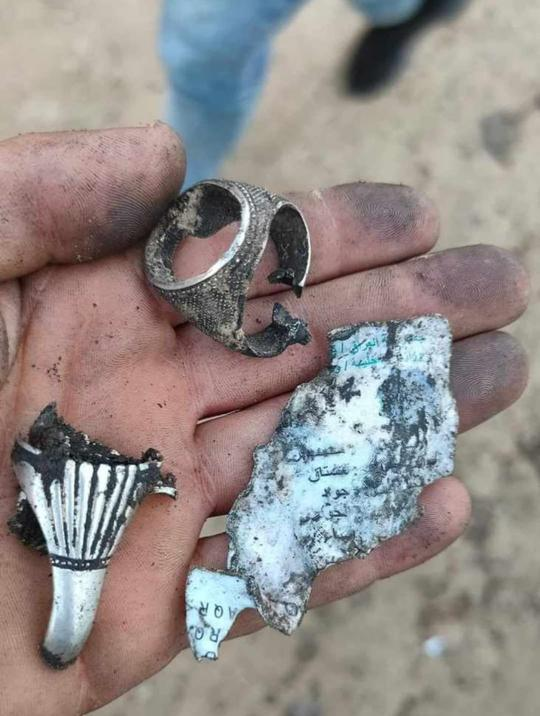
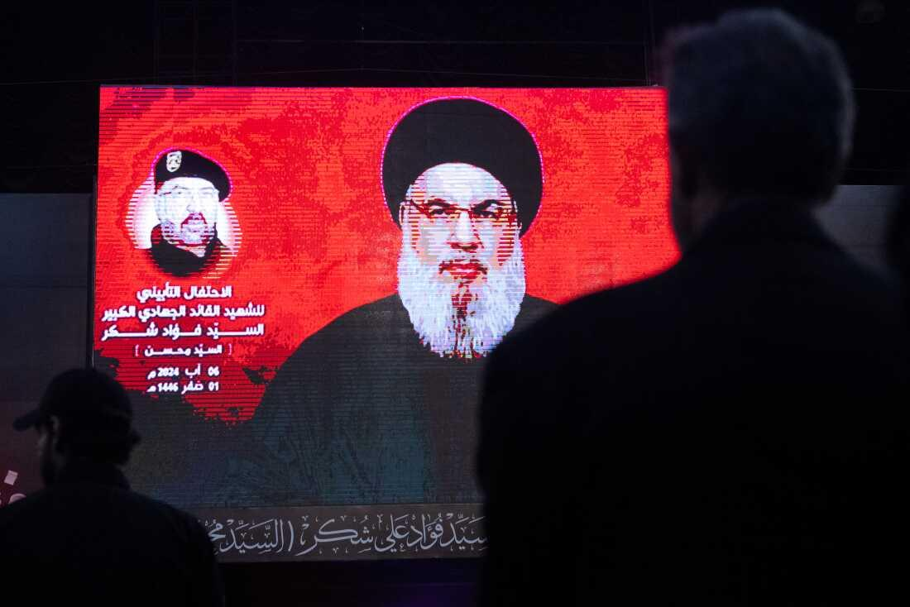
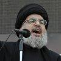
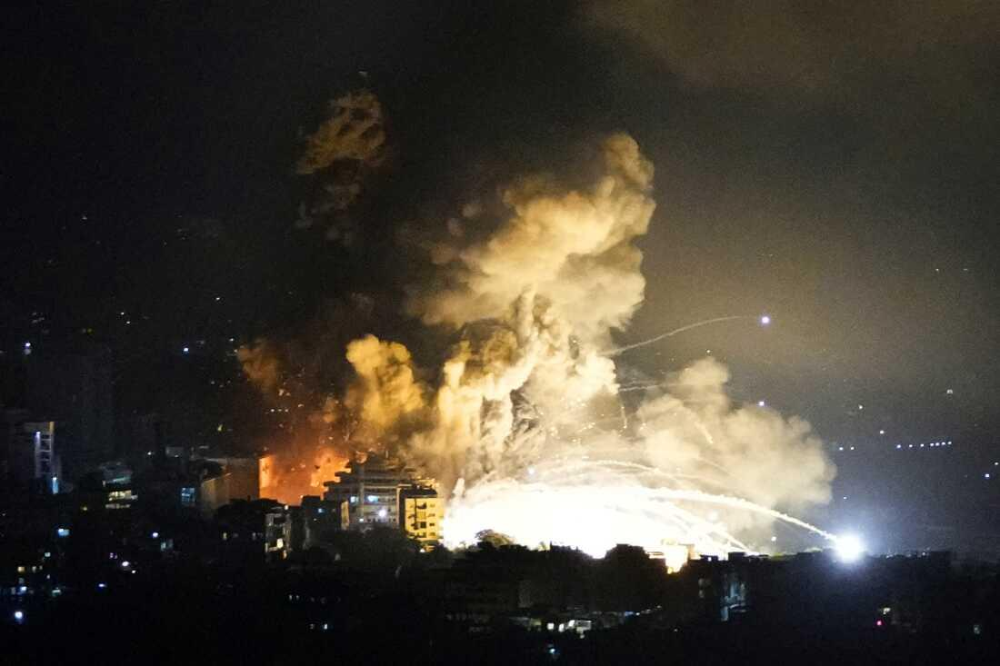
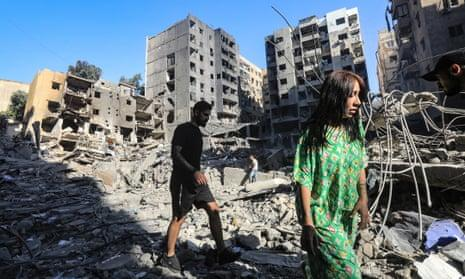
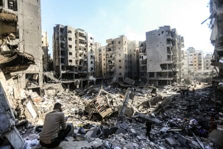

## Claim
Claim: " This image shows the remains of Nasrallah's ring after being killed in an Israeli airstrike in Beirut on September 28, 2024."

## Actions
```
reverse_search()
web_search("Nasrallah ring Israeli airstrike Beirut")
```

## Evidence
### Evidence from `reverse_search`
The image () shows a ring and fragments. According to the sources, the image is of the ring of Mohammad Reza Zahedi, who was killed in an Israeli airstrike in Damascus. The image was published on April 1 and 2, 2024. The ring was received as a gift from Imam Reza Shrine the night before his death.


### Evidence from `web_search`
The NPR article ([https://www.npr.org/2024/09/28/g-s1-25279/israels-military-says-it-killed-hezbollah-leader](https://www.npr.org/2024/09/28/g-s1-25279/israels-military-says-it-killed-hezbollah-leader)) and The Washington Post ([https://www.washingtonpost.com/world/2024/09/28/israel-lebanon-hezbollah-hamas-war-news-gaza/](https://www.washingtonpost.com/world/2024/09/28/israel-lebanon-hezbollah-hamas-war-news-gaza/)) both report that an Israeli airstrike in Beirut on September 28, 2024, killed Hezbollah leader Hassan Nasrallah. The Guardian ([https://www.theguardian.com/world/2024/sep/30/lebanon-reels-from-israeli-bombardment-with-no-sign-of-respite](https://www.theguardian.com/world/2024/sep/30/lebanon-reels-from-israeli-bombardment-with-no-sign-of-respite)) also discusses the airstrikes.

The NPR article includes images , , and . The Guardian article includes images , , and .


## Elaboration
The image (

## Final Judgement
The image shows the ring of Mohammad Reza Zahedi, who was killed in an Israeli airstrike in Damascus, not Hassan Nasrallah. The claim also incorrectly states the date and location of the event.

`misleading`

### Verdict: MISLEADING

### Justification
The image in the claim (