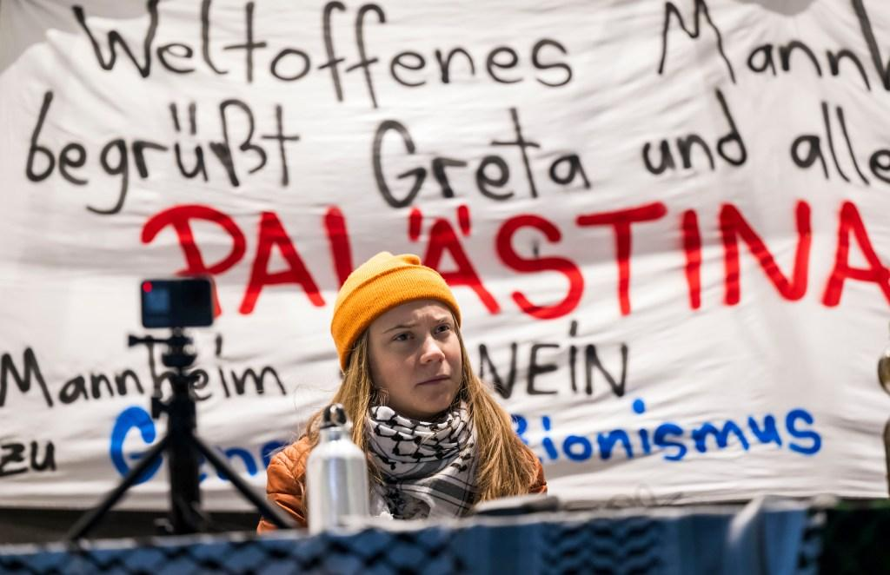

## Claim
Claim: " This is an authentic image of Greta Thunberg from November 2024 holding a sign reading, 'Fuck Israel'."

## Actions
```
reverse_search()
web_search("Greta Thunberg sign Fuck Israel")
```

## Evidence
### Evidence from `reverse_search`
The reverse image search found the image of Greta Thunberg (

### Evidence from `web_search`
The New York Post reports that Greta Thunberg declared "f–k Israel" at an anti-Israel rally in Germany in December, and she has faced backlash for her comments. The Telegraph also reported that Greta Thunberg declared "f--- Israel" at a rally in Mannheim, Germany. The New York Post also reported that Thunberg was filmed saying "f–k Israel" at the rally.

Sources: [https://nypost.com/2024/12/09/world-news/greta-thunberg-bursts-into-laughter-as-she-declares-f-k-israel-at-rally/](https://nypost.com/2024/12/09/world-news/greta-thunberg-bursts-into-laughter-as-she-declares-f-k-israel-at-rally/), [https://www.telegraph.co.uk/world-news/2024/12/10/watch-greta-thunberg-declares-f-israel-german-demonstration/](https://www.telegraph.co.uk/world-news/2024/12/10/watch-greta-thunberg-declares-f-israel-german-demonstration/), [https://www.yahoo.com/news/greta-thunberg-giggles-while-saying-095000750.html](https://www.yahoo.com/news/greta-thunberg-giggles-while-saying-095000750.html). , , , <image:i>, <image:j>, 


## Elaboration
The evidence confirms that Greta Thunberg declared "f–k Israel" at a rally in Germany in December. However, the evidence does not show that she held a sign with the words "FUCK ISRAEL" in November 2024.

Therefore, the claim is not supported by the evidence.


## Final Judgement
The image is authentic, but the claim that Greta Thunberg held a sign reading "FUCK ISRAEL" is not supported by the evidence. While she did make the statement, there is no evidence of her holding a sign with those words. Therefore, the claim is misleading. `misleading`

### Verdict: MISLEADING

### Justification
The claim is misleading. While Greta Thunberg did say "f–k Israel" at a rally in December 2024, there is no evidence to support the claim that she held a sign with the words "FUCK ISRAEL" in November 2024. The New York Post ([https://nypost.com/2024/12/09/world-news/greta-thunberg-bursts-into-laughter-as-she-declares-f-k-israel-at-rally/](https://nypost.com/2024/12/09/world-news/greta-thunberg-bursts-into-laughter-as-she-declares-f-k-israel-at-rally/)) and The Telegraph ([https://www.telegraph.co.uk/world-news/2024/12/10/watch-greta-thunberg-declares-f-israel-german-demonstration/](https://www.telegraph.co.uk/world-news/2024/12/10/watch-greta-thunberg-declares-f-israel-german-demonstration/)) reported on her statement.
