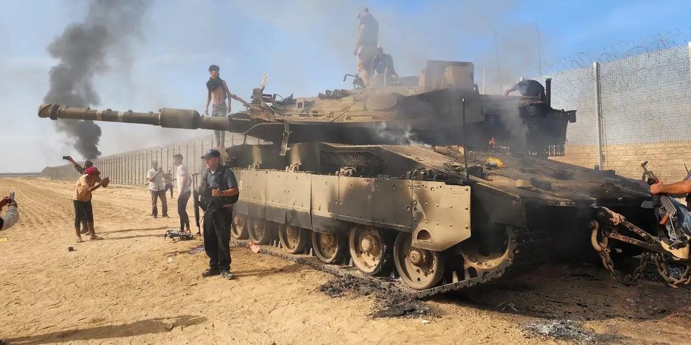

## Claim
Claim: " This image shows an Israeli tank unit near Jabalia camp in northern Gaza that was successfully ambushed by Hamas fighters, destroying multiple vehicles and injuring or killing their crews in October 2024."

## Actions
```
reverse_search()
```

## Evidence
### Evidence from `reverse_search`
The image  was found on two websites. One, from Defence Security Asia, published on June 30, 2024, discusses damage to Israeli armored vehicles and includes the image of a damaged tank . The other, from Defensemirror.com, published on November 8, 2023, discusses Hamas's use of the Yasin 105 missile to destroy Israeli tanks and features the image .

The Defensemirror.com article states that the image is credited to IRNA and that the Yasin 105 missile was first used in the "Al-Aqsa Flood" battle on October 7.


## Elaboration
The claim states that the image shows an Israeli tank unit near Jabalia camp in northern Gaza that was successfully ambushed by Hamas fighters in October 2024. However, the evidence indicates that the image was published on November 8, 2023, by Defensemirror.com, which discusses Hamas's use of the Yasin 105 missile to destroy Israeli tanks. The article credits the image to IRNA and states that the Yasin 105 missile was first used on October 7.

The evidence contradicts the claim's date of October 2024, as the image was published in November 2023. The evidence also does not mention the location of the tank near Jabalia camp or the ambush by Hamas fighters.

Therefore, the claim is not supported by the evidence.


## Final Judgement
The image was published in November 2023, and the claim states the event occurred in October 2024. The evidence also does not support the claim's details about the location and ambush.

`misleading`

### Verdict: MISLEADING

### Justification
The image in the claim was published in November 2023, as reported by [Defensemirror.com](https://www.defensemirror.com/2023/11/08/hamas-destroys-israeli-tanks-with-yasin-105-missile/), contradicting the claim's October 2024 date. The evidence also doesn't support the claim's details about the location and ambush.
