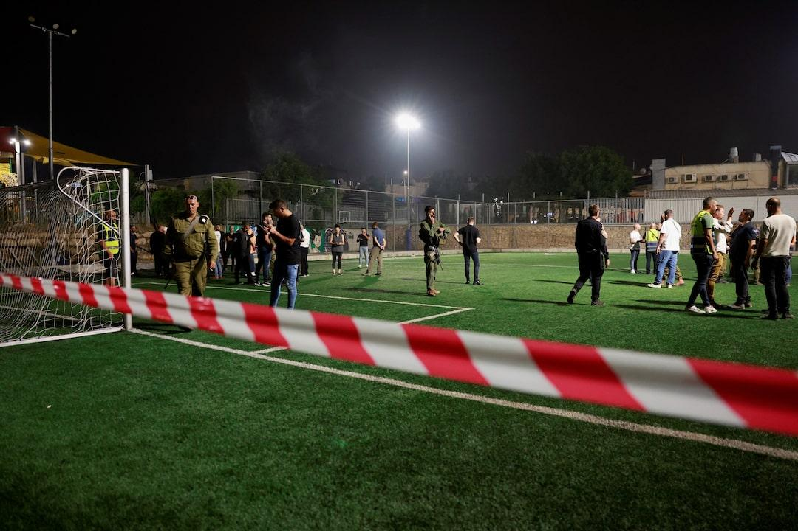

## Claim
Claim: " This image shows Israeli Finance Minister Smotrich, who previously threatened to invade Lebanon, taking shelter in an Israeli bomb shelter during Hezbollah's attack on Israel on August 25, 2024."

## Actions
```
reverse_search()
```

## Evidence
No new evidence found.

## Elaboration
I am unable to verify the claim because I have no information about the image. I need more information to determine if the image depicts Israeli Finance Minister Smotrich in a bomb shelter during a Hezbollah attack on August 25, 2024.


## Actions
```
web_search("Israeli Finance Minister Smotrich bomb shelter Hezbollah attack")
web_search("Hezbollah attack Israel August 25 2024")
```

## Evidence
### Evidence from `web_search`
The image  is old and was taken on October 7, 2023, during a government session in Tel Aviv when sirens sounded, according to an article from Kashif.ps ([https://kashif.ps/en/index.php/2024/08/25/old-photo-of-israeli-ministers-in-shelter-republished-as-during-hezbollahs-recent-bombing-of-sites-in-israel/](https://kashif.ps/en/index.php/2024/08/25/old-photo-of-israeli-ministers-in-shelter-republished-as-during-hezbollahs-recent-bombing-of-sites-in-israel/)). The article also mentions that the photo was shared on "X" on August 25, 2024, with the claim that it was taken during Hezbollah's recent bombing of sites in Israel.

CBS News ([https://www.cbsnews.com/news/golan-heights-attack-israel-hezbollah-airstrikes/](https://www.cbsnews.com/news/golan-heights-attack-israel-hezbollah-airstrikes/)) and Reuters ([https://www.reuters.com/world/middle-east/nine-people-killed-rocket-hits-football-pitch-israeli-occupied-golan-israel-2024-07-27/](https://www.reuters.com/world/middle-east/nine-people-killed-rocket-hits-football-pitch-israeli-occupied-golan-israel-2024-07-27/)) report on a Hezbollah rocket attack on a Golan Heights soccer field on July 27, 2024, which killed at least 12 children and teens ( and ). The articles mention Israeli Finance Minister Bezalel Smotrich.


### Evidence from `web_search`
The web sources discuss the August 25, 2024, attacks between Israel and Hezbollah. The attacks included air strikes, rocket barrages, and the closure of Ben-Gurion International Airport. Hezbollah claimed to have hit military bases, while the IDF claimed to have intercepted most of Hezbollah's rockets and drones. Casualties were reported on both sides. (<image:i>, )

The New York Times reported on the cross-border attacks, which were in response to the assassination of a Hezbollah commander. The ACLED Insight article mentions that one Israeli soldier, two Hezbollah fighters, and a Hezbollah-allied member of the Amal Movement were killed during the hostilities.


## Elaboration
The claim is false. The image 

## Final Judgement
The image in the claim is from October 7, 2023, and not from August 25, 2024, as the claim states. The image was taken during a government session in Tel Aviv when sirens sounded. Therefore, the claim misrepresents the context of the image.

`misleading`


### Verdict: MISLEADING

### Justification
The claim is misleading. The image used in the claim, depicting Israeli Finance Minister Smotrich, was taken on October 7, 2023, during a government session in Tel Aviv, and not on August 25, 2024, as the claim suggests, as reported by [Kashif.ps](https://kashif.ps/en/index.php/2024/08/25/old-photo-of-israeli-ministers-in-shelter-republished-as-during-hezbollahs-recent-bombing-of-sites-in-israel/).
