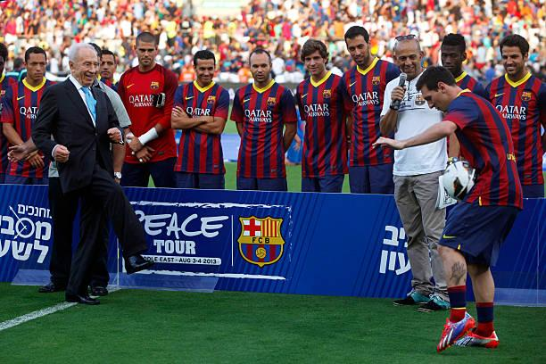
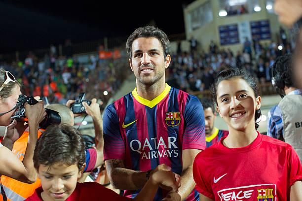
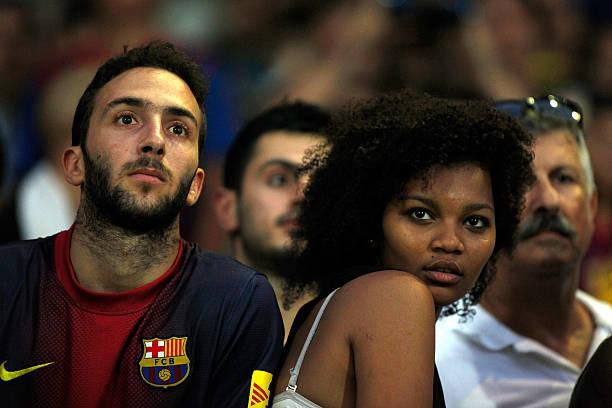

## Claim
Claim: " This image shows the President of FC Barcelona with Israel Embassy Representatives in September 2024 during the ongoing Gaza war."

## Actions
```
web_search("FC Barcelona Israel flag")
web_search("FC Barcelona Israel embassy representatives")
image_search("FC Barcelona president Israel flag")
```

## Evidence
### Evidence from `web_search`
The Jerusalem Post reported that Israeli diplomats presented FC Barcelona's president Joan Laporta with an Israeli flag on February 16, 2023.  Getty Images contains images of FC Barcelona players with Israeli officials and flags from 2013.  The New Arab published an article on September 11, 2023, discussing Barcelona's decision to reverse its decision to cut ties with Israel. 

The search results include images of FC Barcelona with Israeli flags and officials. , , , , , , , 


### Evidence from `web_search`
FC Barcelona's president, Joan Laporte, hosted representatives from the Israeli Embassy and was presented with an Israeli flag. This event occurred in February 2023, after Barcelona announced it would cut ties with Israel.

The sources are from i24NEWS ([https://www.i24news.tv/en/news/israel/diplomacy/1676623454-barcelona-soccer-team-sends-message-of-support-for-israel](https://www.i24news.tv/en/news/israel/diplomacy/1676623454-barcelona-soccer-team-sends-message-of-support-for-israel)) and Israel National News ([https://www.israelnationalnews.com/news/367604](https://www.israelnationalnews.com/news/367604)). The image shows the president of FC Barcelona with Israel Embassy Representatives holding an Israeli flag , , .


### Evidence from `image_search`
From [Source](https://www.fcbarcelona.com/en/club/news/2192444/joan-laporta-meets-with-isaac-herzog-president-of-israel): 
Content: FC Barcelona's president Joan Laporta met with Isaac Herzog, the President of Israel. 


## Elaboration
The claim is partially verifiable. The image does show the President of FC Barcelona, Joan Laporta, with representatives holding an Israeli flag. However, the evidence indicates this event occurred in February 2023, not September 2024. The evidence also does not explicitly state whether the Gaza war was ongoing at the time of the meeting.


## Final Judgement
The image is of FC Barcelona's president with Israeli representatives holding an Israeli flag. The event occurred in February 2023, not September 2024, as the claim states. Therefore, the claim is misleading because it misrepresents the date of the event.

`misleading`

### Verdict: MISLEADING

### Justification
The image depicts FC Barcelona's president with Israeli representatives holding an Israeli flag, which occurred in February 2023, not September 2024 as the claim suggests. Therefore, the claim is misleading due to the incorrect date.
