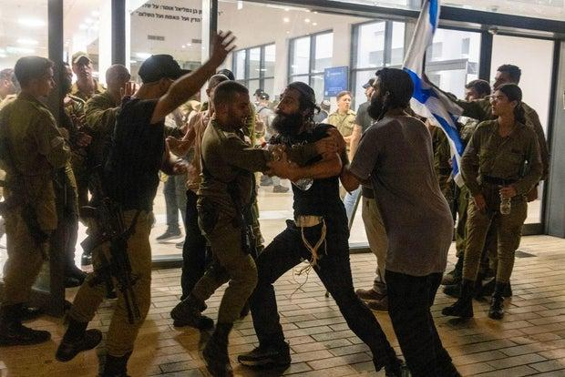

## Claim
Claim: " The image shows a screenshot of an authentic question from Israel's Channel 12 public opinion poll: 'Do you agree with the claim that a solder is allowed to rape a prisoner with his hands tied?'"

## Actions
```
web_search("Channel 12 poll soldier rape prisoner")
```

## Evidence
### Evidence from `web_search`
The search results include an article from Al Jazeera ([https://www.aljazeera.com/news/2024/8/9/everything-is-legitimate-israeli-leaders-defend-soldiers-accused-of-rape](https://www.aljazeera.com/news/2024/8/9/everything-is-legitimate-israeli-leaders-defend-soldiers-accused-of-rape)) discussing the gang rape of a Palestinian prisoner and the defense of the soldiers involved by some Israeli politicians. A Reuters fact-check ([https://www.inss.org.il/wp-content/uploads/2024/09/Fact-Check-Israeli-opinion-poll-mistranslated-as-saying-soldiers-%E2%80%98should-rape-prisoners-poll-conducted-by-Mora-Deitch-Rebecca-Meller-Idit-Shafran-and-Anat-Shapira-in-Reuters-for-site-.pdf](https://www.inss.org.il/wp-content/uploads/2024/09/Fact-Check-Israeli-opinion-poll-mistranslated-as-saying-soldiers-%E2%80%98should-rape-prisoners-poll-conducted-by-Mora-Deitch-Rebecca-Meller-Idit-Shafran-and-Anat-Shapira-in-Reuters-for-site-.pdf)) clarifies a mistranslation of an Israeli opinion poll, stating that the original poll did not ask about the acceptability of rape. A CBS News article ([https://www.cbsnews.com/news/israel-hamas-war-idf-palestinian-prisoner-alleged-rape-sde-teinman-abuse-protest/](https://www.cbsnews.com/news/israel-hamas-war-idf-palestinian-prisoner-alleged-rape-sde-teinman-abuse-protest/)) discusses the detention of IDF reservists suspected of rape and abuse, and mentions that some senior government officials justified the abuse.

The Al Jazeera article includes images , . The Reuters fact-check includes an image . The CBS News article includes images , .


## Elaboration
The evidence suggests the claim is based on a mistranslation. The Reuters fact-check ([https://www.inss.org.il/wp-content/uploads/2024/09/Fact-Check-Israeli-opinion-poll-mistranslated-as-saying-soldiers-%E2%80%98should-rape-prisoners-poll-conducted-by-Mora-Deitch-Rebecca-Meller-Idit-Shafran-and-Anat-Shapira-in-Reuters-for-site-.pdf](https://www.inss.org.il/wp-content/uploads/2024/09/Fact-Check-Israeli-opinion-poll-mistranslated-as-saying-soldiers-%E2%80%98should-rape-prisoners-poll-conducted-by-Mora-Deitch-Rebecca-Meller-Idit-Shafran-and-Anat-Shapira-in-Reuters-for-site-.pdf)) clarifies that the original poll did not ask about the acceptability of rape. The image in the claim is present in the Reuters fact-check.


## Final Judgement
The claim misrepresents the content of the poll. The original poll's question was mistranslated, leading to a false interpretation.

`misleading`


### Verdict: MISLEADING

### Justification
The claim is misleading. A Reuters fact-check ([https://www.inss.org.il/wp-content/uploads/2024/09/Fact-Check-Israeli-opinion-poll-mistranslated-as-saying-soldiers-%E2%80%98should-rape-prisoners-poll-conducted-by-Mora-Deitch-Rebecca-Meller-Idit-Shafran-and-Anat-Shapira-in-Reuters-for-site-.pdf](https://www.inss.org.il/wp-content/uploads/2024/09/Fact-Check-Israeli-opinion-poll-mistranslated-as-saying-soldiers-%E2%80%98should-rape-prisoners-poll-conducted-by-Mora-Deitch-Rebecca-Meller-Idit-Shafran-and-Anat-Shapira-in-Reuters-for-site-.pdf)) reveals that the poll's question was mistranslated, and the original poll did not ask about the acceptability of rape.
