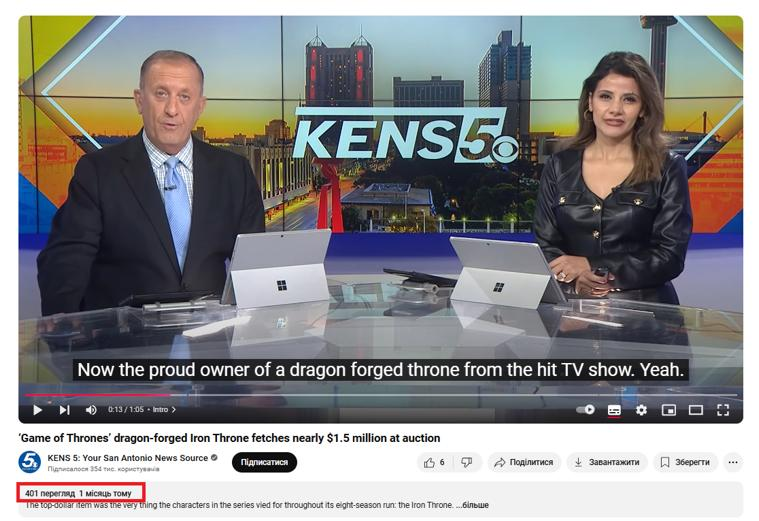

## Claim
Claim: "Ukrainian President Volodymyr Zelenskyy purchased an 88 million euro hotel in the Courchevel ski resort in France."

## Actions
```
web_search("Volodymyr Zelenskyy Courchevel hotel")
```

## Evidence
### Evidence from `web_search`
The claim that Volodymyr Zelenskyy purchased an 88 million euro hotel in Courchevel, France, is false. According to [Myth Detector](https://mythdetector.com/en/that-volodymyr-zelenskyy/), the information originated from anonymous Russian-language accounts and a questionable French-language media outlet. [Inshorts](https://inshorts.com/en/news/posts-falsely-claim-zelenskyy-bought-88-mn-euro-hotel-in-france----1734106048310) also reports that posts on Facebook and X falsely made this claim.

[Ukrinform.net](https://www.ukrinform.net/rubric-factcheck/3935929-russian-propaganda-falsely-claims-zelensky-bought-french-hotel-kulebas-son-acquired-iron-throne.html) states that Russian media falsely claimed Zelenskyy purchased the Palace des Neiges hotel, originating from a video created by "French journalists" and a cloned website. , , , 


## Elaboration
The claim is false. Multiple sources, including Myth Detector ([https://mythdetector.com/en/that-volodymyr-zelenskyy/](https://mythdetector.com/en/that-volodymyr-zelenskyy/)) and Inshorts ([https://inshorts.com/en/news/posts-falsely-claim-zelenskyy-bought-88-mn-euro-hotel-in-france----1734106048310](https://inshorts.com/en/news/posts-falsely-claim-zelenskyy-bought-88-mn-euro-hotel-in-france----1734106048310)), have debunked the claim, citing its origin in anonymous Russian-language accounts and questionable media sources.

The information was spread through social media posts on Facebook and X. Furthermore, Ukrinform.net ([https://www.ukrinform.net/rubric-factcheck/3935929-russian-propaganda-falsely-claims-zelensky-bought-french-hotel-kulebas-son-acquired-iron-throne.html](https://www.ukrinform.net/rubric-factcheck/3935929-russian-propaganda-falsely-claims-zelensky-bought-french-hotel-kulebas-son-acquired-iron-throne.html)) indicates that the false claim was related to the Palace des Neiges hotel and originated from a video created by "French journalists" and a cloned website.


## Final Judgement
The claim that Volodymyr Zelenskyy purchased an 88 million euro hotel in Courchevel, France, is demonstrably false. Multiple sources, including Myth Detector and Inshorts, have debunked the claim, citing its origin in anonymous Russian-language accounts and questionable media sources. The information was spread through social media posts on Facebook and X.

`false`

### Verdict: FALSE

### Justification
The claim that Volodymyr Zelenskyy purchased an 88 million euro hotel in Courchevel, France, is false. Fact-checkers, including [Myth Detector](https://mythdetector.com/en/that-volodymyr-zelenskyy/) and [Inshorts](https://inshorts.com/en/news/posts-falsely-claim-zelenskyy-bought-88-mn-euro-hotel-in-france----1734106048310), have debunked the claim, tracing its origins to anonymous Russian-language accounts and questionable media outlets.
