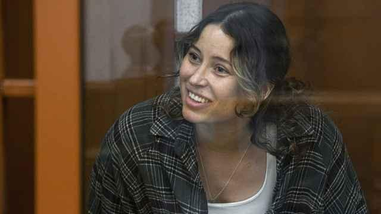
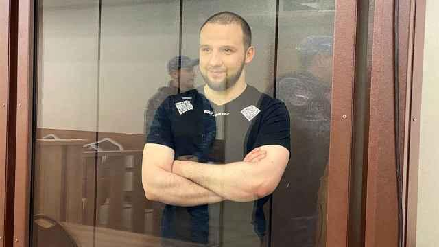
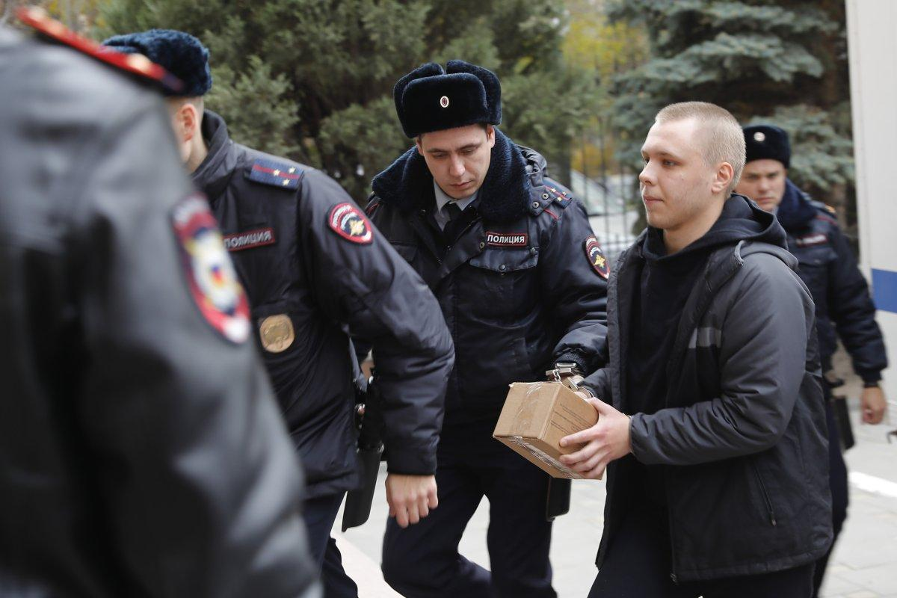

## Claim
Claim: "In November 2024 Russia sentenced a man to 14 years in prison for burning the Quran."

## Actions
```
web_search("Russia sentence man burn Quran November 2024")
```

## Evidence
### Evidence from `web_search`
On November 25, 2024, The Moscow Times reported that Nikita Zhuravel was sentenced to an additional 13 years and six months in prison for treason, bringing his total sentence to 14 years. He was previously sentenced to 3.5 years for burning the Quran (, , ). U.S. News & World Report also reported on November 25, 2024, that Zhuravel was sentenced to 14 years for treason, while also serving time for burning a Quran (<image:k>).

Newsweek reported on November 14, 2024, that Zhuravel is serving a 3.5-year sentence for burning a Quran and was beaten while in pretrial custody ().

*   [https://www.themoscowtimes.com/2024/11/25/russian-man-jailed-for-quran-burning-sentenced-to-135-more-years-in-prison-for-treason-a87123](https://www.themoscowtimes.com/2024/11/25/russian-man-jailed-for-quran-burning-sentenced-to-135-more-years-in-prison-for-treason-a87123)
*   [https://www.usnews.com/news/world/articles/2024-11-25/russian-man-jailed-for-burning-koran-sentenced-to-14-years-on-separate-ukraine-treason-charge](https://www.usnews.com/news/world/articles/2024-11-25/russian-man-jailed-for-burning-koran-sentenced-to-14-years-on-separate-ukraine-treason-charge)
*   [https://www.newsweek.com/nikita-zhuravel-trial-treason-russia-ukriane-war-1985947](https://www.newsweek.com/nikita-zhuravel-trial-treason-russia-ukriane-war-1985947)


## Elaboration
The evidence indicates that Nikita Zhuravel was sentenced in November 2024. He received a 3.5-year sentence for burning the Quran. Later, he was sentenced to an additional 13 years and six months for treason, resulting in a total sentence of 14 years.


## Final Judgement
The claim is accurate. Multiple reliable sources confirm that Nikita Zhuravel was sentenced in November 2024. He received a 3.5-year sentence for burning the Quran and a 14-year sentence for treason. `true`

### Verdict: TRUE

### Justification
In November 2024, Nikita Zhuravel was sentenced to 3.5 years in prison for burning the Quran. He was later sentenced to an additional 13 years and six months for treason, bringing his total sentence to 14 years, as reported by sources such as *The Moscow Times* ([https://www.themoscowtimes.com/2024/11/25/russian-man-jailed-for-quran-burning-sentenced-to-135-more-years-in-prison-for-treason-a87123](https://www.themoscowtimes.com/2024/11/25/russian-man-jailed-for-quran-burning-sentenced-to-135-more-years-in-prison-for-treason-a87123)) and *U.S. News & World Report* ([https://www.usnews.com/news/world/articles/2024-11-25/russian-man-jailed-for-burning-koran-sentenced-to-14-years-on-separate-ukraine-treason-charge](https://www.usnews.com/news/world/articles/2024-11-25/russian-man-jailed-for-burning-koran-sentenced-to-14-years-on-separate-ukraine-treason-charge)).
