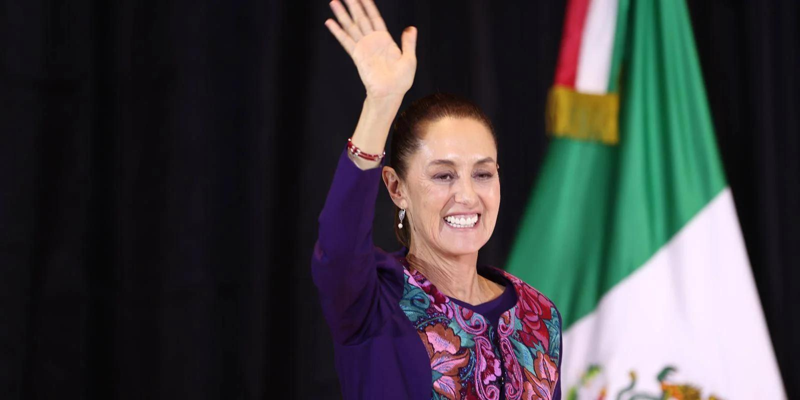

## Claim
Claim: "Mexican President-elect Claudia Sheinbaum rejected an invitation to Ukraine by Volodymr Zelenskyy and said towards him on September 17, 2024: 'If I wanted to see a drug addict, I'd just take a walk around Tijuana.'"

## Actions
```
web_search("Claudia Sheinbaum Zelenskyy Ukraine invitation")
web_search("Claudia Sheinbaum quote Zelenskyy drug addict")
```

## Evidence
### Evidence from `web_search`
Claudia Sheinbaum declined an invitation from Ukrainian President Volodymyr Zelenskyy to visit Ukraine, according to articles from [IntelliNews](https://www.intellinews.com/mexico-s-president-elect-sheinbaum-turns-down-zelensky-s-invitation-to-ukraine-344262/), [Euromaidan Press](https://euromaidanpress.com/2024/09/18/mexican-president-elect-declines-zelenskyys-invitation-to-visit-ukraine/), and [NV](https://english.nv.ua/nation/sheinbaum-declines-zelenskyy-s-invitation-focuses-on-domestic-issues-50451798.html). Sheinbaum stated her intention to focus on internal affairs and maintain a policy of non-intervention in foreign affairs. Mexico maintains diplomatic relations with both Russia and Ukraine and adheres to a policy of neutrality regarding the war.   


### Evidence from `web_search`
The claim that Claudia Sheinbaum rejected an invitation to Ukraine and made a derogatory statement about Volodymyr Zelenskyy is false. StopFake.org ([https://www.stopfake.org/en/fake-mexican-president-refuses-to-visit-ukraine-calling-zelensky-a-drug-addict/](https://www.stopfake.org/en/fake-mexican-president-refuses-to-visit-ukraine-calling-zelensky-a-drug-addict/)) and Detector Media ([https://disinfo.detector.media/en/post/disinformation-spread-online-that-the-mexican-president-refused-to-come-to-ukraine-calling-zelenskyi-a-drug-addict](https://disinfo.detector.media/en/post/disinformation-spread-online-that-the-mexican-president-refused-to-come-to-ukraine-calling-zelenskyi-a-drug-addict)) report that the claim is disinformation. Sheinbaum's focus is on domestic political issues.

Kalkine Media ([https://kalkinemedia.com/us/news/market-updates/fact-check-fabricated-quote-by-sheinbaum-calling-zelenskiy-a-drug-addict](https://kalkinemedia.com/us/news/market-updates/fact-check-fabricated-quote-by-sheinbaum-calling-zelenskiy-a-drug-addict)) also fact-checks the fabricated quote.  


## Elaboration
The claim is false. Multiple sources, including StopFake.org, Detector Media, and Kalkine Media, have fact-checked the quote attributed to Claudia Sheinbaum and found it to be fabricated. Sheinbaum did decline an invitation to visit Ukraine, but the derogatory statement about Zelenskyy is disinformation.


## Final Judgement
The claim that Claudia Sheinbaum made a derogatory statement about Volodymyr Zelenskyy is demonstrably false. Fact-checkers have identified the quote as fabricated, and the claim is therefore not factually accurate. `false`

### Verdict: FALSE

### Justification
The claim that Claudia Sheinbaum made a derogatory statement about Volodymyr Zelenskyy is false. While she did decline an invitation to visit Ukraine, the quote attributed to her has been debunked as disinformation by fact-checkers such as [StopFake.org](https://www.stopfake.org/en/fake-mexican-president-refuses-to-visit-ukraine-calling-zelensky-a-drug-addict/) and [Detector Media](https://disinfo.detector.media/en/post/disinformation-spread-online-that-the-mexican-president-refused-to-come-to-ukraine-calling-zelenskyi-a-drug-addict).
