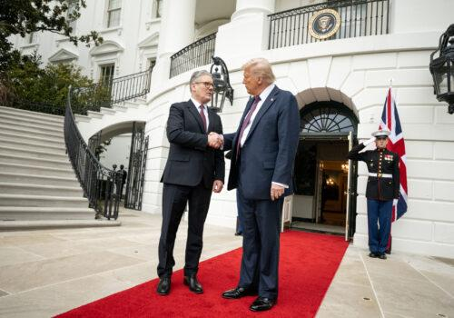
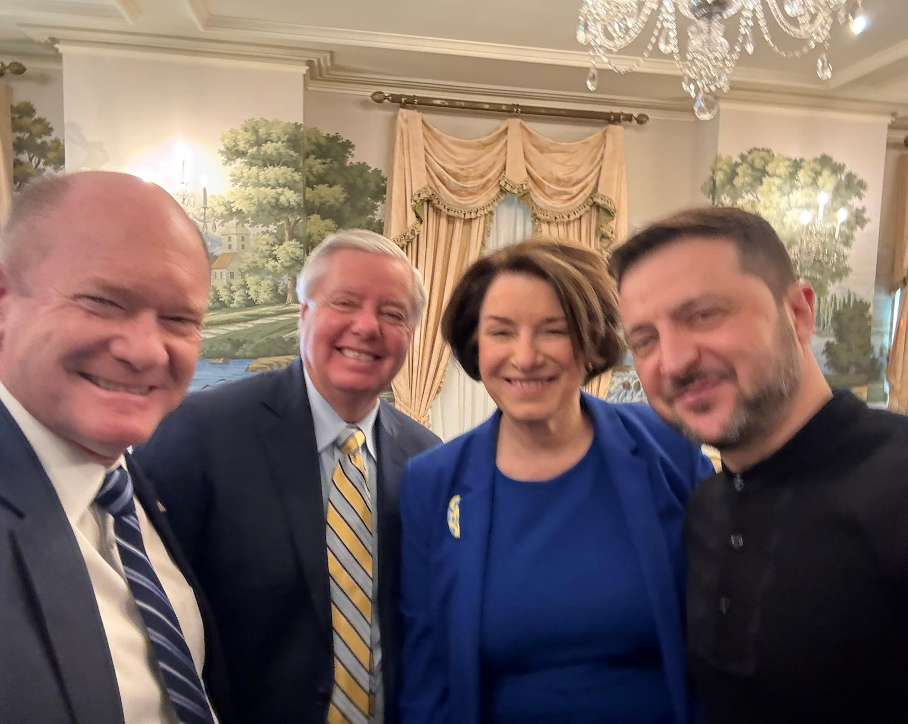

## Claim
Claim: "On Feb. 28, 2025, before a meeting with U.S. President Donald Trump, Ukraine President Volodymyr Zelenskyy met with Democrats."

## Actions
```
web_search("Volodymyr Zelenskyy Donald Trump meeting February 2025")
web_search("Volodymyr Zelenskyy meeting Democrats February 2025")
```

## Evidence
### Evidence from `web_search`
On February 28, 2025, Volodymyr Zelenskyy met with Donald Trump in the Oval Office, as reported by a Wikipedia article ([https://en.wikipedia.org/wiki/2025_Trump%E2%80%93Zelenskyy_Oval_Office_meeting](https://en.wikipedia.org/wiki/2025_Trump%E2%80%93Zelenskyy_Oval_Office_meeting)) <image:i>. The meeting was contentious, and Senator Lindsey Graham advised Zelenskyy to focus on the minerals agreement.

NPR ([https://www.npr.org/2025/02/28/nx-s1-5313079/trump-zelenskyy-meeting](https://www.npr.org/2025/02/28/nx-s1-5313079/trump-zelenskyy-meeting)) also reported on the meeting, mentioning criticism from top Democratic lawmakers , . The Atlantic Council ([https://www.atlanticcouncil.org/content-series/fastthinking/the-trump-zelenskyy-meeting-just-blew-up-what-now/](https://www.atlanticcouncil.org/content-series/fastthinking/the-trump-zelenskyy-meeting-just-blew-up-what-now/)) discussed the meeting and noted that Zelenskyy met with European leaders afterward .


### Evidence from `web_search`
On February 28, 2025, Volodymyr Zelenskyy met with a bipartisan delegation of the U.S., as reported by Yahoo News ([https://www.yahoo.com/news/fact-check-zelenskyy-met-democrats-205100784.html](https://www.yahoo.com/news/fact-check-zelenskyy-met-democrats-205100784.html)) . Zelenskyy posted a video of the meeting on X. The article discusses claims that Democrats persuaded Zelenskyy to reject a deal. Zelenskyy said they discussed his upcoming meeting with President Trump.

ABC News reports that on March 1, 2025, a group of bipartisan senators, including Chris Coons and Amy Klobuchar, met with Ukrainian President Volodymyr Zelenskyy before his meeting with Donald Trump on February 28, 2025 ([https://abcnews.go.com/Politics/zelenskyy-meets-bipartisan-group-senators-ahead-tense-white/story?id=119305439](https://abcnews.go.com/Politics/zelenskyy-meets-bipartisan-group-senators-ahead-tense-white/story?id=119305439)). , 


## Elaboration
The claim is accurate. According to the evidence, Volodymyr Zelenskyy met with a bipartisan delegation of U.S. officials, including Democrats, before his meeting with Donald Trump on February 28, 2025. ABC News confirms that Zelenskyy met with a bipartisan group of senators before the Trump meeting.


## Final Judgement
The evidence confirms that Volodymyr Zelenskyy met with a bipartisan group of U.S. officials, including Democrats, before his meeting with Donald Trump on February 28, 2025. This is supported by multiple sources, including ABC News and Yahoo News.

`true`


### Verdict: TRUE

### Justification
The claim is accurate. Evidence from sources like [ABC News](https://abcnews.go.com/Politics/zelenskyy-meets-bipartisan-group-senators-ahead-tense-white/story?id=119305439) and [Yahoo News](https://www.yahoo.com/news/fact-check-zelenskyy-met-democrats-205100784.html) confirms that Volodymyr Zelenskyy met with a bipartisan group of U.S. officials, including Democrats, before his meeting with Donald Trump on February 28, 2025.
