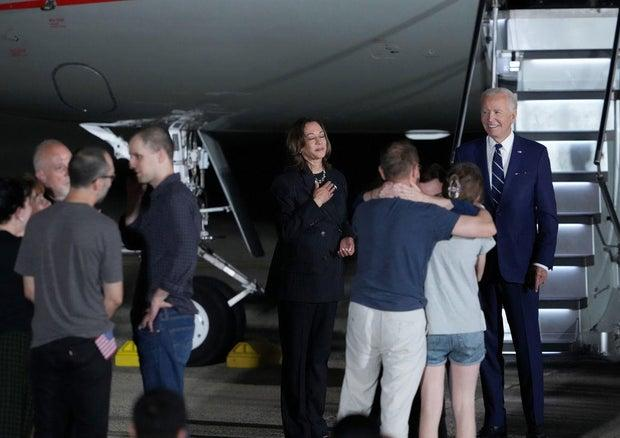
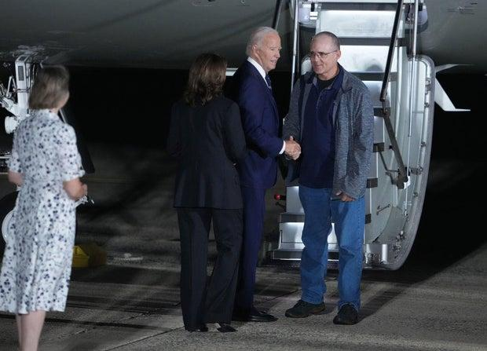

## Claim
Claim: "In August 2024 U.S. President Joe Biden boarded an empty plane after three freed Americans arrived back in the U.S. and exited the aircraft."

## Actions
```
web_search("Joe Biden empty plane August 2024")
web_search("Joe Biden freed Americans plane August 2024")
```

## Evidence
### Evidence from `web_search`
The Times of India published an article on August 3, 2024, stating that Joe Biden entered an empty plane carrying American prisoners from Russia and remained on the plane for about two minutes. The White House clarified that Biden wanted to thank the flight crew. ([https://timesofindia.indiatimes.com/world/us/did-joe-biden-enter-empty-plane-carrying-russian-prisoners-white-house-clarifies/articleshow/112249634.cms](https://timesofindia.indiatimes.com/world/us/did-joe-biden-enter-empty-plane-carrying-russian-prisoners-white-house-clarifies/articleshow/112249634.cms)) 

Yahoo News published an article on August 1, 2024, discussing a claim that Joe Biden boarded an empty plane after three freed Americans arrived back in the U.S. The article states that Biden boarded the plane to speak to the people who helped bring the three freed prisoners home. ([https://www.yahoo.com/news/fact-check-no-biden-did-000500209.html](https://www.yahoo.com/news/fact-check-no-biden-did-000500209.html))  The Guardian published an article on August 1, 2024, reporting on the release of Evan Gershkovich and other Americans from Russian prisons, mentioning that President Joe Biden and Vice President Kamala Harris greeted the freed Americans upon their arrival in the US. ([https://www.theguardian.com/world/live/2024/aug/01/russia-prison-swap-us-journalist-evan-gershkovich-wsj-vadim-krasikov-live?filterKeyEvents=false&page=with%3Ablock-66aba9e68f08a0af63bb3f00](https://www.theguardian.com/world/live/2024/aug/01/russia-prison-swap-us-journalist-evan-gershkovich-wsj-vadim-krasikov-live?filterKeyEvents=false&page=with%3Ablock-66aba9e68f08a0af63bb3f00)) 


### Evidence from `web_search`
In August 2024, President Joe Biden and Vice President Kamala Harris welcomed three Americans freed by Russia at Joint Base Andrews in Maryland. The three Americans, Paul Whelan, Evan Gershkovich, and Alsu Kurmasheva, were greeted by Biden and Harris on the tarmac after deplaning.

Sources: [CBS News](https://www.cbsnews.com/news/us-russia-prisoner-swap-biden-harris-welcome-paul-whelan-evan-gershkovich/), [ABC News](https://www.abc.net.au/news/2024-08-02/biden-meets-with-freed-americans-in-major-russia-prisoner-swap/104174404), and [The New York Times](https://www.nytimes.com/2024/08/02/us/politics/biden-greeting-freed-prisoners.html). , , , , , 


## Elaboration
The claim is partially supported by the evidence. Multiple sources confirm that Joe Biden was present when the freed Americans arrived in the U.S. in August 2024. The evidence also indicates that Biden boarded the plane. However, the evidence does not explicitly state that the plane was empty when Biden boarded it. The Times of India article states that Biden entered an empty plane, but the Yahoo News article suggests that Biden boarded the plane to speak to the people who helped bring the freed prisoners home.

Therefore, the claim is likely true, but the exact reason for Biden boarding the plane is not entirely clear.


## Final Judgement
The evidence confirms that Joe Biden was present when the freed Americans arrived and that he boarded the plane. While one source states the plane was empty, another suggests he boarded to speak to those who helped bring the prisoners home.

`true`


### Verdict: TRUE

### Justification
The claim is supported by evidence that Joe Biden boarded a plane after three freed Americans arrived in the U.S. in August 2024. Sources such as the [Times of India](https://timesofindia.indiatimes.com/world/us/did-joe-biden-enter-empty-plane-carrying-russian-prisoners-white-house-clarifies/articleshow/112249634.cms) and [Yahoo News](https://www.yahoo.com/news/fact-check-no-biden-did-000500209.html) confirm this, with the former stating the plane was empty and the latter suggesting Biden boarded to speak to those who helped bring the prisoners home.
