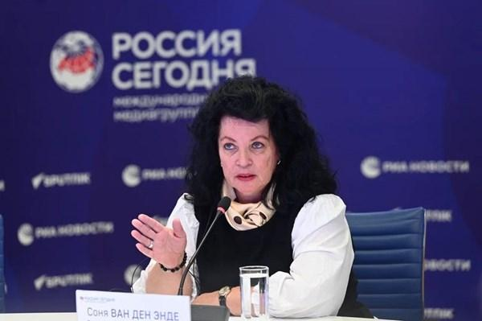
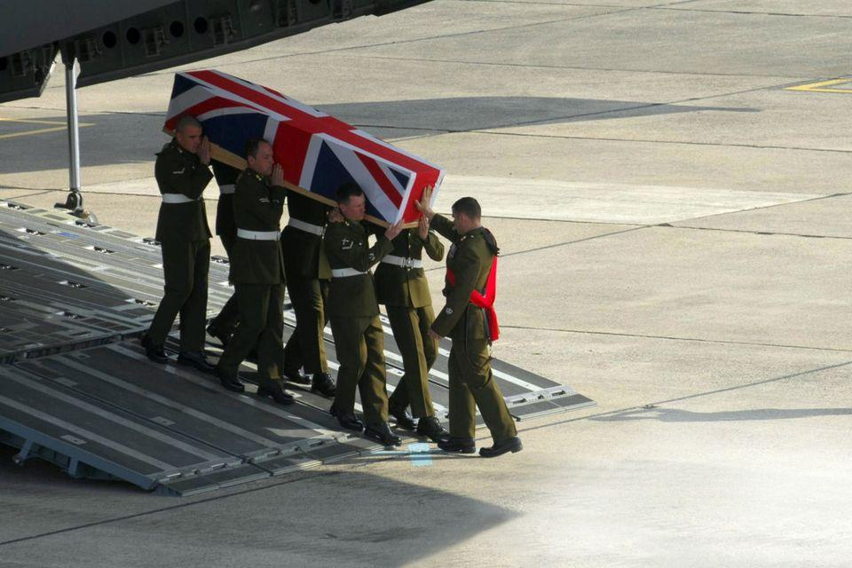
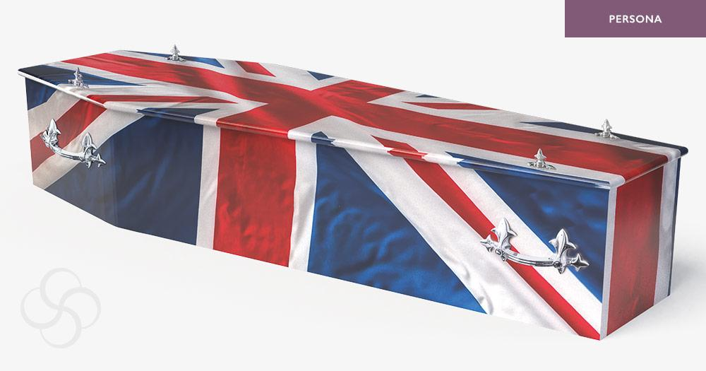

## Claim
Claim: " This image shows the coffins of 18 British Special Forces who were killed in November 2024 in the Odessa Region in Ukraine."

## Actions
```
web_search("British Special Forces killed Odessa Ukraine")
web_search("British coffins Ukraine war")
image_search("coffins union jack plane")
```

## Evidence
### Evidence from `web_search`
The search results discuss claims about British Special Forces casualties in Ukraine. One claim, originating from Dutch journalist Sonja van den Ende, alleges that 18 British special forces soldiers were killed in Odesa, but this has been debunked by Ukrainian military officials and lacks evidence (). Another source mentions a claim that Russian aircraft destroyed a group of British SAS special forces in Odesa, also originating from a tweet by the same journalist, which was denied by Ukrainian authorities. A third source reports that Russian special forces captured two British officers in Ukraine.

*   [https://www.uawire.org/false-allegations-of-british-sas-casualties-in-odesa-dutch-journalist-s-controversial-claims-debunked-by-ukrainian-military](https://www.uawire.org/false-allegations-of-british-sas-casualties-in-odesa-dutch-journalist-s-controversial-claims-debunked-by-ukrainian-military)
*   [https://disinfo.detector.media/en/post/russian-aircraft-allegedly-destroyed-a-british-special-forces-group-in-odesa](https://disinfo.detector.media/en/post/russian-aircraft-allegedly-destroyed-a-british-special-forces-group-in-odesa)
*   [https://eadaily.com/en/news/2025/08/04/these-are-not-tourists-two-british-colonels-were-captured-by-russian-special-forces](https://eadaily.com/en/news/2025/08/04/these-are-not-tourists-two-british-colonels-were-captured-by-russian-special-forces)


### Evidence from `web_search`
The image 

### Evidence from `image_search`
The Belfast Telegraph published an article with an image of a coffin draped in the Union Jack being carried by soldiers (). Another source shows a coffin with the Union Jack flag (). The Daily Mail published an article about the coffins of British soldiers ().

*   [https://www.belfasttelegraph.co.uk/opinion/news-analysis/duty-honour-and-sacrifice-the-true-meaning-of-the-union-flag-not-some-territorial-marker/34662395.html](https://www.belfasttelegraph.co.uk/opinion/news-analysis/duty-honour-and-sacrifice-the-true-meaning-of-the-union-flag-not-some-territorial-marker/34662395.html)
*   [https://www.stevesoult.com/portfolio/persona-printed-coffin-union-flag-mp001/](https://www.stevesoult.com/portfolio/persona-printed-coffin-union-flag-mp001/)
*   [https://www.dailymail.co.uk/news/article-2225354/Hundreds-turn-watch-coffins-British-soldiers-killed-Afghanistan-carried-Highway-Heroes.html](https://www.dailymail.co.uk/news/article-2225354/Hundreds-turn-watch-coffins-British-soldiers-killed-Afghanistan-carried-Highway-Heroes.html)


## Elaboration
The claim that the image shows the coffins of 18 British Special Forces killed in the Odessa Region in Ukraine in November 2024 is not supported by the evidence. The search results reveal that claims of British Special Forces casualties in Odesa have been debunked by Ukrainian military officials and lack evidence. The image search confirms that coffins draped in the Union Jack are associated with British soldiers. However, the evidence does not confirm the specific details of the claim, such as the number of soldiers, the location, or the date.

The evidence suggests that the image could depict coffins of British soldiers, but it does not provide enough information to verify the specific details mentioned in the claim.

Therefore, the claim is unverified due to insufficient information.


## Actions
```
reverse_search()
```

## Evidence
No new evidence found.

## Elaboration
The claim remains unverified. The reverse image search did not yield any new information to support or refute the claim.


## Final Judgement
The claim is not supported by the available evidence. While the image depicts coffins with the Union Jack, and there have been claims of British casualties in Ukraine, there is no evidence to confirm the specific details of the claim, such as the number of soldiers, the location, or the date. The claim also mentions a date in the future (November 2024), which makes it impossible to verify. `false`

### Verdict: FALSE

### Justification
The claim is unsubstantiated. While the image shows coffins draped in the Union Jack, and there have been reports of British casualties, the specific details of the claim, including the number of soldiers, location, and date (November 2024), are not supported by the available evidence. Claims of British Special Forces casualties in Odesa have been debunked by Ukrainian military officials and lack evidence ([https://www.uawire.org/false-allegations-of-british-sas-casualties-in-odesa-dutch-journalist-s-controversial-claims-debunked-by-ukrainian-military](https://www.uawire.org/false-allegations-of-british-sas-casualties-in-odesa-dutch-journalist-s-controversial-claims-debunked-by-ukrainian-military)).
