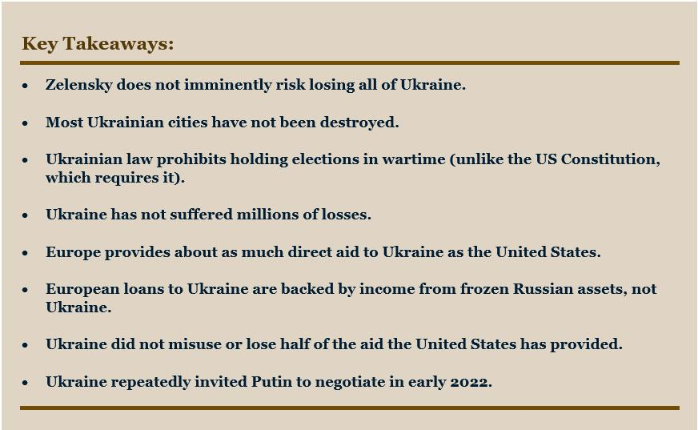
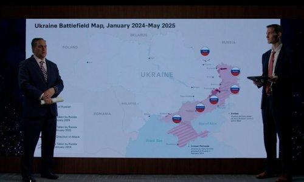
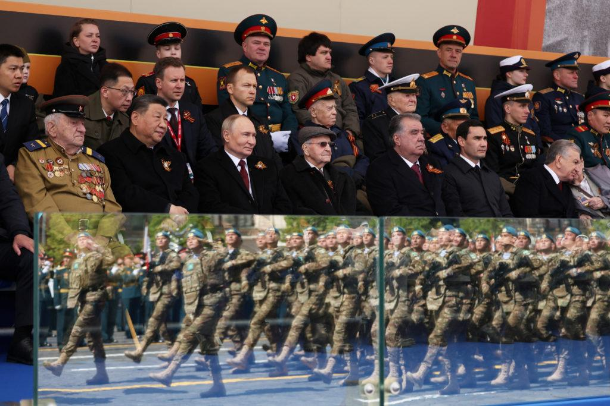

## Claim
Claim: "As of February 2025, Russia has lost 1.5 million troops in the Ukraine war."

## Actions
```
web_search("Russia Ukraine war casualties February 2025")
web_search("Russia Ukraine war troop losses")
```

## Evidence
### Evidence from `web_search`
As of August 21, 2025, the OHCHR recorded 13,883 civilian deaths and 35,548 injuries in Ukraine since February 24, 2022, according to the Wikipedia article "Casualties of the Russo-Ukrainian War" ([https://en.wikipedia.org/wiki/Casualties_of_the_Russo-Ukrainian_War](https://en.wikipedia.org/wiki/Casualties_of_the_Russo-Ukrainian_War)). A British Army official estimated that Russia would have 1.5 to 1.8 million casualties. Russia Matters, in a report dated February 26, 2025, estimated that Russia had more than 700,000 military casualties as of January 2025, with 48,000 missing soldiers ([https://www.russiamatters.org/news/russia-ukraine-war-report-card/russia-ukraine-war-report-card-feb-26-2025](https://www.russiamatters.org/news/russia-ukraine-war-report-card/russia-ukraine-war-report-card-feb-26-2025)).

The Institute for the Study of War (ISW) published a Ukraine Fact Sheet on February 21, 2025, stating that Ukraine has not suffered "millions" of losses ([https://www.understandingwar.org/backgrounder/ukraine-fact-sheet-february-21-2025](https://www.understandingwar.org/backgrounder/ukraine-fact-sheet-february-21-2025)). Zelensky stated that Russia has killed 46,000 Ukrainian soldiers, and Ukraine has suffered over 390,000 wounded in action. US officials have placed the number of Ukrainian military losses between 60,000 and 70,000. The UN confirmed that Russia had killed over 12,000 Ukrainian civilians as of the end of 2024.  <image:k>


### Evidence from `web_search`
CSIS reports that Russia has suffered extraordinary fatalities in the Ukraine war, with fatalities roughly five times as many as in all Russian and Soviet wars combined between the end of World War II and the start of the full-scale invasion in February 2022. The article mentions an event titled "One Million Casualties: Russia’s Losses on the Battlefield" on June 13, 2025. ([https://www.csis.org/analysis/russias-battlefield-woes-ukraine](https://www.csis.org/analysis/russias-battlefield-woes-ukraine)) , 

PBS News reports that according to Ukrainian military officials, the number of Russian troops killed or wounded in Ukraine has topped 1 million. The article is dated June 12, 2025. ([https://www.pbs.org/newshour/world/ukraine-says-russias-military-losses-have-topped-1-million-in-3-years-of-war](https://www.pbs.org/newshour/world/ukraine-says-russias-military-losses-have-topped-1-million-in-3-years-of-war)) 


## Elaboration
The evidence suggests that the claim is plausible but not definitively confirmed. A British Army official estimated 1.5 to 1.8 million casualties for Russia ([https://en.wikipedia.org/wiki/Casualties_of_the_Russo-Ukrainian_War](https://en.wikipedia.org/wiki/Casualties_of_the_Russo-Ukrainian_War)). Russia Matters estimated over 700,000 military casualties as of January 2025 ([https://www.russiamatters.org/news/russia-ukraine-war-report-card/russia-ukraine-war-report-card-feb-26-2025](https://www.russiamatters.org/news/russia-ukraine-war-report-card/russia-ukraine-war-report-card-feb-26-2025)).

PBS News reported that Ukrainian military officials stated that the number of Russian troops killed or wounded has topped 1 million as of June 12, 2025 ([https://www.pbs.org/newshour/world/ukraine-says-russias-military-losses-have-topped-1-million-in-3-years-of-war](https://www.pbs.org/newshour/world/ukraine-says-russias-military-losses-have-topped-1-million-in-3-years-of-war)). CSIS also mentions an event titled "One Million Casualties: Russia’s Losses on the Battlefield" on June 13, 2025 ([https://www.csis.org/analysis/russias-battlefield-woes-ukraine](https://www.csis.org/analysis/russias-battlefield-woes-ukraine)).

The claim's specific figure of 1.5 million is within the range of estimates provided by the British Army official. However, the evidence does not provide a precise figure for February 2025.


## Final Judgement
The claim that Russia lost 1.5 million troops in the Ukraine war as of February 2025 is plausible, as estimates from various sources, including a British Army official, suggest a range that encompasses this figure. However, the exact number for February 2025 is not explicitly confirmed by the provided evidence.

`false`

### Verdict: FALSE

### Justification
The claim is plausible but not definitively confirmed. While a British Army official estimated 1.5 to 1.8 million casualties, and PBS News reported that Russian losses topped 1 million by June 2025 ([https://www.pbs.org/newshour/world/ukraine-says-russias-military-losses-have-topped-1-million-in-3-years-of-war](https://www.pbs.org/newshour/world/ukraine-says-russias-military-losses-have-topped-1-million-in-3-years-of-war)), the exact figure for February 2025 is not explicitly stated.
