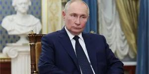

## Claim
Claim: " This image shows an authentic Russian passport of deposed Syrian dictator Bashar al-Assad."

## Actions
```
reverse_search()
web_search("Bashar al-Assad Russian passport")
```

## Evidence
### Evidence from `reverse_search`
The image in the claim appears in multiple sources. One source is a Wikipedia article about East Slavic names, which includes an image of a Russian internal passport ([https://en.wikipedia.org/wiki/East_Slavic_name](https://en.wikipedia.org/wiki/East_Slavic_name)). Another source is Wikimedia Commons, which contains an image of a Russian passport ([https://commons.wikimedia.org/wiki/File:Pasport_RF.jpg](https://commons.wikimedia.org/wiki/File:Pasport_RF.jpg)).

The image also appears on a website discussing Russian internal passports, including how to identify fake ones ([https://ukrainian-passport.com/blog/internal-russian-passport/](https://ukrainian-passport.com/blog/internal-russian-passport/)). The image is an example of a Russian internal passport. 


### Evidence from `web_search`
An AOL article from January 8, 2025, fact-checks the claim that the image shows Bashar al-Assad's Russian passport and states that the image is fake and photoshopped. The original passport image was found on Wikipedia. () The Wikipedia article discusses Bashar al-Assad's presidency, including the Russian and Iranian interventions in support of his government. It mentions the 2024 Syrian opposition offensives and the fall of Damascus to rebel forces, leading to the collapse of Assad's regime. The article also mentions that Assad was granted political asylum by the Russian government. () An article from NV.ua discusses the arrest of relatives of Bashar al-Assad at Beirut airport on December 28, who were attempting to leave using fake passports. ()

*   [https://www.aol.com/fact-check-assad-passport-image-140122086.html](https://www.aol.com/fact-check-assad-passport-image-140122086.html)
*   [https://en.wikipedia.org/wiki/Bashar\_al-Assad](https://en.wikipedia.org/wiki/Bashar_al_Assad)
*   [https://english.nv.ua/nation/relatives-of-bashar-al-assad-arrested-at-beirut-airport-using-fake-passports-50477670.html](https://english.nv.ua/nation/relatives-of-bashar-al-assad-arrested-at-beirut-airport-using-fake-passports-50477670.html)

## Elaboration
The claim that the image shows an authentic Russian passport of Bashar al-Assad is false. The evidence indicates that the image is photoshopped and fake. The original passport image was found on Wikipedia.


## Final Judgement
The image is a photoshopped version of a Russian passport. The original image is available on Wikipedia. An AOL fact-check confirms the image is fake. Therefore, the claim is not accurate. `false`

### Verdict: FALSE

### Justification
The claim is false. The image is a photoshopped version of a Russian passport, as confirmed by an AOL fact-check ([https://www.aol.com/fact-check-assad-passport-image-140122086.html](https://www.aol.com/fact-check-assad-passport-image-140122086.html)). The original passport image is available on Wikipedia.
