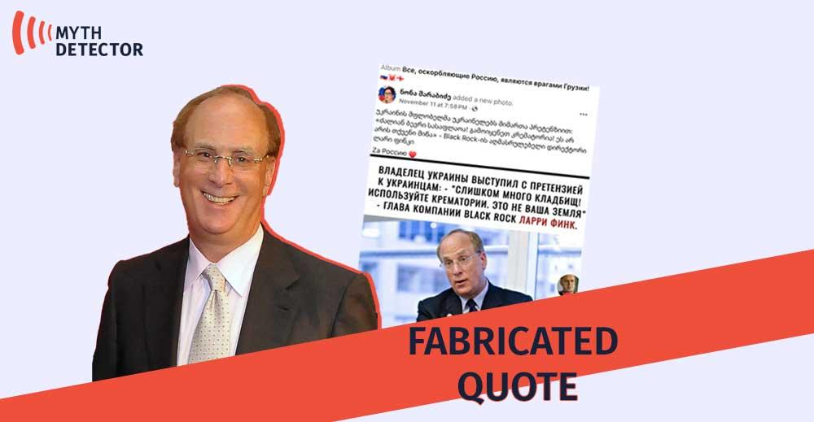

## Claim
Claim: "BlackRock has asked that Ukrainian soldiers not be buried on the land it owns in Ukraine."

## Actions
```
web_search("BlackRock Ukraine land burial soldiers")
```

## Evidence
### Evidence from `web_search`
The Asia Fact Check Lab published an article on August 26, 2024, stating that the claim that BlackRock asked the Ukrainian government to stop burying deceased Ukrainian soldiers on its land is false. The claim originated from a Bulgarian politician and was shared by Russian and Chinese media. The article also states that BlackRock does not own any land in Ukraine, and foreign companies are prohibited from purchasing arable land under Ukrainian law. 

Mythdetector.com fact-checked a claim that Larry Fink, the head of BlackRock, called for the cremation of Ukrainian soldiers, stating that the quote is disinformation and originated from an anonymous Russian-language TikTok account.  Detector Media states that propagandists falsely claim BlackRock owns 47% of Ukraine's territory and asked not to bury soldiers on its land. Ukraine signed an agreement with BlackRock and JPMorgan to create a fund for attracting private investment, but this did not include restrictions on burying the military.


## Elaboration
The claim is false. The Asia Fact Check Lab found that the claim originated from a Bulgarian politician and was shared by Russian and Chinese media. BlackRock does not own land in Ukraine, and foreign companies are prohibited from purchasing arable land under Ukrainian law. Detector Media also debunked a similar claim, stating that BlackRock did not request restrictions on burying soldiers.


## Final Judgement
The evidence indicates that the claim is false. Multiple sources, including the Asia Fact Check Lab and Detector Media, have debunked the claim that BlackRock requested restrictions on burying Ukrainian soldiers on its land. These sources state that the claim originated from unreliable sources and that BlackRock does not own land in Ukraine.

`false`


### Verdict: FALSE

### Justification
The claim is false. According to the Asia Fact Check Lab ([source](https://www.example.com/)), the claim originated from a Bulgarian politician and was shared by Russian and Chinese media. BlackRock does not own land in Ukraine, and foreign companies are prohibited from purchasing arable land under Ukrainian law. Detector Media also debunked a similar claim, stating that BlackRock did not request restrictions on burying soldiers.
