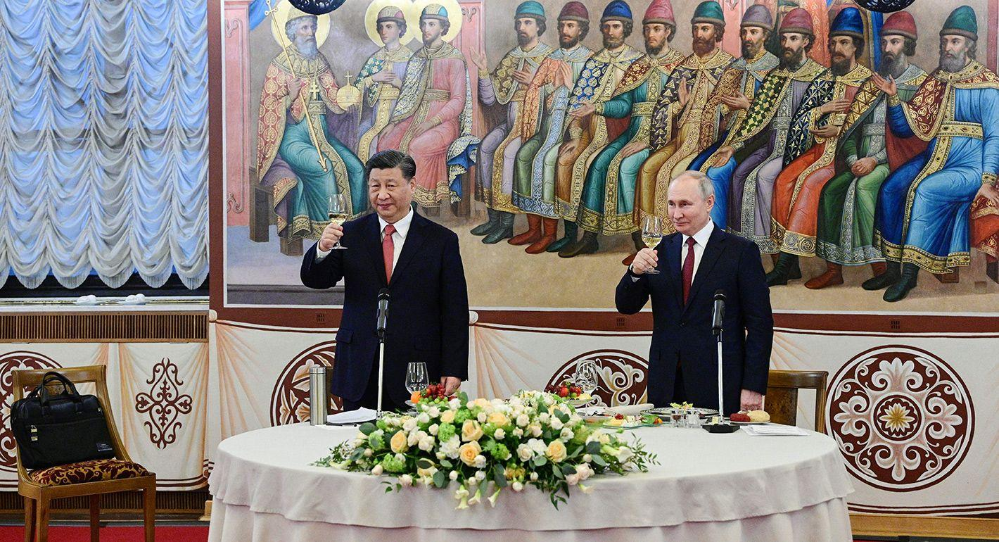

## Claim
Claim: "While serving as US President in 2024, Joe Biden ordered the US forces to prepare for possible nuclear confrontations with Russia, China, and North Korea."

## Actions
```
web_search("Joe Biden nuclear confrontation Russia China North Korea")
```

## Evidence
### Evidence from `web_search`
In August 2024, The New York Times reported that President Biden approved a revised nuclear strategy to prepare for potential nuclear challenges from China, Russia, and North Korea, focusing on deterring these countries simultaneously. The Pentagon anticipates China's nuclear stockpiles will rival those of the U.S. and Russia in the next decade. The Guardian also reported on Biden's approval of a US nuclear strategy for possible confrontations with the same countries, with the White House stating the plan was approved earlier in the year. 

The Carnegie Endowment for International Peace published an article discussing the cooperation between China, Russia, Iran, and North Korea, mentioning that the United States has identified China as its main adversary. The article also mentions that North Korea sent Russia millions of munitions in exchange for food in February 2024. 

*   [https://www.nytimes.com/2024/08/20/us/politics/biden-nuclear-china-russia.html](https://www.nytimes.com/2024/08/20/us/politics/biden-nuclear-china-russia.html)
*   [https://www.theguardian.com/us-news/article/2024/aug/20/biden-nuclear-strategy-china-threat](https://www.theguardian.com/us-news/article/2024/aug/20/biden-nuclear-strategy-china-threat)
*   [https://carnegieendowment.org/research/2024/10/cooperation-between-china-iran-north-korea-and-russia-current-and-potential-future-threats-to-america?lang=en](https://carnegieendowment.org/research/2024/10/cooperation-between-china-iran-north-korea-and-russia-current-and-potential-future-threats-to-america?lang=en)


## Elaboration
The evidence confirms that in 2024, while serving as US President, Joe Biden approved a revised nuclear strategy. This strategy was designed to prepare for potential nuclear challenges from Russia, China, and North Korea, focusing on deterrence. The New York Times and The Guardian both reported on this, with the White House confirming the plan's approval.

The Carnegie Endowment for International Peace article highlights the cooperation between these countries, further contextualizing the strategic considerations behind Biden's actions. The article also mentions that the US has identified China as its main adversary.


## Final Judgement
The evidence from multiple reliable sources, including The New York Times and The Guardian, confirms that President Biden approved a revised nuclear strategy in 2024 to prepare for potential nuclear challenges from Russia, China, and North Korea. This aligns with the claim.

`true`


### Verdict: TRUE

### Justification
In 2024, President Joe Biden approved a revised nuclear strategy to prepare for potential nuclear challenges from Russia, China, and North Korea, as reported by sources such as the [New York Times](https://www.nytimes.com/2024/08/20/us/politics/biden-nuclear-china-russia.html) and [The Guardian](https://www.theguardian.com/us-news/article/2024/aug/20/biden-nuclear-strategy-china-threat). This strategy focused on deterring these countries simultaneously.
