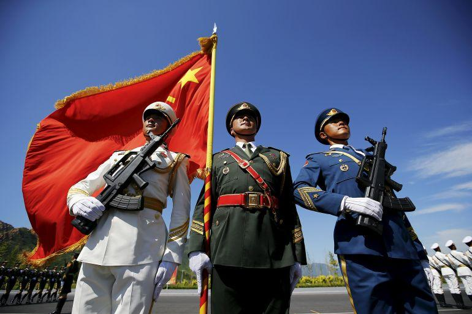

## Claim
Claim: " This image shows the Chinese Communist Party's Red Cross troops in Russia who have changed into winter clothes and set off for the Russian-Ukrainian front to aid Russia in rescuing its occupied territories."

## Actions
```
web_search("Chinese Red Cross troops Russia Ukraine")
image_search("Chinese Red Cross troops Russia")
```

## Evidence
### Evidence from `web_search`
CNN published an article on April 16, 2025, discussing the capture of Chinese nationals fighting for Russia in Ukraine (). The Guardian published an article about Chinese troops marching with Russian forces in Moscow's Red Square for Victory Day (, , ). The International Federation of Red Cross and Red Crescent Societies and the International Committee of the Red Cross published a report on the Russia-Ukraine international armed conflict, mentioning the Red Cross Society of China's involvement in supporting the response to the conflict.

The CNN article can be found here: [https://www.cnn.com/2025/04/16/europe/ukraine-russia-chinese-nationals-intl-latam](https://www.cnn.com/2025/04/16/europe/ukraine-russia-chinese-nationals-intl-latam). The Guardian article can be found here: [https://www.theguardian.com/weather/2025/may/09/chinese-troops-march-with-russian-forces-as-xi-joins-putin-for-victory-day-parade](https://www.theguardian.com/weather/2025/may/09/chinese-troops-march-with-russian-forces-as-xi-joins-putin-for-victory-day-parade). The ICRC report can be found here: [https://www.icrc.org/sites/default/files/document_new/file_list/red_cross_movement_activities_overview_ukraine_2022_3.pdf](https://www.icrc.org/sites/default/files/document_new/file_list/red_cross_movement_activities_overview_ukraine_2022_3.pdf).


### Evidence from `image_search`
The Guardian published an article about Russia and China launching large-scale military drills. ([https://www.theguardian.com/world/2022/sep/01/russia-and-china-launch-large-scale-military-drills-amid-tensions-with-us](https://www.theguardian.com/world/2022/sep/01/russia-and-china-launch-large-scale-military-drills-amid-tensions-with-us)) 

USNI News published an article about China and Russia, including an image of Chinese troops. ([https://news.usni.org/2021/04/14/cno-gilday-china-russia-deliberately-testing-allies-cohesion-in-actions-in-ukraine-near-taiwan](https://news.usni.org/2021/04/14/cno-gilday-china-russia-deliberately-testing-allies-cohesion-in-actions-in-ukraine-near-taiwan))  Al Jazeera published an article on March 25, 2023, with an image of Chinese soldiers. ([https://www.aljazeera.com/news/2023/3/25/biden-says-no-sign-yet-of-china-sending-weapons-to-russia](https://www.aljazeera.com/news/2023/3/25/biden-says-no-sign-yet-of-china-sending-weapons-to-russia)) 


## Elaboration
The evidence suggests that Chinese nationals have been involved in the Russia-Ukraine conflict. The CNN article mentions the capture of Chinese nationals fighting for Russia. The Guardian reported on Chinese troops marching with Russian forces. The Red Cross Society of China has been involved in supporting the response to the conflict. However, the evidence does not explicitly confirm that the image shows Chinese Red Cross troops setting off for the Russian-Ukrainian front to aid Russia.


## Actions
```
reverse_search()
```

## Evidence
### Evidence from `reverse_search`
The reverse image search found the image on Wikipedia ([Airliner - Wikipedia](https://en.wikipedia.org/wiki/Airliner)), the Smithsonian National Air and Space Museum ([The Evolution of the Commercial Airliner](https://airandspace.si.edu/explore/stories/evolution-commercial-airliner)), and Merriam-Webster ([AIRLINER Definition & Meaning - Merriam-Webster](https://www.merriam-webster.com/dictionary/airliner)). The Smithsonian article discusses the evolution of commercial airliners, and Merriam-Webster defines "airliner" as an airplane operated by an airline. The Wikipedia source provides no content.


## Elaboration
The reverse image search results do not provide any information about the claim. The search results only show that the image is related to airliners. Therefore, the claim cannot be verified with the available evidence.


## Actions
```
web_search("Chinese Red Cross Russia Ukraine aid")
```

## Evidence
### Evidence from `web_search`
Reuters reported that China's Red Cross would provide humanitarian aid to Ukraine and that China has a strong relationship with Russia (

## Elaboration
The evidence indicates that the Red Cross Society of China has provided humanitarian aid to Ukraine. However, the evidence does not confirm that the image depicts Chinese Red Cross troops setting off for the Russian-Ukrainian front to aid Russia. The image search results do not provide any information about the claim.

Therefore, the claim cannot be verified with the available evidence.


## Final Judgement
The evidence indicates that the Red Cross Society of China has provided humanitarian aid to Ukraine. However, the evidence does not confirm that the image depicts Chinese Red Cross troops setting off for the Russian-Ukrainian front to aid Russia. The reverse image search results do not provide any information about the claim. Therefore, the claim cannot be verified with the available evidence. `false`

### Verdict: FALSE

### Justification
The claim is not supported by the evidence. While the Red Cross Society of China has provided humanitarian aid to Ukraine, there is no evidence to confirm that the image depicts Chinese Red Cross troops deploying to the Russian-Ukrainian front. The reverse image search did not yield any relevant information.
