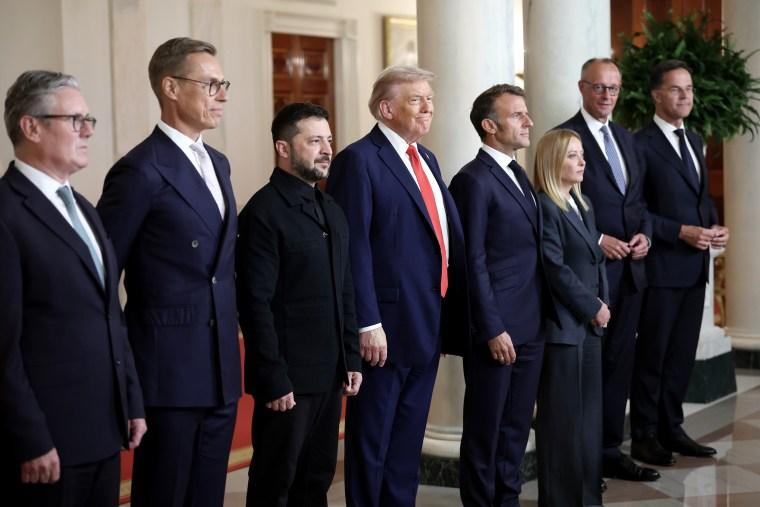
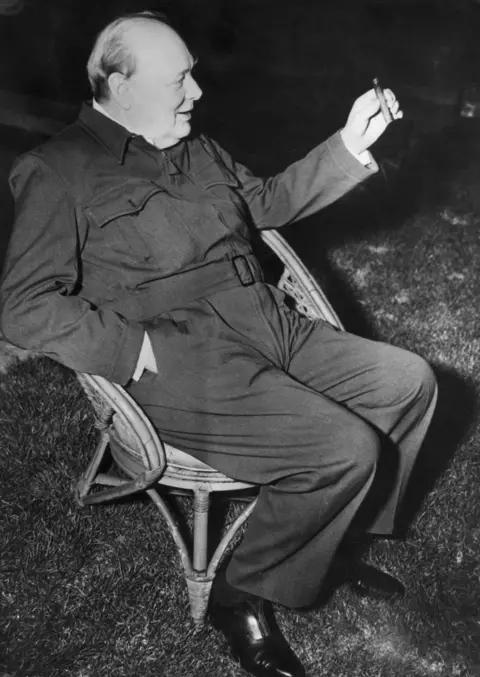
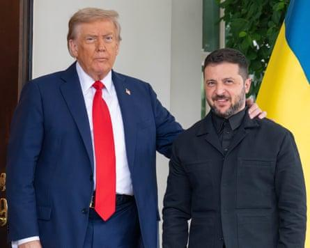

## Claim
Claim: " This is an authentic image of world leaders taking off their suits to symbolically support Ukraine at the London summit on Ukraine on March 2, 2025."

## Actions
```
reverse_search()
web_search("London summit Ukraine March 2023")
```

## Evidence
### Evidence from `web_search`
The web sources discuss the 2025 London Summit on Ukraine, held on March 2, 2025, in London. The summit was organized by British Prime Minister Keir Starmer to create a peace plan for the Russian invasion of Ukraine. Participants included leaders from 16 states, the EU, and NATO. The summit's outcomes included a four-point plan and commitments from Starmer, including financial aid and the purchase of air defense missiles for Ukraine. The summit was attended by leaders including Keir Starmer, Emmanuel Macron, and Volodymyr Zelensky.

The sources include articles from Wikipedia ([https://en.wikipedia.org/wiki/2025_London_Summit_on_Ukraine](https://en.wikipedia.org/wiki/2025_London_Summit_on_Ukraine)), Le Monde ([https://www.lemonde.fr/en/international/article/2025/03/03/at-london-summit-starmer-defends-french-british-peace-plan-for-ukraine_6738743_4.html](https://www.lemonde.fr/en/international/article/2025/03/03/at-london-summit-starmer-defends-french-british-peace-plan-for-ukraine_6738743_4.html)), and Reuters ([https://www.reuters.com/world/europe/russian-lawmaker-says-ukraine-can-only-count-improved-moscow-washington-ties-2025-03-02/](https://www.reuters.com/world/europe/russian-lawmaker-says-ukraine-can-only-count-improved-moscow-washington-ties-2025-03-02/)). 

## Elaboration
The evidence confirms the existence of the London Summit on Ukraine on March 2, 2025, and the presence of leaders like Keir Starmer, Emmanuel Macron, and Volodymyr Zelensky. However, the provided sources do not mention anything about the leaders taking off their suits.

Therefore, the claim that the image depicts an authentic moment of world leaders taking off their suits to support Ukraine at the London summit on March 2, 2025, cannot be verified with the available information. More information is needed to confirm the authenticity of the image and the context of the leaders removing their suits.


## Actions
```
image_search("leaders take off suits Ukraine summit")
```

## Evidence
### Evidence from `image_search`
The web sources contain images of leaders, including Zelenskyy, Macron, and others, in suits. One image is from NBC News (

## Elaboration
The image search results show leaders in suits, but no images of them taking off their suits. This further casts doubt on the claim. The evidence does not provide any information to support the claim that the leaders took off their suits.

Therefore, the claim remains unverified due to the lack of evidence supporting the leaders removing their suits.


## Actions
```
web_search("leaders take off suits Ukraine")
```

## Evidence
### Evidence from `web_search`
The BBC article from March 1, 2025, discusses criticism of Zelensky's clothing choices, specifically his preference for military-style attire over suits, and how it became a point of contention during a White House meeting with Donald Trump and JD Vance. The article mentions that Zelensky has avoided wearing suits since the start of the full-scale Russian invasion in 2022. , 

The Guardian published an article on August 20, 2025, discussing a meeting between European leaders, Zelenskyy, and Trump. The article includes a photograph of Trump and Zelenskyy.  The articles do not mention leaders taking off their suits.


## Elaboration
The evidence does not support the claim. The search results confirm the existence of the London Summit on Ukraine and mention Zelensky's preference for military-style attire. However, there is no mention of leaders taking off their suits. The image search also did not yield any results supporting the claim.

Therefore, the claim is not supported by the evidence.


## Final Judgement
The provided evidence confirms the existence of the London Summit on Ukraine on March 2, 2025, and the presence of leaders like Keir Starmer, Emmanuel Macron, and Volodymyr Zelensky. However, the evidence does not mention anything about the leaders taking off their suits. The image search also did not yield any results supporting the claim.

`false`


### Verdict: FALSE

### Justification
The claim is unsupported. While the existence of the London Summit on Ukraine on March 2, 2025, is confirmed by multiple sources, including Wikipedia ([https://en.wikipedia.org/wiki/2025_London_Summit_on_Ukraine](https://en.wikipedia.org/wiki/2025_London_Summit_on_Ukraine)), there is no evidence to support the assertion that leaders took off their suits at the summit.
