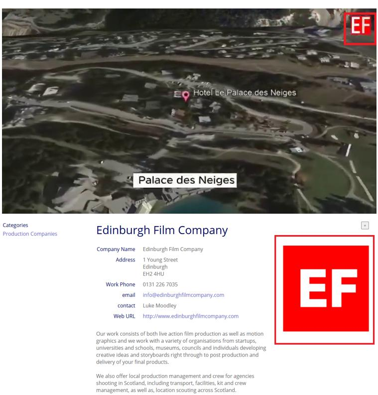

## Claim
Claim: "Ukrainian President Volodymyr Zelenskyy purchased an 88 million euro hotel in the Courchevel ski resort in France."

## Actions
```
web_search("Volodymyr Zelenskyy Courchevel hotel purchase")
```

## Evidence
### Evidence from `web_search`
The Myth Detector ([https://mythdetector.com/en/that-volodymyr-zelenskyy/](https://mythdetector.com/en/that-volodymyr-zelenskyy/)) fact-checked the claim that Volodymyr Zelenskyy purchased an 88 million euro hotel in Courchevel, France, and found it to be false. The information originated from anonymous Russian-language accounts and was reported by a questionable French-language media outlet. The hotel was purchased in 2023 by the Monegasque company Société des Bains de Mer (SBM) (, ).

Ukrinform.net ([https://www.ukrinform.net/rubric-factcheck/3935929-russian-propaganda-falsely-claims-zelensky-bought-french-hotel-kulebas-son-acquired-iron-throne.html](https://www.ukrinform.net/rubric-factcheck/3935929-russian-propaganda-falsely-claims-zelensky-bought-french-hotel-kulebas-son-acquired-iron-throne.html)) also reported that Russian media falsely claimed Zelenskyy purchased the Palace des Neiges hotel in Courchevel, France, for 88 million euros, as part of a disinformation campaign (, , ). UNN news ([https://unn.ua/en/news/zelensky-bought-a-hotel-cpj-records-a-surge-in-fake-news-about-ukraine-in-france](https://unn.ua/en/news/zelensky-bought-a-hotel-cpj-records-a-surge-in-fake-news-about-ukraine-in-france)) reported that the Center for Countering Disinformation identified the spread of fake news in France, including the claim that Zelenskyy bought a hotel in Courchevel for 88 million euros, which is untrue (<image:k>).


## Elaboration
The claim that Volodymyr Zelenskyy purchased an 88 million euro hotel in Courchevel, France, is false. Multiple sources, including Myth Detector ([https://mythdetector.com/en/that-volodymyr-zelenskyy/](https://mythdetector.com/en/that-volodymyr-zelenskyy/)) and Ukrinform.net ([https://www.ukrinform.net/rubric-factcheck/3935929-russian-propaganda-falsely-claims-zelensky-bought-french-hotel-kulebas-son-acquired-iron-throne.html](https://www.ukrinform.net/rubric-factcheck/3935929-russian-propaganda-falsely-claims-zelensky-bought-french-hotel-kulebas-son-acquired-iron-throne.html)), have debunked this claim, citing its origin in disinformation campaigns. The hotel was actually purchased by the Monegasque company Société des Bains de Mer (SBM).


## Final Judgement
The claim is demonstrably false, as multiple sources confirm that the hotel was not purchased by Zelenskyy. The evidence points to a disinformation campaign. `false`


### Verdict: FALSE

### Justification
The claim that Volodymyr Zelenskyy purchased an 88 million euro hotel in Courchevel, France, is false. Fact-checks by Myth Detector ([https://mythdetector.com/en/that-volodymyr-zelenskyy/](https://mythdetector.com/en/that-volodymyr-zelenskyy/)) and Ukrinform.net ([https://www.ukrinform.net/rubric-factcheck/3935929-russian-propaganda-falsely-claims-zelensky-bought-french-hotel-kulebas-son-acquired-iron-throne.html](https://www.ukrinform.net/rubric-factcheck/3935929-russian-propaganda-falsely-claims-zelensky-bought-french-hotel-kulebas-son-acquired-iron-throne.html)) show the claim originated from disinformation and that the hotel was purchased by Société des Bains de Mer (SBM).
