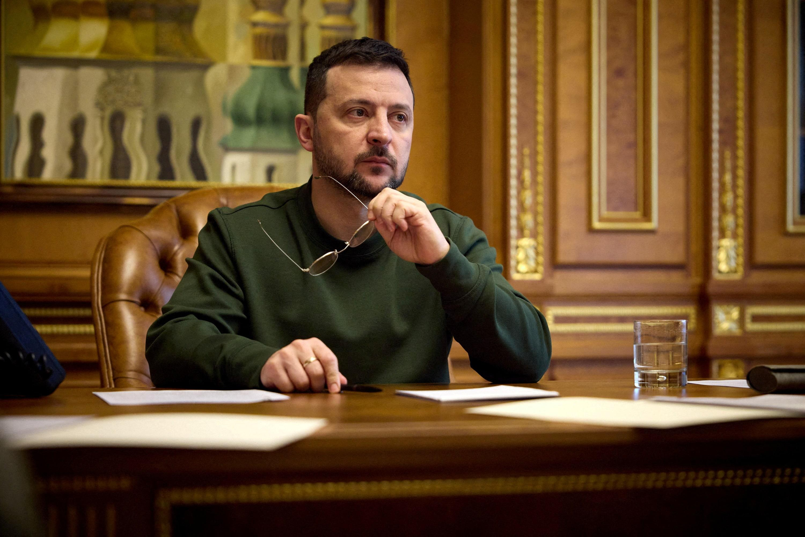

## Claim
Claim: "Ukrainian President Volodymyr Zelenskyy owns 15 homes including a $35 million home in Florida, has $1.2 billion in an overseas bank account, owns 15 homes, three private planes and has a monthly income of $11 million."

## Actions
```
web_search("Volodymyr Zelenskyy real estate holdings")
web_search("Volodymyr Zelenskyy overseas bank accounts")
web_search("Volodymyr Zelenskyy private planes")
web_search("Volodymyr Zelenskyy monthly income")
```

## Evidence
### Evidence from `web_search`
A Yahoo News article from May 29, 2024, fact-checked the claim and rated it as "False" , stating that Zelenskyy's asset declaration showed fewer than 15 properties, none in the U.S., no planes, and an annual income of around $300,000. The declaration listed one overseas bank account holding around $377,000. The article also mentions that Zelenskyy declared whole or part ownership of 14 properties in his 2024 asset declaration. ([Source](https://www.yahoo.com/news/fact-check-facts-behind-resurfaced-231800640.html)).

The Times of India published an article on March 5, 2025, stating that Zelenskyy's real estate portfolio is worth $4 million ([Source](https://timesofindia.indiatimes.com/etimes/trending/net-worth-of-volodymyr-zelenskyy-the-entertainer-turned-president-of-ukraine/articleshow/118651819.cms)). An OCCRP article from October 3, 2021, discussed Zelenskyy's offshore holdings, revealing that he and his partners owned a network of offshore companies ([Source](https://www.occrp.org/en/project/the-pandora-papers/pandora-papers-reveal-offshore-holdings-of-ukrainian-president-and-his-inner-circle)).


### Evidence from `web_search`
Al Jazeera ([Source](https://www.aljazeera.com/news/2021/10/4/pandora-papers-ukraine-leader-seeks-to-justify-offshore-accounts)) reported on the Pandora Papers, revealing that Volodymyr Zelenskyy and his partners established offshore companies in 2012 . Two of these companies were used to buy three properties in London. An advisor stated the companies were created to protect the group's incomes.

The Guardian ([Source](https://www.theguardian.com/news/2021/oct/03/revealed-anti-oligarch-ukrainian-president-offshore-connections-volodymyr-zelenskiy)) discussed Zelenskyy's offshore connections, his business ties to Russia, and his pledge to address wealth sent overseas. The article includes images of Volodymyr Zelenskiy , , .


### Evidence from `web_search`
Web sources indicate that Ukrainian President Volodymyr Zelenskyy utilizes an ACJ319 for travel. (<image:k>)
The sources include [AINonline.com](https://www.ainonline.com/archive-email/waypoints/newsletter/153516042413) and [bjtonline.com](https://bjtonline.com/business-jet-news/the-boys-on-the-airbus).


### Evidence from `web_search`
Reuters reports that Volodymyr Zelenskyy's income for 2022 rose to 12.42 million hryvnias ($306,000) due to improved rent collection and the sale of government bonds. Most of the income came from his salary, bank interest, and rent from his properties. The article was published on March 29. ([https://www.reuters.com/world/europe/ukraines-zelenskiy-reports-his-income-increased-2022-2024-03-29/](https://www.reuters.com/world/europe/ukraines-zelenskiy-reports-his-income-increased-2022-2024-03-29/)) 

The Hindustan Times, published on March 2, 2025, discusses Volodymyr Zelensky's wealth, mentioning his background in entertainment and his income. It states that Zelensky's income has likely decreased since the 2022 invasion of Ukraine. The article mentions Zelensky's 2020 financial statement, which showed earnings of about $623,000. ([https://www.hindustantimes.com/world-news/us-news/is-zelensky-a-billionaire-know-about-his-net-worth-as-trump-rages-over-us-funding-to-ukraine-101740820041614.html](https://www.hindustantimes.com/world-news/us-news/is-zelensky-a-billionaire-know-about-his-net-worth-as-trump-rages-over-us-funding-to-ukraine-101740820041614.html)) <image:k>


## Elaboration
The claim is largely false. A Yahoo News article fact-checked the claim and rated it as "False" ([https://www.yahoo.com/news/fact-check-facts-behind-resurfaced-231800640.html](https://www.yahoo.com/news/fact-check-facts-behind-resurfaced-231800640.html)). Zelenskyy's asset declaration showed fewer than 15 properties, none in the U.S., no private planes, and an annual income of around $300,000. The declaration listed one overseas bank account holding around $377,000.

Zelenskyy's real estate portfolio is worth $4 million ([https://timesofindia.indiatimes.com/etimes/trending/net-worth-of-volodymyr-zelenskyy-the-entertainer-turned-president-of-ukraine/articleshow/118651819.cms](https://timesofindia.indiatimes.com/etimes/trending/net-worth-of-volodymyr-zelenskyy-the-entertainer-turned-president-of-ukraine/articleshow/118651819.cms)). He declared whole or part ownership of 14 properties in his 2024 asset declaration. Zelenskyy's income for 2022 rose to $306,000 ([https://www.reuters.com/world/europe/ukraines-zelenskiy-reports-his-income-increased-2022-2024-03-29/](https://www.reuters.com/world/europe/ukraines-zelenskiy-reports-his-income-increased-2022-2024-03-29/)).


## Final Judgement
The claim is demonstrably false. Multiple sources, including a fact-check from Yahoo News, contradict the specifics of the claim. Zelenskyy does not own 15 homes, a $35 million home in Florida, or have $1.2 billion in an overseas bank account. His income is also significantly less than $11 million per month.

`false`

### Verdict: FALSE

### Justification
The claim that Volodymyr Zelenskyy owns 15 homes, a $35 million home in Florida, has $1.2 billion in an overseas bank account, three private planes, and a monthly income of $11 million is false. A Yahoo News fact-check rated the claim as "False" ([https://www.yahoo.com/news/fact-check-facts-behind-resurfaced-231800640.html](https://www.yahoo.com/news/fact-check-facts-behind-resurfaced-231800640.html)). Zelenskyy's asset declaration shows fewer than 15 properties, no U.S. properties, no private planes, and an annual income of around $300,000. His real estate portfolio is worth $4 million, and his 2022 income was $306,000.
