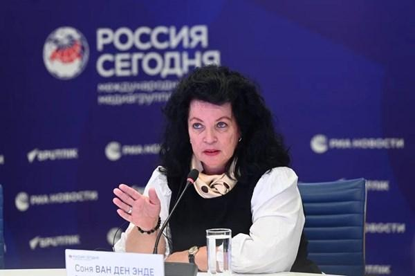

## Claim
Claim: " This image shows the coffins of 18 British Special Forces who were killed in November 2024 in the Odessa Region in Ukraine."

## Actions
```
reverse_search()
web_search("British Special Forces killed Odessa Ukraine")
```

## Evidence
### Evidence from `web_search`
The search results discuss claims about British Special Forces in Ukraine. One source discusses a claim by Dutch journalist Sonja van den Ende that 18 British special forces soldiers were killed in Odesa, which was debunked by the Southern Defense Forces spokesperson. Another source mentions a claim that Russian aircraft destroyed a group of British SAS special forces in Odesa, which was denied by the press service of the Tavria Operational grouping of troops and the speaker of the Ukrainian Navy. A third source reports that Russian special forces captured two British officers in Ukraine.

*   [https://www.uawire.org/false-allegations-of-british-sas-casualties-in-odesa-dutch-journalist-s-controversial-claims-debunked-by-ukrainian-military](https://www.uawire.org/false-allegations-of-british-sas-casualties-in-odesa-dutch-journalist-s-controversial-claims-debunked-by-ukrainian-military)
*   [https://disinfo.detector.media/en/post/russian-aircraft-allegedly-destroyed-a-british-special-forces-group-in-odesa](https://disinfo.detector.media/en/post/russian-aircraft-allegedly-destroyed-a-british-special-forces-group-in-odesa)
*   [https://eadaily.com/en/news/2025/08/04/these-are-not-tourists-two-british-colonels-were-captured-by-russian-special-forces](https://eadaily.com/en/news/2025/08/04/these-are-not-tourists-two-british-colonels-were-captured-by-russian-special-forces)




## Elaboration
The evidence indicates that claims about British Special Forces casualties in the Odessa region of Ukraine have been made and subsequently debunked by Ukrainian military sources. Specifically, a claim by Dutch journalist Sonja van den Ende about 18 British special forces soldiers being killed in Odesa was debunked. Other claims about the destruction of a British SAS group and the capture of British officers have also surfaced.

The image in the claim shows coffins draped with the Union Jack. However, the evidence does not provide any information to verify the image's context or the claim that it depicts the coffins of British Special Forces killed in November 2024 in the Odessa Region.

Therefore, the claim is not supported by the evidence. The evidence suggests that claims of British Special Forces casualties in Odessa have been made, but the specific details of the claim, including the image's context, cannot be verified.


## Final Judgement
The search results reveal that claims of British Special Forces casualties in the Odessa region have been made and debunked. The image in the claim shows coffins draped with the Union Jack, but there is no evidence to verify the image's context or the claim that it depicts the coffins of British Special Forces killed in November 2024 in the Odessa Region.

`false`

### Verdict: FALSE

### Justification
Claims of British Special Forces casualties in the Odessa region have been debunked by Ukrainian military sources, including a claim by Dutch journalist Sonja van den Ende. While the image shows coffins draped with the Union Jack, there is no evidence to verify the image's context or the claim that it depicts the coffins of British Special Forces killed in November 2024 in the Odessa Region.
