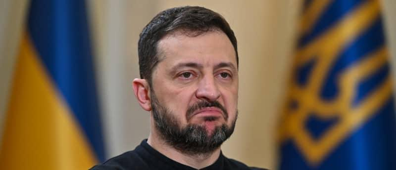

## Claim
Claim: " This image shows a screenshot of an authentic Charlie Hebdo magazine cover from March 20, 2025 illustrating Ukrainian President Volodoymr Zelenskyy lying in a coffin and saying 'Ukraine is an independet state' in French."

## Actions
```
web_search("Charlie Hebdo March 20 2025 Zelenskyy coffin")
```

## Evidence
### Evidence from `web_search`
The search results indicate that the Charlie Hebdo cover featuring Volodymyr Zelenskyy in a coffin is a fabrication. Myth Detector ([Source](https://mythdetector.com/en/coffin-was-not-published-by-charlie-hebdo/)) published on April 8, 2025, fact-checked the image, stating that the magazine did not publish an issue on March 20, 2025. The Daily Caller also reported on March 28, 2025, that the cover was fake ([Source](https://www.aol.com/fact-check-charlie-hebdo-magazine-151901596.html)).

Without-lie.info ([Source](https://without-lie.info/en/fake-with-another-fictional-cover-of-charlie-hebdo-magazine-with-a-caricature-of-the-president-of-ukraine/)) also confirmed the cover's inauthenticity, noting the fake cover's release date as March 20, 2025, with issue number 1705. The real cover was published on March 19, 2025. The image is a fabrication, as confirmed by a Charlie Hebdo journalist. , , 


## Elaboration
The evidence confirms that the Charlie Hebdo cover featuring Zelenskyy in a coffin is a fabrication. Multiple sources, including Myth Detector ([https://mythdetector.com/en/coffin-was-not-published-by-charlie-hebdo/](https://mythdetector.com/en/coffin-was-not-published-by-charlie-hebdo/)), The Daily Caller ([https://www.aol.com/fact-check-charlie-hebdo-magazine-151901596.html](https://www.aol.com/fact-check-charlie-hebdo-magazine-151901596.html)), and without-lie.info ([https://without-lie.info/en/fake-with-another-fictional-cover-of-charlie-hebdo-magazine-with-a-caricature-of-the-president-of-ukraine/](https://without-lie.info/en/fake-with-another-fictional-cover-of-charlie-hebdo-magazine-with-a-caricature-of-the-president-of-ukraine/)), have fact-checked the image and confirmed its inauthenticity. The cover's release date of March 20, 2025, is also incorrect, as the magazine did not publish an issue on that date.


## Final Judgement
The claim is demonstrably false. Multiple fact-checking sources confirm that the Charlie Hebdo cover featuring Zelenskyy in a coffin is a fabrication. The image is not authentic, and the magazine did not publish an issue with that cover. `false`

### Verdict: FALSE

### Justification
The Charlie Hebdo cover depicting Zelenskyy in a coffin is a fabrication, as confirmed by fact-checks from sources like Myth Detector ([https://mythdetector.com/en/coffin-was-not-published-by-charlie-hebdo/](https://mythdetector.com/en/coffin-was-not-published-by-charlie-hebdo/)) and The Daily Caller ([https://www.aol.com/fact-check-charlie-hebdo-magazine-151901596.html](https://www.aol.com/fact-check-charlie-hebdo-magazine-151901596.html)). The image's release date and content are not authentic.
