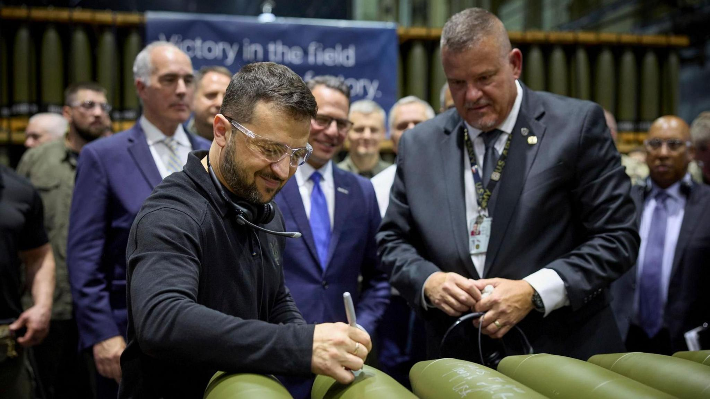

## Claim
Claim: " This image shows Ukrainian President Volodymyr Zelenskyy signing Israeli bombs intended for use against Palestinians in Gaza."

## Actions
```
reverse_search()
```

## Evidence
### Evidence from `reverse_search`
The image shows Ukrainian President Volodymyr Zelenskyy signing ammunition at the Scranton Army Ammunition Plant (SCAAP) in Scranton, Pennsylvania. The BBC News article ([https://www.bbc.com/news/articles/c80rkv0k4j8o](https://www.bbc.com/news/articles/c80rkv0k4j8o)) and ([https://www.bbc.co.uk/news/articles/c80rkv0k4j8o](https://www.bbc.co.uk/news/articles/c80rkv0k4j8o)) discuss Zelensky's meeting with US President Joe Biden and the visit to the plant.

The New York Post ([https://nypost.com/2024/09/25/opinion/zelenskys-arms-factory-visit-reeks-of-partisan-foreign-election-interference/](https://nypost.com/2024/09/25/opinion/zelenskys-arms-factory-visit-reeks-of-partisan-foreign-election-interference/)) article focuses on the political implications of the visit. None of the articles mention Israeli bombs or Gaza.   


## Elaboration
The evidence indicates that the image shows Volodymyr Zelenskyy signing ammunition at the Scranton Army Ammunition Plant (SCAAP) in Pennsylvania. The ammunition was not identified as Israeli bombs, nor was it stated that they were intended for use against Palestinians in Gaza.

The BBC News article ([https://www.bbc.com/news/articles/c80rkv0k4j8o](https://www.bbc.com/news/articles/c80rkv0k4j8o)) and ([https://www.bbc.co.uk/news/articles/c80rkv0k4j8o](https://www.bbc.co.uk/news/articles/c80rkv0k4j8o)) and the New York Post ([https://nypost.com/2024/09/25/opinion/zelenskys-arms-factory-visit-reeks-of-partisan-foreign-election-interference/](https://nypost.com/2024/09/25/opinion/zelenskys-arms-factory-visit-reeks-of-partisan-foreign-election-interference/)) do not support the claim.

The claim is not supported by the provided evidence.


## Final Judgement
The image depicts Volodymyr Zelenskyy signing ammunition at a US plant, not Israeli bombs. The claim misrepresents the context of the image and the nature of the ammunition. `false`

### Verdict: FALSE

### Justification
The image shows Ukrainian President Volodymyr Zelenskyy signing ammunition at the Scranton Army Ammunition Plant (SCAAP) in Pennsylvania, as reported by the BBC News ([https://www.bbc.com/news/articles/c80rkv0k4j8o](https://www.bbc.com/news/articles/c80rkv0k4j8o)) and ([https://www.bbc.co.uk/news/articles/c80rkv0k4j8o](https://www.bbc.co.uk/news/articles/c80rkv0k4j8o)). The ammunition is not identified as Israeli bombs, nor is there any mention of them being intended for use against Palestinians in Gaza. The New York Post ([https://nypost.com/2024/09/25/opinion/zelenskys-arms-factory-visit-reeks-of-partisan-foreign-election-interference/](https://nypost.com/2024/09/25/opinion/zelenskys-arms-factory-visit-reeks-of-partisan-foreign-election-interference/)) also does not support the claim.
