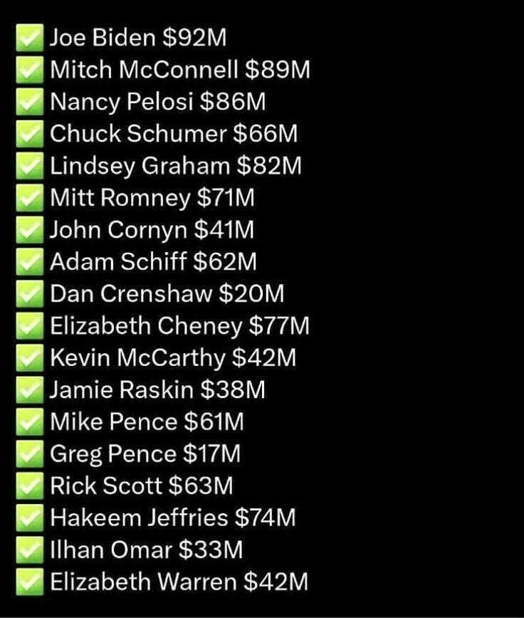
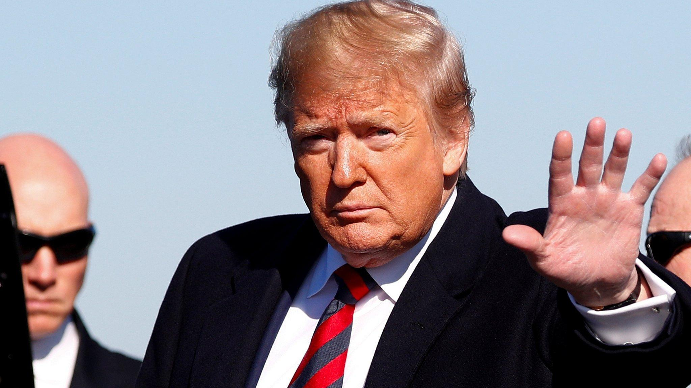

## Claim
Claim: " This image shows an authentic list realeased by Ukraine showing US politicians taking bribes from Ukraine. The highest bribe was 92 Million US-$ for Joe Biden."

## Actions
```
web_search("Joe Biden Mitch McConnell Nancy Pelosi Ukraine bribes")
image_search("US politicians Ukraine bribes list")
```

## Evidence
### Evidence from `web_search`
The web search results discuss corruption concerns related to Ukraine aid commitments, mentioning potential undermining of confidence in the Ukrainian government and allegations of a "secret deal" on Ukraine aid involving Kevin McCarthy and Joe Biden. The BBC News article discusses the impeachment inquiry into President Donald Trump, focusing on his contacts with Ukraine and allegations of Joe Biden trying to force out a Ukrainian prosecutor. The articles include images of a Ukrainian soldier, the Capitol in Washington, and the Ukrainian State Emergency Service clearing rubble , Joe Biden, Donald Trump, and Nancy Pelosi , , , .

The search results do not provide any information about a list of US politicians taking bribes from Ukraine.


### Evidence from `image_search`
The search results include a book cover titled "All the President's Money" by James Comer, which investigates "the secret foreign schemes that made the Biden family rich" (). Al Jazeera reports on a corruption scheme uncovered in Ukraine's defense sector (). The other source provided no content.

The search results do not provide any information about a list released by Ukraine showing US politicians taking bribes.


## Elaboration
The evidence does not support the claim. The web search and image search results do not contain any information about a list released by Ukraine detailing bribes taken by US politicians. The search results mention corruption concerns and investigations related to Ukraine, but they do not provide any evidence to support the specific claim made in the image.


## Final Judgement
The search results do not provide any evidence to support the claim that the image is an authentic list released by Ukraine showing US politicians taking bribes. Therefore, the claim is demonstrably false. `false`

### Verdict: FALSE

### Justification
The claim is false. Neither the web search nor the image search results provide any evidence of a list released by Ukraine detailing bribes taken by US politicians. The search results mention corruption concerns and investigations related to Ukraine, but they do not support the specific claim made in the image.
