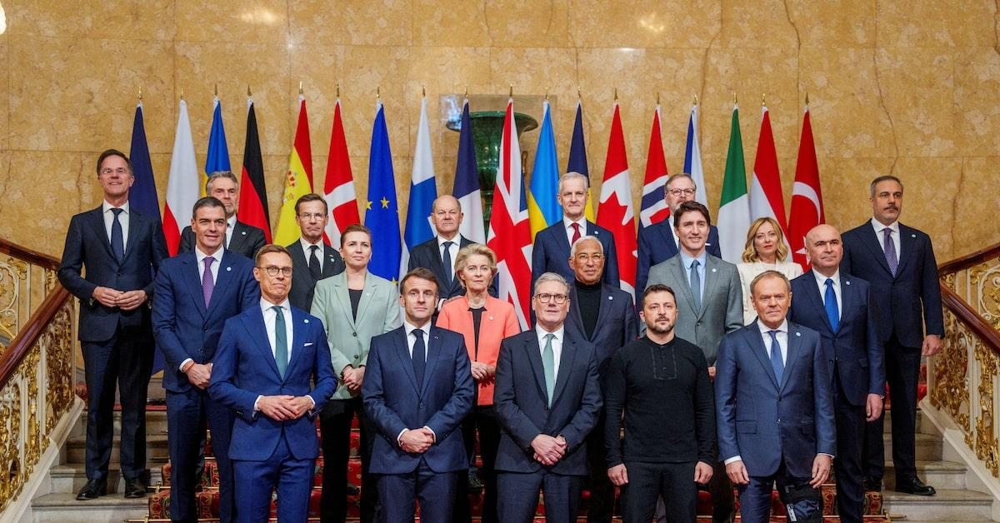
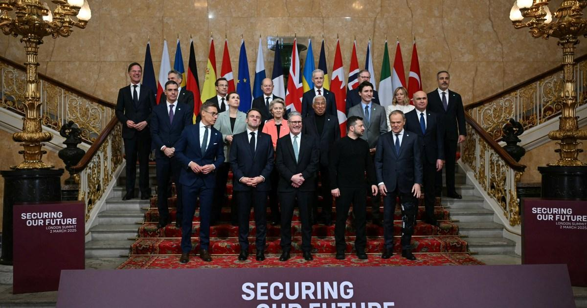

## Claim
Claim: " This is an authentic image of world leaders taking off their suits to symbolically support Ukraine at the London summit on Ukraine on March 2, 2025."

## Actions
```
reverse_search()
web_search("London summit on Ukraine March 2 2025")
image_search("European leaders take off suits Ukraine support")
```

## Evidence
### Evidence from `web_search`
The web sources discuss the 2025 London Summit on Ukraine, held on March 2, 2025. The summit, hosted by Keir Starmer, involved leaders from various states, the EU, and NATO, with the aim of supporting peace negotiations between Ukraine and Russia. The summit resulted in commitments, including financial aid. The Guardian article mentions the attendance of Volodymyr Zelenskyy, Keir Starmer, Emmanuel Macron, and other leaders.

The CNN article reports on the summit in London where European leaders discussed negotiations over the Russia-Ukraine war. The image 

### Evidence from `image_search`
NPR ([https://www.npr.org/2025/02/17/nx-s1-5299750/europe-trump-putin-ukraine-summit](https://www.npr.org/2025/02/17/nx-s1-5299750/europe-trump-putin-ukraine-summit)) published an image of European leaders. NBC News ([https://www.nbcnews.com/world/ukraine/trump-zelenskyy-ukraine-europe-putin-summit-suit-golf-rcna225759](https://www.nbcnews.com/world/ukraine/trump-zelenskyy-ukraine-europe-putin-summit-suit-golf-rcna225759)) published an image of Zelenskyy with other leaders.

The BBC News website ([https://www.bbc.com/news/articles/c9d0v8ljw3no](https://www.bbc.com/news/articles/c9d0v8ljw3no)) contains an image of Volodymyr Zelenskyy with Emmanuel Macron. 


## Elaboration
The evidence confirms the existence of the London Summit on Ukraine on March 2, 2025, attended by Volodymyr Zelenskyy and other European leaders. The image search results show images of Zelenskyy with other leaders. However, the evidence does not explicitly state that the leaders took off their suits to support Ukraine. Therefore, the claim cannot be fully verified.

The evidence does not provide enough information to confirm the authenticity of the image and the action described in the claim. More information is needed to verify the claim.


## Actions
```
web_search("London summit on Ukraine March 2 2025 leaders suits")
```

## Evidence
### Evidence from `web_search`
From [Source](https://www.pm.gc.ca/en/news/news-releases/2025/03/02/standing-united-in-support-of-ukraine): 
Content: The Prime Minister of Canada, Justin Trudeau, participated in the Securing our Future Summit in London, United Kingdom, on March 2, 2025. The summit, hosted by Sir Keir Starmer, focused on supporting Ukraine. The summit resulted in new sanctions against individuals and entities. The article does not mention leaders taking off their suits.


## Elaboration
The new evidence from the web search confirms the London summit on March 2, 2025, but it does not mention leaders taking off their suits. The source focuses on the summit's outcomes, such as new sanctions.

The claim remains unverified due to the lack of evidence supporting the leaders removing their suits.


## Actions
```
image_search("European leaders London summit Ukraine suits off")
```

## Evidence
### Evidence from `image_search`
The Reuters ([https://www.reuters.com/world/europe/uks-starmer-tries-revive-hope-ukraine-peace-summit-2025-03-01/](https://www.reuters.com/world/europe/uks-starmer-tries-revive-hope-ukraine-peace-summit-2025-03-01/)) and Al Jazeera ([https://www.aljazeera.com/news/2025/3/2/european-leaders-gather-in-london-to-strengthen-support-for-ukraine](https://www.aljazeera.com/news/2025/3/2/european-leaders-gather-in-london-to-strengthen-support-for-ukraine)) articles discuss the London summit on Ukraine in March 2025 and include images of the leaders. The images (, ) show the leaders wearing suits.


## Elaboration
The image search results provide images of the leaders at the London summit. These images show the leaders wearing suits, which contradicts the claim that they took off their suits.

Therefore, the claim is false.


## Final Judgement
The fact-check reveals that while the London summit on Ukraine did occur on March 2, 2025, and involved European leaders, the available images and reports do not support the claim that they took off their suits to show support. On the contrary, the images show the leaders wearing suits.

`false`

### Verdict: FALSE

### Justification
The claim is false. While the London summit on Ukraine did take place on March 2, 2025, and involved European leaders, the provided evidence, including images from Reuters ([https://www.reuters.com/world/europe/uks-starmer-tries-revive-hope-ukraine-peace-summit-2025-03-01/](https://www.reuters.com/world/europe/uks-starmer-tries-revive-hope-ukraine-peace-summit-2025-03-01/)) and Al Jazeera ([https://www.aljazeera.com/news/2025/3/2/european-leaders-gather-in-london-to-strengthen-support-for-ukraine](https://www.aljazeera.com/news/2025/3/2/european-leaders-gather-in-london-to-strengthen-support-for-ukraine)), shows the leaders wearing suits, contradicting the claim.
