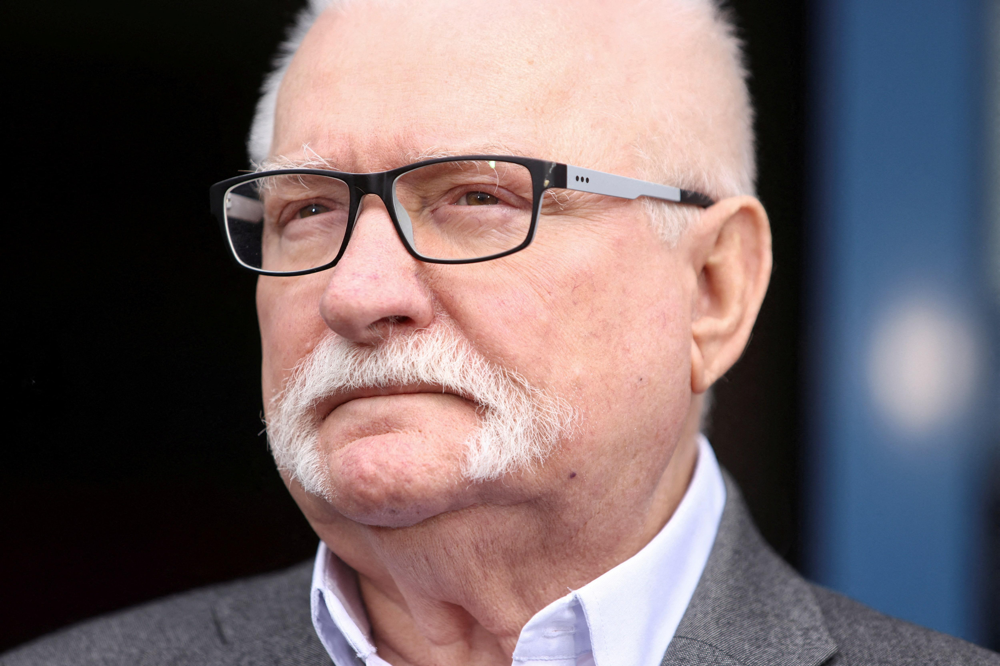

## Claim
Claim: "In March 2025 former President of Poland Lech Wałęsa wrote a letter to Donald Trump criticizing the U.S. President's decision to suspend the delivery of all U.S. military aid to Ukraine."

## Actions
```
web_search("Lech Wałęsa letter Donald Trump Ukraine aid March 2025")
```

## Evidence
### Evidence from `web_search`
In March 2025, Lech Wałęsa wrote a letter to Donald Trump criticizing his treatment of Ukrainian President Volodymyr Zelenskyy. The letter was signed by dozens of former Polish political prisoners. NPR reported on March 5, 2025, that Wałęsa's letter was sent to the White House, while Reuters reported on March 3, 2025, that the letter was posted on Facebook. The Los Angeles Times also reported on March 3, 2025, that Wałęsa and other former political prisoners wrote a letter to Trump criticizing his behavior toward Zelenskyy.

Sources: [NPR](https://www.npr.org/2025/03/05/nx-s1-5317474/nobel-peace-prize-winner-lech-walesa-condemns-president-trumps-treatment-of-zelenskyy), [Reuters](https://www.reuters.com/world/polish-cold-war-hero-walesa-writes-trump-expressing-horror-zelenskiy-spat-2025-03-03/), and [Los Angeles Times](https://www.latimes.com/world-nation/story/2025-03-03/polish-democracy-hero-walesa-says-trump-treatment-of-zelensky-filled-him-with-horror).   <image:i>


## Elaboration
The evidence confirms that Lech Wałęsa wrote a letter to Donald Trump in March 2025. The letter criticized Trump's treatment of Ukrainian President Volodymyr Zelenskyy. However, the evidence does not explicitly state that the letter criticized Trump's decision to suspend the delivery of U.S. military aid to Ukraine.

Therefore, the claim is partially supported. While Wałęsa did write a letter to Trump, the specific content regarding the suspension of military aid cannot be verified based on the provided evidence.

To fully verify the claim, information about the letter's content, specifically whether it addressed the suspension of military aid, is missing.


## Final Judgement
The evidence confirms that Lech Wałęsa wrote a letter to Donald Trump in March 2025 criticizing his treatment of Ukrainian President Volodymyr Zelenskyy. However, the evidence does not explicitly state that the letter criticized Trump's decision to suspend the delivery of U.S. military aid to Ukraine.

The claim is partially supported, as Wałęsa did write a letter to Trump. However, the specific content regarding the suspension of military aid cannot be verified based on the provided evidence. Therefore, the most appropriate decision option is `false`.

### Verdict: FALSE

### Justification
In March 2025, Lech Wałęsa wrote a letter to Donald Trump criticizing his treatment of Ukrainian President Volodymyr Zelenskyy, as reported by [NPR](https://www.npr.org/2025/03/05/nx-s1-5317474/nobel-peace-prize-winner-lech-walesa-condemns-president-trumps-treatment-of-zelenskyy), [Reuters](https://www.reuters.com/world/polish-cold-war-hero-walesa-writes-trump-expressing-horror-zelenskiy-spat-2025-03-03/), and the [Los Angeles Times](https://www.latimes.com/world-nation/story/2025-03-03/polish-democracy-hero-walesa-says-trump-treatment-of-zelensky-filled-him-with-horror). However, the provided evidence does not confirm that the letter specifically addressed the suspension of U.S. military aid to Ukraine.
