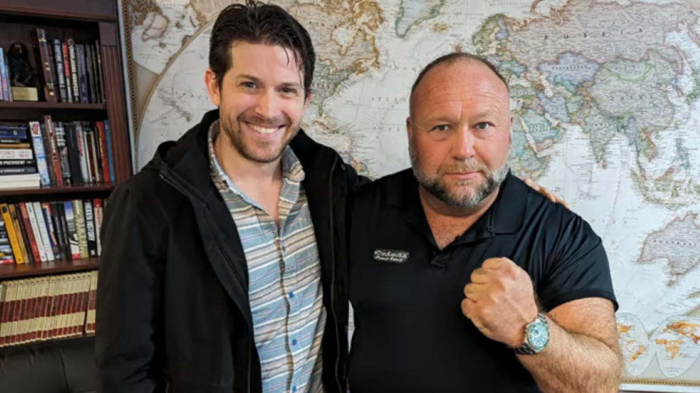
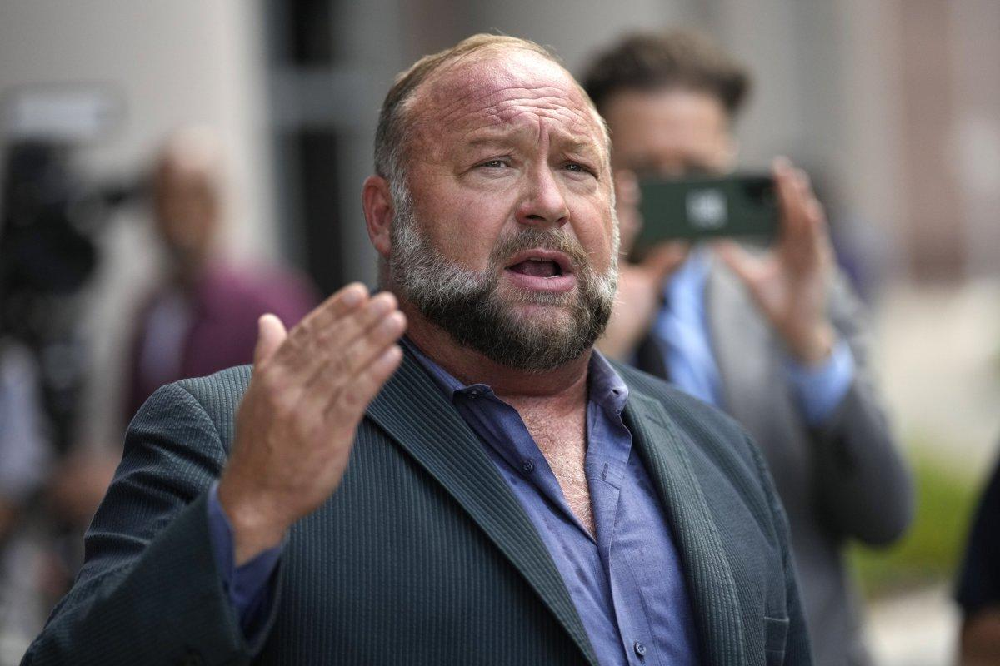

## Claim
Claim: "After InfoWars reporter Jamie White was shot dead on March 10, 2025 in Austin, Texas, it was revelaed that he was on a Ukranian enemies hit list."

## Actions
```
web_search("Jamie White shot dead Austin Texas March 10 2025")
web_search("Jamie White InfoWars Ukrainian enemies hit list")
```

## Evidence
### Evidence from `web_search`
Jamie White, an InfoWars reporter, was shot dead in Austin, Texas, on March 10, 2025, while interrupting a vehicle burglary, according to reports from FOX 7 Austin ([https://www.fox7austin.com/news/infowars-writer-shooting-austin-police-jamie-white](https://www.fox7austin.com/news/infowars-writer-shooting-austin-police-jamie-white)) and Fox News ([https://www.foxnews.com/us/police-release-more-details-murder-infowars-reporter-jamie-white-search-suspects-continues](https://www.foxnews.com/us/police-release-more-details-murder-infowars-reporter-jamie-white-search-suspects-continues)). Several arrests have been made in connection to the murder.

KVUE.com also reported on the murder of Jamie White ([https://www.kvue.com/article/news/crime/jamie-white-murder-arrests-infowars/269-aa20c169-085c-4827-8e8c-ce8755a4b715](https://www.kvue.com/article/news/crime/jamie-white-murder-arrests-infowars/269-aa20c169-085c-4827-8e8c-ce8755a4b715)). , , , , , , 


### Evidence from `web_search`
According to [Latin Times](https://www.latintimes.com/infowars-reporter-assassinated-ukraine-outside-his-home-conspiracy-theorists-claim-578436), Infowars reporter Jamie White was shot dead in Austin, Texas, and Alex Jones claimed he was on a Ukrainian hit list. The Austin police confirmed White was shot in his apartment complex parking lot. 

[StopFake.org](https://www.stopfake.org/en/fake-infowars-journalist-murdered-shortly-after-ukraine-put-him-on-their-kill-list/) states that White was murdered on March 9, and his death was unrelated to his journalistic activities. The article claims there is no evidence that White was on any "list of enemies of Ukraine." [Newsweek](https://www.newsweek.com/alex-jones-claims-killed-infowars-reporter-jamie-white-ukraine-hit-list-2043418) reports that Alex Jones claimed White was on a Ukrainian "hit list" and that the Austin Police Department stated White was shot and killed in his apartment's parking lot on March 9, likely due to a car robbery. 


## Elaboration
The evidence confirms that Jamie White, an InfoWars reporter, was shot dead in Austin, Texas. Alex Jones claimed that White was on a Ukrainian "hit list." However, there is no evidence to support this claim. The Austin Police Department stated that White was likely killed during a car robbery.


## Final Judgement
The claim that Jamie White was on a Ukrainian enemies hit list after being shot dead is not supported by evidence. While Alex Jones made this claim, there is no evidence to back it up. The Austin Police Department stated that White was likely killed during a car robbery.

`false`

### Verdict: FALSE

### Justification
The claim that Jamie White was on a Ukrainian hit list after being shot dead is not supported by evidence. While the InfoWars reporter was shot dead in Austin, Texas, and Alex Jones made the claim, there is no evidence to support it, and the Austin Police Department suggested the murder was related to a car robbery, as reported by [Newsweek](https://www.newsweek.com/alex-jones-claims-killed-infowars-reporter-jamie-white-ukraine-hit-list-2043418).
