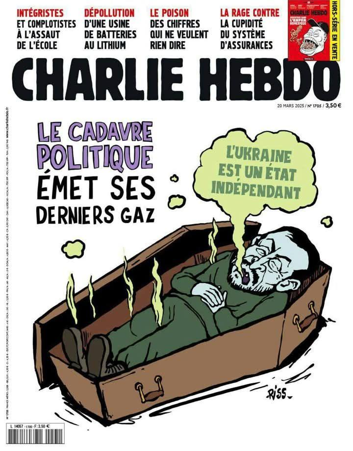

## Claim
Claim: " This image shows a screenshot of an authentic Charlie Hebdo magazine cover from March 20, 2025 illustrating Ukrainian President Volodoymr Zelenskyy lying in a coffin and saying 'Ukraine is an independet state' in French."

## Actions
```
web_search("Charlie Hebdo March 20 2025 Zelenskyy coffin")
```

## Evidence
### Evidence from `web_search`
The search results indicate that the Charlie Hebdo cover featuring Volodymyr Zelenskyy in a coffin is fabricated. Myth Detector ([https://mythdetector.com/en/coffin-was-not-published-by-charlie-hebdo/](https://mythdetector.com/en/coffin-was-not-published-by-charlie-hebdo/)) and without-lie.info ([https://without-lie.info/en/fake-with-another-fictional-cover-of-charlie-hebdo-magazine-with-a-caricature-of-the-president-of-ukraine/](https://without-lie.info/en/fake-with-another-fictional-cover-of-charlie-hebdo-magazine-with-a-caricature-of-the-president-of-ukraine/)) both confirm the image's inauthenticity, noting incorrect dates and issue numbers. Aol.com ([https://www.aol.com/fact-check-charlie-hebdo-magazine-151901301.html](https://www.aol.com/fact-check-charlie-hebdo-magazine-151901301.html)) also states the cover is fake, confirmed by a Charlie Hebdo journalist.

The sources provide images of the fabricated cover ,  and the real cover.


## Elaboration
The evidence confirms the Charlie Hebdo cover featuring Zelenskyy in a coffin is fabricated. Multiple sources, including Myth Detector ([https://mythdetector.com/en/coffin-was-not-published-by-charlie-hebdo/](https://mythdetector.com/en/coffin-was-not-published-by-charlie-hebdo/)), without-lie.info ([https://without-lie.info/en/fake-with-another-fictional-cover-of-charlie-hebdo-magazine-with-a-caricature-of-the-president-of-ukraine/](https://without-lie.info/en/fake-with-another-fictional-cover-of-charlie-hebdo-magazine-with-a-caricature-of-the-president-of-ukraine/)), and aol.com ([https://www.aol.com/fact-check-charlie-hebdo-magazine-151901301.html](https://www.aol.com/fact-check-charlie-hebdo-magazine-151901301.html)), explicitly state the cover is fake. The sources also provide images of the fabricated cover.


## Final Judgement
The claim is demonstrably false. Multiple sources confirm the Charlie Hebdo cover featuring Zelenskyy in a coffin is fabricated. The evidence includes images of the fake cover and statements from fact-checking websites and a Charlie Hebdo journalist.

`false`

### Verdict: FALSE

### Justification
The Charlie Hebdo cover depicting Volodymyr Zelenskyy in a coffin is a fabrication, as confirmed by multiple fact-checking sources, including Myth Detector ([https://mythdetector.com/en/coffin-was-not-published-by-charlie-hebdo/](https://mythdetector.com/en/coffin-was-not-published-by-charlie-hebdo/)) and without-lie.info ([https://without-lie.info/en/fake-with-another-fictional-cover-of-charlie-hebdo-magazine-with-a-caricature-of-the-president-of-ukraine/](https://without-lie.info/en/fake-with-another-fictional-cover-of-charlie-hebdo-magazine-with-a-caricature-of-the-president-of-ukraine/)), which identify the image as inauthentic.
