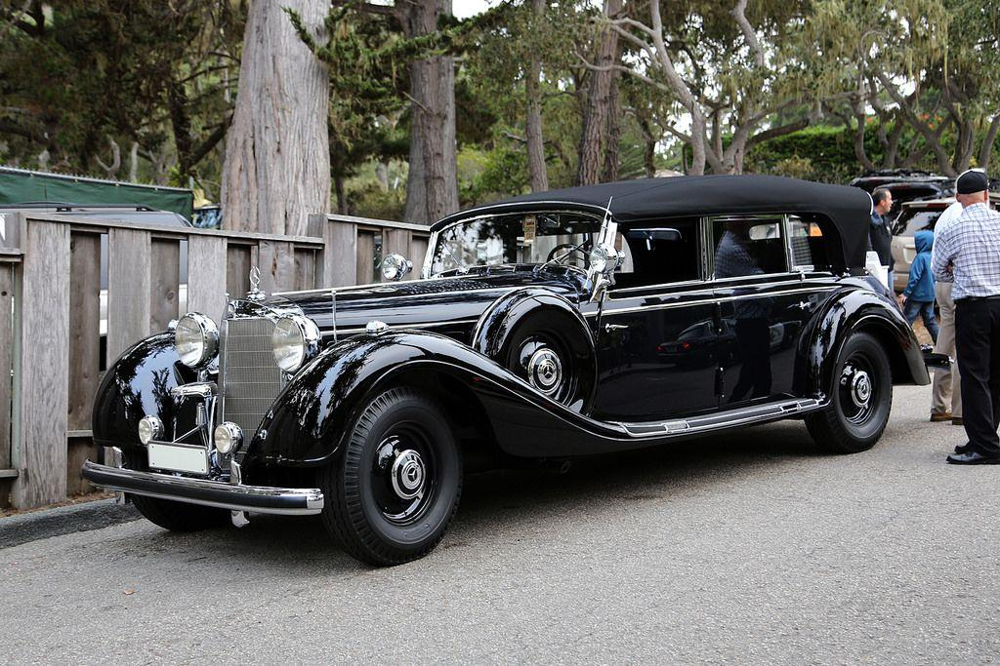

## Claim
Claim: " This image shows Hitler's parade car which was bought by the Ukrainian president Volodymyr Zelenskyy for 15 Million US-$."

## Actions
```
reverse_search()
```

## Evidence
### Evidence from `reverse_search`
The Voice of America ([https://www.voanews.com/a/russian-propagandists-push-fake-story-that-zelenskyy-bought-hitler-s-car/7818175.html](https://www.voanews.com/a/russian-propagandists-push-fake-story-that-zelenskyy-bought-hitler-s-car/7818175.html)) and The Insider ([https://theins.ru/en/antifake/275232](https://theins.ru/en/antifake/275232)) debunked a hoax spread by Russian media claiming that Volodymyr Zelenskyy bought Adolf Hitler's parade car. The image used in the claim () was doctored, and the story originated from a fake publication.

Truthmeter.mk ([https://truthmeter.mk/endless-inspiration-for-disinformation-zelenskys-new-alleged-luxury-is-hitlers-mercedes/](https://truthmeter.mk/endless-inspiration-for-disinformation-zelenskys-new-alleged-luxury-is-hitlers-mercedes/)) also fact-checked the claim, stating it is disinformation originating from the "news portal" Seattle Tribune. The car in the image () was auctioned in Arizona, USA, in 2018. The claim has been debunked by multiple sources.


## Elaboration
The claim is false. Multiple sources, including The Voice of America ([https://www.voanews.com/a/russian-propagandists-push-fake-story-that-zelenskyy-bought-hitler-s-car/7818175.html](https://www.voanews.com/a/russian-propagandists-push-fake-story-that-zelenskyy-bought-hitler-s-car/7818175.html)), The Insider ([https://theins.ru/en/antifake/275232](https://theins.ru/en/antifake/275232)), and Truthmeter.mk ([https://truthmeter.mk/endless-inspiration-for-disinformation-zelenskys-new-alleged-luxury-is-hitlers-mercedes/](https://truthmeter.mk/endless-inspiration-for-disinformation-zelenskys-new-alleged-luxury-is-hitlers-mercedes/)), have debunked the story as disinformation.

The image used in the claim was associated with a car auctioned in Arizona in 2018. The story originated from a fake publication.


## Final Judgement
The claim that the image shows Hitler's parade car bought by Volodymyr Zelenskyy is false. Multiple sources have debunked this as disinformation, with the image being associated with a car auctioned in Arizona in 2018.

`false`

### Verdict: FALSE

### Justification
The claim is false. Multiple sources, including The Voice of America ([https://www.voanews.com/a/russian-propagandists-push-fake-story-that-zelenskyy-bought-hitler-s-car/7818175.html](https://www.voanews.com/a/russian-propagandists-push-fake-story-that-zelenskyy-bought-hitler-s-car/7818175.html)) and The Insider ([https://theins.ru/en/antifake/275232](https://theins.ru/en/antifake/275232)), have debunked the story as disinformation. The image used in the claim was associated with a car auctioned in Arizona in 2018.
