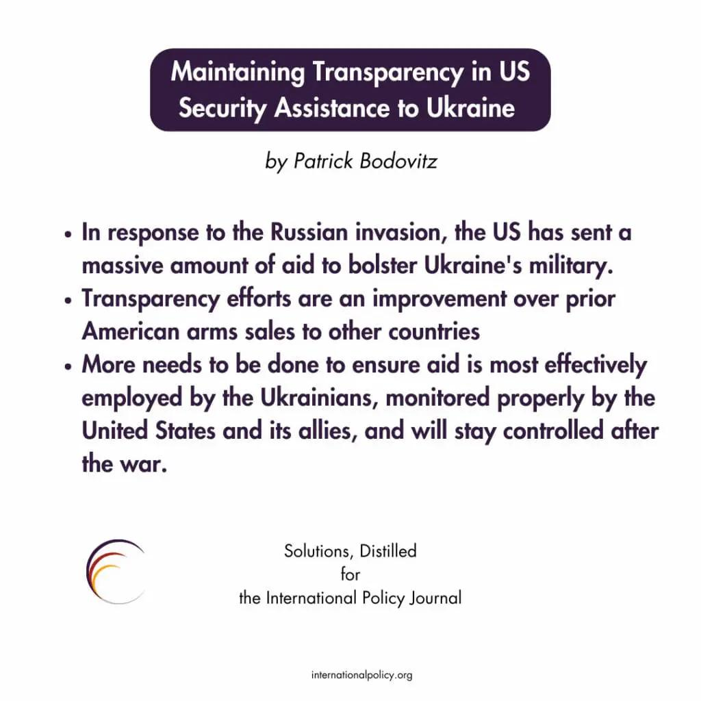

## Claim
Claim: "Ukraine is selling half of the armaments it receives from the United States"

## Actions
```
web_search("Ukraine arms sales US aid")
web_search("US aid to Ukraine arms accountability")
```

## Evidence
### Evidence from `web_search`
The Trump administration approved the sale of 3,350 Extended Range Attack Munition (ERAM) missiles to Ukraine, valued at $825 million, funded by Denmark, the Netherlands, Norway, and Foreign Military Financing from the United States, according to a CNN article published on August 28, 2025 (<image:k>, [Source](https://www.cnn.com/2025/08/28/politics/trump-missile-sale-ukraine)). A timeline of military aid to Ukraine from various countries, including the United States, Germany, and the Netherlands, details specific equipment and financial aid packages, but does not mention Ukraine selling armaments ([Source](https://www.forumarmstrade.org/ukrainearms.html)). The US Department of Defense announced that the Pentagon did not properly track $1 billion worth of military equipment sent to Ukraine.


### Evidence from `web_search`
The Center for Economic and Policy Research ([CEPR.org](http://cepr.org/voxeu/columns/new-analysis-economists-ukraine-cost-us-aid-ukraine-less-half-official-figures)) states that the total value of US aid to Ukraine is $50.9 billion, with $18.3 billion in military aid. It also mentions that there is no evidence of issues or anomalies unearthed through audits. <image:k>

CBS Austin ([cbsaustin.com/news/nation-world/exploring-impact-accountability-us-military-aid-to-ukraine-war-russia-congressional-budget-funding-money-weapons-refugees-tracking-territory-report](https://cbsaustin.com/news/nation-world/exploring-impact-accountability-us-military-aid-to-ukraine-war-russia-congressional-budget-funding-money-weapons-refugees-tracking-territory-report)) reports that the U.S. has provided Ukraine with over $107 billion in military assistance since 2022 and that a report found that at least one billion dollars worth of weapons sent to Ukraine wasn’t properly tracked.  The International Policy Journal ([internationalpolicy.org/publications/maintaining-transparency-in-us-security-assistance-to-ukraine/](https://internationalpolicy.org/publications/maintaining-transparency-in-us-security-assistance-to-ukraine/)) discusses US security assistance to Ukraine, mentioning the US has sent a massive amount of aid to bolster Ukraine's military. 


## Elaboration
The evidence does not support the claim that Ukraine is selling half of the armaments it receives from the United States. While there are reports of the US providing substantial military aid to Ukraine, and some equipment not being properly tracked, there is no mention of Ukraine selling any of the received armaments. One source mentions a sale of missiles to Ukraine, but this was approved by the Trump administration and funded by other countries, not a sale by Ukraine.


## Final Judgement
The evidence indicates that the claim is not supported by the available information. While there are reports of military aid from the US to Ukraine and some issues with tracking equipment, there is no evidence to suggest that Ukraine is selling half of the armaments it receives.

`false`


### Verdict: FALSE

### Justification
The claim is not supported by the evidence. While the US has provided significant military aid to Ukraine, and there have been issues with tracking some equipment, there is no evidence to suggest that Ukraine is selling half of the armaments it receives from the United States. Sources like [CNN](https://www.cnn.com/2025/08/28/politics/trump-missile-sale-ukraine) and [forumarmstrade.org](https://www.forumarmstrade.org/ukrainearms.html) detail aid packages and sales but do not mention Ukraine selling armaments.
