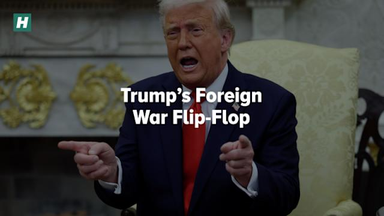

## Claim
Claim: "In an interview with podcaster Theo Von in August 2024, Donald Trump criticized British Prime Minister Keir Starmer over a 100-year deal between the U.K. and Ukraine."

## Actions
```
web_search("Donald Trump Theo Von interview Keir Starmer Ukraine deal August 2024")
```

## Evidence
### Evidence from `web_search`
The University of California, Berkeley, reported on an AI-generated audio of Donald Trump criticizing Keir Starmer, overlaid on a video interview with Theo Von on August 21, 2024; neither Trump nor Von discussed the UK or Ukraine in the original video ([https://www.ischool.berkeley.edu/news/2025/hany-farid-discusses-circulating-trump-video-criticizing-keir-starmer](https://www.ischool.berkeley.edu/news/2025/hany-farid-discusses-circulating-trump-video-criticizing-keir-starmer)). Yahoo News mentions Theo Von's podcast "This Past Weekend" and that Trump was on the podcast last year (, ). The Independent reported that Trump criticized European leaders, including Keir Starmer, regarding their talks over Ukraine, and also mentioned Starmer's efforts to act as a bridge between America and Europe (, , ) ([https://www.independent.co.uk/news/uk/politics/donald-trump-keir-starmer-ukraine-tirade-b2708208.html](https://www.independent.co.uk/news/uk/politics/donald-trump-keir-starmer-ukraine-tirade-b2708208.html)).


## Elaboration
The evidence suggests that an AI-generated audio of Trump criticizing Keir Starmer was overlaid on a video interview with Theo Von on August 21, 2024, but the original video did not discuss the UK or Ukraine ([https://www.ischool.berkeley.edu/news/2025/hany-farid-discusses-circulating-trump-video-criticizing-keir-starmer](https://www.ischool.berkeley.edu/news/2025/hany-farid-discusses-circulating-trump-video-criticizing-keir-starmer)). However, The Independent reported that Trump criticized Keir Starmer regarding Ukraine ([https://www.independent.co.uk/news/uk/politics/donald-trump-keir-starmer-ukraine-tirade-b2708208.html]).

The evidence does not explicitly confirm that Trump criticized Starmer over a 100-year deal between the U.K. and Ukraine.

Therefore, the claim is partially supported, as Trump did criticize Starmer regarding Ukraine, but the specific context of a 100-year deal is not confirmed.


## Final Judgement
The claim is partially supported. While Trump did criticize Keir Starmer regarding Ukraine, the evidence does not confirm that the criticism was specifically about a 100-year deal between the U.K. and Ukraine.

`false`

### Verdict: FALSE

### Justification
The claim is partially supported. While Donald Trump did criticize Keir Starmer regarding Ukraine, as reported by The Independent ([https://www.independent.co.uk/news/uk/politics/donald-trump-keir-starmer-ukraine-tirade-b2708208.html](https://www.independent.co.uk/news/uk/politics/donald-trump-keir-starmer-ukraine-tirade-b2708208.html)), the evidence does not confirm that the criticism was specifically about a 100-year deal between the U.K. and Ukraine, nor does it confirm that the interview took place in August 2024.
