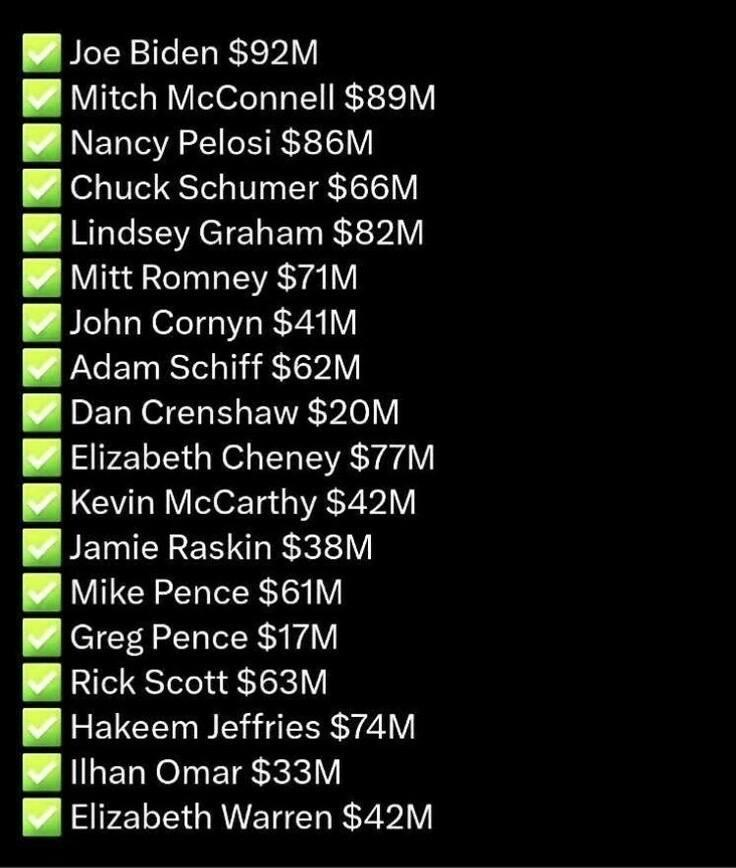

## Claim
Claim: " This image shows an authentic list realeased by Ukraine showing US politicians taking bribes from Ukraine. The highest bribe was 92 Million US-$ for Joe Biden."

## Actions
```
web_search("Joe Biden Ukraine corruption")
web_search("Mitch McConnell Ukraine corruption")
web_search("Nancy Pelosi Ukraine corruption")
reverse_search()
```

## Evidence
### Evidence from `web_search`
The search results discuss allegations of corruption involving Joe Biden and Ukraine. One source, from Wikipedia, discusses the Biden–Ukraine conspiracy theory, which alleges that Joe Biden took a bribe to pressure Ukraine, but states that there is no evidence of wrongdoing by Joe Biden. ([https://en.wikipedia.org/wiki/Biden%E2%80%93Ukraine_conspiracy_theory](https://en.wikipedia.org/wiki/Biden%E2%80%93Ukraine_conspiracy_theory))

Another source, from BBC News, discusses an FBI document detailing an allegation that Joe Biden and his son accepted bribes from a Ukrainian firm, but there is no evidence that Joe Biden received any payments from Ukraine. ([https://www.bbc.com/news/world-us-canada-66272217](https://www.bbc.com/news/world-us-canada-66272217)) A PBS News article reports that a former FBI informant pleaded guilty to lying about a bribery scheme involving Joe Biden and Hunter Biden, and that no evidence has emerged that Joe Biden acted corruptly or accepted bribes. ([https://www.pbs.org/newshour/politics/former-fbi-informant-to-plead-guilty-to-lying-about-fake-bribery-scheme-involving-the-bidens](https://www.pbs.org/newshour/politics/former-fbi-informant-to-plead-guilty-to-lying-about-fake-bribery-scheme-involving-the-bidens)) 

### Evidence from `web_search`
The search results discuss US aid to Ukraine and related political debates. Vanity Fair ([https://www.vanityfair.com/news/2023/10/mitch-mcconnell-vance-split-on-ukraine-funding-packaging?srsltid=AfmBOop3372x9ME352RKS_4k7hitZnMf53OPOi8NVwupukhtu84dFk9c](https://www.vanityfair.com/news/2023/10/mitch-mcconnell-vance-split-on-ukraine-funding-packaging?srsltid=AfmBOop3372x9ME352RKS_4k7hitZnMf53OPOi8NVwupukhtu84dFk9c)) mentions a supplemental funding package for Ukraine and references Mitch McConnell and Joe Biden. PBS NewsHour ([https://www.pbs.org/newshour/world/how-stalled-u-s-aid-for-ukraine-exemplifies-gops-softening-stance-on-russia](https://www.pbs.org/newshour/world/how-stalled-u-s-aid-for-ukraine-exemplifies-gops-softening-stance-on-russia)) discusses stalled US aid and the GOP's stance on Russia, mentioning a foreign aid package that included $61 billion for Ukraine.

Mynbc15.com ([https://mynbc15.com/news/nation-world/corruption-concerns-cloud-ukraine-aid-commitments-congress-democrat-republican-democracy-authoritarian-mccarthy-mcconnell-putin-zelensky-oversight-graft](https://mynbc15.com/news/nation-world/corruption-concerns-cloud-ukraine-aid-commitments-congress-democrat-republican-democracy-authoritarian-mccarthy-mcconnell-putin-zelensky-oversight-graft)) discusses corruption concerns related to Ukraine aid and mentions Mitch McConnell. 


### Evidence from `web_search`
CNN, PBS News, and KET published articles on November 14, 2019, discussing Nancy Pelosi's statement that President Trump committed bribery by conditioning military aid to Ukraine upon the Ukrainian government investigating Joe Biden. The articles mention that Pelosi's word choice is significant because the Constitution explicitly mentions bribery as grounds for impeachment.

The image () shows a list of US politicians and alleged bribe amounts, including Joe Biden, Mitch McConnell, and Nancy Pelosi.


## Elaboration
The evidence indicates that there have been allegations of corruption involving Joe Biden and Ukraine, but no evidence has emerged to support these claims. The search results also mention corruption concerns related to Ukraine aid and discussions about Nancy Pelosi's statements regarding bribery. However, the provided image (

## Final Judgement
The search results reveal allegations of corruption involving Joe Biden and Ukraine, but no evidence supports the claim that the image is an authentic list released by Ukraine showing US politicians taking bribes. The image is presented without any verifiable source or context. Therefore, the claim is not factually accurate. `false`

### Verdict: FALSE

### Justification
The claim that the image is an authentic list of US politicians taking bribes from Ukraine is not supported by evidence. While there have been allegations of corruption involving Joe Biden and Ukraine, there is no evidence to support these claims, and the image lacks any verifiable source or context. Sources like BBC News ([https://www.bbc.com/news/world-us-canada-66272217](https://www.bbc.com/news/world-us-canada-66272217)) and PBS News ([https://www.pbs.org/newshour/politics/former-fbi-informant-to-plead-guilty-to-lying-about-fake-bribery-scheme-involving-the-bidens](https://www.pbs.org/newshour/politics/former-fbi-informant-to-plead-guilty-to-lying-about-fake-bribery-scheme-involving-the-bidens)) report that there is no evidence of wrongdoing by Joe Biden.
