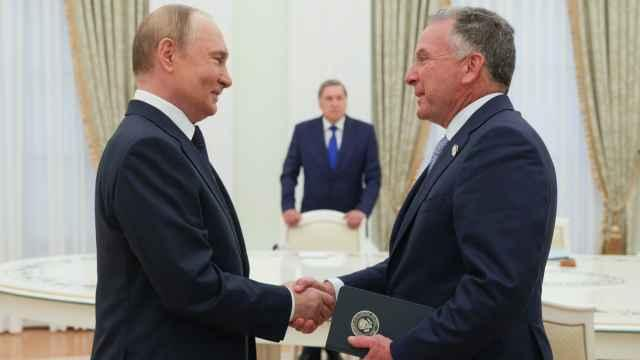
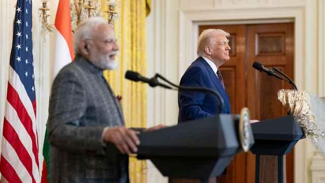
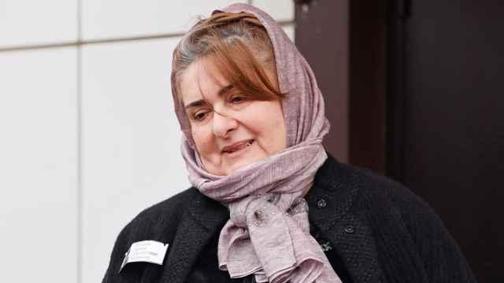

## Claim
Claim: "French President Emmanuel Macron called Russian President Vladimir Putin a 'butcher' during his press conference with Donald Trump on Monday, Feb. 24, 2025."

## Actions
```
web_search("Emmanuel Macron Vladimir Putin butcher February 24 2025")
```

## Evidence
### Evidence from `web_search`
According to [France 24](https://www.france24.com/en/live-news/20220327-macron-warns-against-escalation-after-biden-brands-putin-butcher), Emmanuel Macron warned against escalating the situation after Joe Biden called Vladimir Putin a "butcher" <image:i>. [Yahoo News UK](https://uk.news.yahoo.com/macron-didn-t-call-putin-113000978.html) states that Macron did not call Putin a "butcher" during a press conference with Donald Trump on February 24, 2025. [The Moscow Times](https://www.themoscowtimes.com/2022/03/27/macron-warns-against-escalation-after-biden-brands-putin-butcher-a77097) also reports on Macron's warning against escalation after Biden's comments , and mentions events in August 2025, and Putin sending troops into Ukraine on February 24 , , .


## Elaboration
The evidence indicates that the claim is false. According to [Yahoo News UK](https://uk.news.yahoo.com/macron-didn-t-call-putin-113000978.html), Macron did not call Putin a "butcher" during a press conference with Donald Trump on February 24, 2025.


## Final Judgement
The search results confirm that Macron did not call Putin a "butcher" during a press conference with Donald Trump on February 24, 2025. The evidence directly contradicts the claim.

`false`


### Verdict: FALSE

### Justification
The claim is false. According to [Yahoo News UK](https://uk.news.yahoo.com/macron-didn-t-call-putin-113000978.html), Macron did not call Putin a "butcher" during a press conference with Donald Trump on February 24, 2025.
