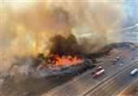

## Claim
Claim: "Russia offered assistance for the California wildfires from January 2025."

## Actions
```
web_search("Russia assistance California wildfires 2025")
```

## Evidence
### Evidence from `web_search`
The Tasnim News Agency published an article on January 12, 2025, discussing the California wildfires and mentioning Russia's comments on the situation, including reports of prisoners being mobilized to extinguish fires (). The article also notes that wildfires began to spread across Los Angeles County on January 7 (). The article is available at [Source](https://www.tasnimnews.com/en/news/2025/01/12/3236714/russia-notes-us-hypocrisy-in-california-fire-case).

Articles from the German Marshall Fund of the United States, published on January 15, 2025, and NPR, published on January 16, 2025, discuss how Russian state-affiliated accounts and news sites leveraged the California wildfires to sow division and spread false narratives (). These articles do not mention Russia offering assistance for the California wildfires. The German Marshall Fund of the United States article is available at [Source](https://www.gmfus.org/news/inflaming-divides-russian-narratives-california-wildfires), and the NPR article is available at [Source](https://www.npr.org/2025/01/16/nx-s1-5259842/los-angeles-california-fires-russia-ukraine).


## Elaboration
The Tasnim News Agency article mentions Russia's comments on the California wildfires, but it does not explicitly state that Russia offered assistance. The article does mention reports of prisoners being mobilized to extinguish fires.

Other sources, such as the German Marshall Fund of the United States and NPR, discuss how Russian state-affiliated accounts used the wildfires to spread false narratives, but they do not mention any offers of assistance.

Based on the provided evidence, there is no information to verify that Russia offered assistance for the California wildfires.


## Final Judgement
The search results indicate that Russia commented on the California wildfires in January 2025, but there is no evidence to confirm that Russia offered assistance. Therefore, the claim cannot be verified. `false`

### Verdict: FALSE

### Justification
The available evidence, including a Tasnim News Agency article ([Source](https://www.tasnimnews.com/en/news/2025/01/12/3236714/russia-notes-us-hypocrisy-in-california-fire-case)), indicates that Russia commented on the California wildfires in January 2025. However, the article does not explicitly state that Russia offered assistance. Furthermore, articles from the German Marshall Fund of the United States ([Source](https://www.gmfus.org/news/inflaming-divides-russian-narratives-california-wildfires)) and NPR ([Source](https://www.npr.org/2025/01/16/nx-s1-5259842/los-angeles-california-fires-russia-ukraine)) discuss how Russian state-affiliated accounts used the wildfires to spread false narratives, but they do not mention any offers of assistance. Therefore, the claim cannot be verified.
