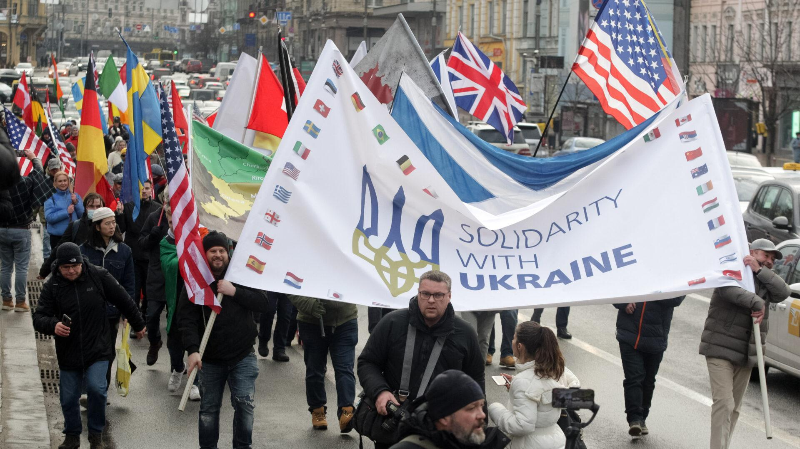

## Claim
Claim: "Russian President Vladimir Putin has declared war on the United States."

## Actions
```
web_search("Vladimir Putin declares war on United States")
```

## Evidence
### Evidence from `web_search`
Fact Crescendo states that there has been no official declaration of war by Russia against the USA, and the claim is unfounded and incorrect. The BBC article discusses the war in Ukraine and Putin's goals, including "demilitarise and denazify" Ukraine, and mentions Putin's false allegations and refusal to agree to peace talks. The Journal of Democracy article discusses Putin's hostile policies toward the United States and his justification for them, including the NATO threat, and his view of Ukraine's democracy as a threat.

The sources are: [Fact Crescendo](https://srilanka.factcrescendo.com/english/did-russia-declare-war-against-the-usa/), [BBC](https://www.bbc.com/news/articles/cj0q964851po), and [Journal of Democracy](https://www.journalofdemocracy.org/articles/what-putin-fears-most/). , , , , , , 


## Elaboration
The evidence indicates that the claim is false. Fact Crescendo explicitly states that there has been no official declaration of war by Russia against the USA, and the claim is unfounded and incorrect ([Fact Crescendo](https://srilanka.factcrescendo.com/english/did-russia-declare-war-against-the-usa/)). The BBC and Journal of Democracy articles discuss Putin's policies and justifications for actions, but do not mention a declaration of war against the United States.


## Final Judgement
The claim is demonstrably false. Multiple reliable sources confirm that there has been no declaration of war by Russia against the United States. `false`

### Verdict: FALSE

### Justification
The claim is false. According to [Fact Crescendo](https://srilanka.factcrescendo.com/english/did-russia-declare-war-against-the-usa/), there has been no official declaration of war by Russia against the USA. Other sources discuss Putin's actions and policies but do not mention a declaration of war against the United States.
