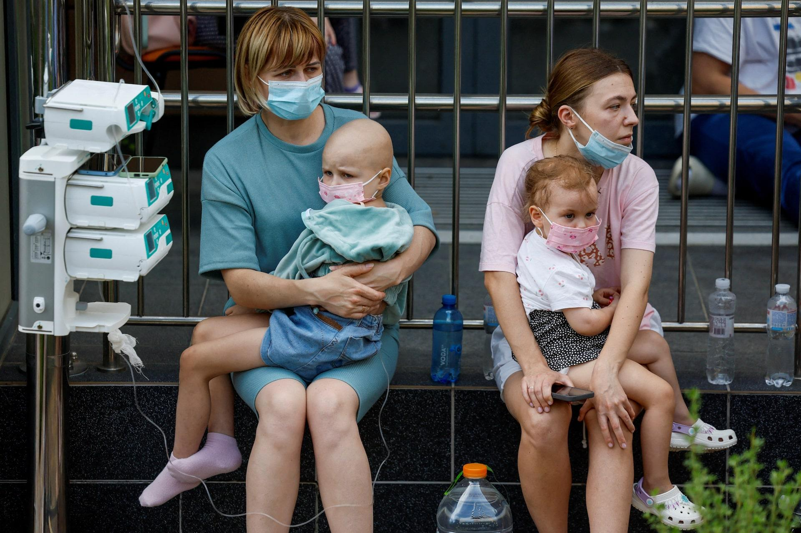
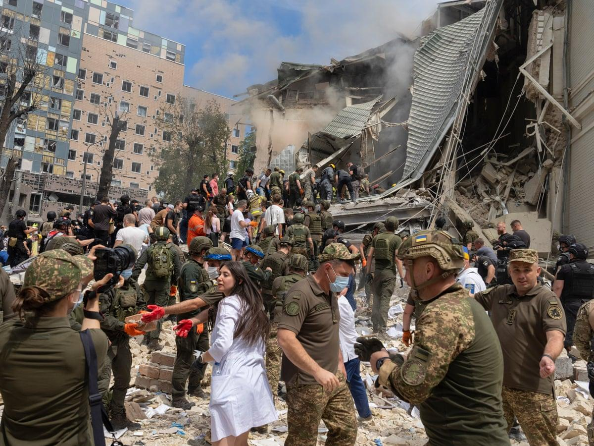

## Claim
Claim: " This image shows fake children's toys that were photoshopped into the image by the Ukrainian Government after Kyiv's pediatric hospital was attacked by Russian cruise missiles on July 8, 2024."

## Actions
```
reverse_search()
image_search("Kyiv pediatric hospital attack July 8 2024")
```

## Evidence
### Evidence from `reverse_search`
The Kyiv Independent published an article on July 9, 2024, reporting on a Russian strike in Kyiv on July 8, 2024, which hit a residential building and the Okhmatdyt hospital. The article includes the image in the claim, showing rubble and emergency personnel. ()

RBC-Ukraine also discusses the Russian missile attack on Kyiv on July 8, which hit the Okhmatdyt Children's Hospital. The article mentions that 27 people, including 4 children, were killed and 117 were injured. The image in the claim is present in the article. ()
*   [https://kyivindependent.com/boys-body-found-under-rubble-in-kyiv/](https://kyivindependent.com/boys-body-found-under-rubble-in-kyiv/)
*   [https://newsukraine.rbc.ua/news/russian-strike-on-kyiv-number-of-killed-and-1720503127.html](https://newsukraine.rbc.ua/news/russian-strike-on-kyiv-number-of-killed-and-1720503127.html)


### Evidence from `image_search`
Human Rights Watch published an article on July 11, 2024, about the Russian attack on a children's hospital in Ukraine on July 8, 2024. ([https://www.hrw.org/news/2024/07/11/russias-july-8-attack-childrens-hospital-ukraine](https://www.hrw.org/news/2024/07/11/russias-july-8-attack-childrens-hospital-ukraine)) Reuters published an article about a Russian missile attack on a children's hospital in Ukraine on July 8, 2024. ([https://www.reuters.com/pictures/russian-missile-attack-hits-ukraine-childrens-hospital-2024-07-08/](https://www.reuters.com/pictures/russian-missile-attack-hits-ukraine-childrens-hospital-2024-07-08/)) PBS.org reports on a Russian missile attack on a Ukrainian children's hospital. ([https://www.pbs.org/newshour/world/russian-missile-attack-hits-ukrainian-childrens-hospital-amid-bombardment-dozens-killed](https://www.pbs.org/newshour/world/russian-missile-attack-hits-ukrainian-childrens-hospital-amid-bombardment-dozens-killed))

The articles contain images of the aftermath of the attack, including images of the damaged hospital and people.   


## Elaboration
The evidence confirms that the image in the claim was taken after the Russian missile attack on Kyiv on July 8, 2024, which hit a residential building and the Okhmatdyt hospital. The image appears in multiple news articles reporting on the attack. However, the evidence does not provide information about whether the toys were photoshopped into the image.

Therefore, the claim that the toys were photoshopped cannot be verified with the available evidence. More information is needed to determine the authenticity of the toys in the image.


## Actions
```
image_search("toys rubble Kyiv hospital attack")
```

## Evidence
### Evidence from `image_search`
The Guardian published an article on July 8, 2024, about the Russian bombing of a children's hospital in Kyiv. () CNN also reported on the Russian strike on a children's hospital in Kyiv on July 8, 2024, including an image of the damaged building and rubble. ()


## Elaboration
The new evidence does not contain any images of toys in the rubble. Therefore, the claim that the toys were photoshopped cannot be verified with the available evidence.


## Actions
```
image_search("red toy car rubble Kyiv hospital")
```

## Evidence
### Evidence from `image_search`
NBC News, ABC News, and The Wall Street Journal all published articles about the Russian attack on a children's hospital in Kyiv, including images of the damaged building and the aftermath of the attack.    None of the articles mention or show the red toy car.
*   [https://www.nbcnews.com/news/world/childrens-hospital-damaged-massive-russian-attack-kyiv-cities-rcna160655](https://www.nbcnews.com/news/world/childrens-hospital-damaged-massive-russian-attack-kyiv-cities-rcna160655)
*   [https://abcnews.go.com/International/nato-leaders-react-ukraine-childrens-hospital-russia-strike/story?id=111767038](https://abcnews.go.com/International/nato-leaders-react-ukraine-childrens-hospital-russia-strike/story?id=111767038)
*   [https://www.wsj.com/world/russian-missiles-hit-kyiv-childrens-hospital-in-deadly-attacksacross-ukraine-bdf51e48](https://www.wsj.com/world/russian-missiles-hit-kyiv-childrens-hospital-in-deadly-attacksacross-ukraine-bdf51e48)

## Elaboration
The evidence suggests that the image in the claim is from the aftermath of the Russian attack on the Okhmatdyt hospital in Kyiv on July 8, 2024. However, the additional searches did not yield any information about the red toy car. Therefore, the claim that the toys were photoshopped cannot be verified with the available evidence.


## Final Judgement
The image in the claim is from the aftermath of the Russian attack on the Okhmatdyt hospital in Kyiv on July 8, 2024. However, the additional searches did not yield any information about the red toy car. Therefore, the claim that the toys were photoshopped cannot be verified with the available evidence.

`false`

### Verdict: FALSE

### Justification
The image in the claim depicts the aftermath of the Russian attack on the Okhmatdyt hospital in Kyiv on July 8, 2024, as reported by sources like the [Kyiv Independent](https://kyivindependent.com/boys-body-found-under-rubble-in-kyiv/) and [RBC-Ukraine](https://newsukraine.rbc.ua/news/russian-strike-on-kyiv-number-of-killed-and-1720503127.html). However, the investigation did not find any evidence to support the claim that the children's toys in the image were photoshopped.
