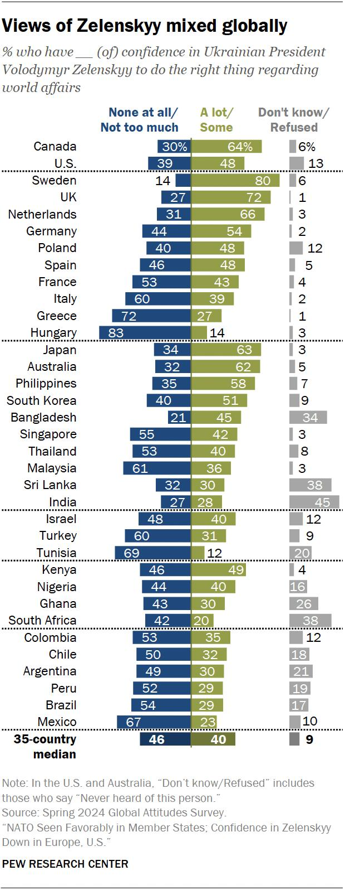

## Claim
Claim: "In February 2025 Ukrainian President Volodymyr Zelenskyy's approval rating in Ukraine was down at 4%."

## Actions
```
image_search("Volodymyr Zelenskyy approval rating February 2025 Ukraine")
```

## Evidence
### Evidence from `image_search`
A Pew Research Center survey from July 2024 shows mixed views of Zelenskyy globally, but does not include data from February 2025. [https://www.pewresearch.org/global/2024/07/02/confidence-in-zelenskyy-and-support-for-ukraine/](https://www.pewresearch.org/global/2024/07/02/confidence-in-zelenskyy-and-support-for-ukraine/) 

Euronews.com published an article on February 19, 2025, stating that Zelenskyy's approval rating grew to 57%. [https://www.euronews.com/2025/02/19/zelenskyys-approval-rating-grows-to-57-debunking-trumps-4-support-claim](https://www.euronews.com/2025/02/19/zelenskyys-approval-rating-grows-to-57-debunking-trumps-4-support-claim) 


## Elaboration
The claim is false. According to a Euronews.com article published on February 19, 2025, Zelenskyy's approval rating was 57% at that time. [https://www.euronews.com/2025/02/19/zelenskyys-approval-rating-grows-to-57-debunking-trumps-4-support-claim](https://www.euronews.com/2025/02/19/zelenskyys-approval-rating-grows-to-57-debunking-trumps-4-support-claim)


## Final Judgement
The Euronews.com article from February 19, 2025, states that Zelenskyy's approval rating was 57%, directly contradicting the claim of a 4% approval rating. The Pew Research Center survey from July 2024 does not provide data for February 2025.

`false`


### Verdict: FALSE

### Justification
The claim is false. A Euronews.com article from February 19, 2025, reported Zelenskyy's approval rating at 57%, directly contradicting the 4% figure stated in the claim.
