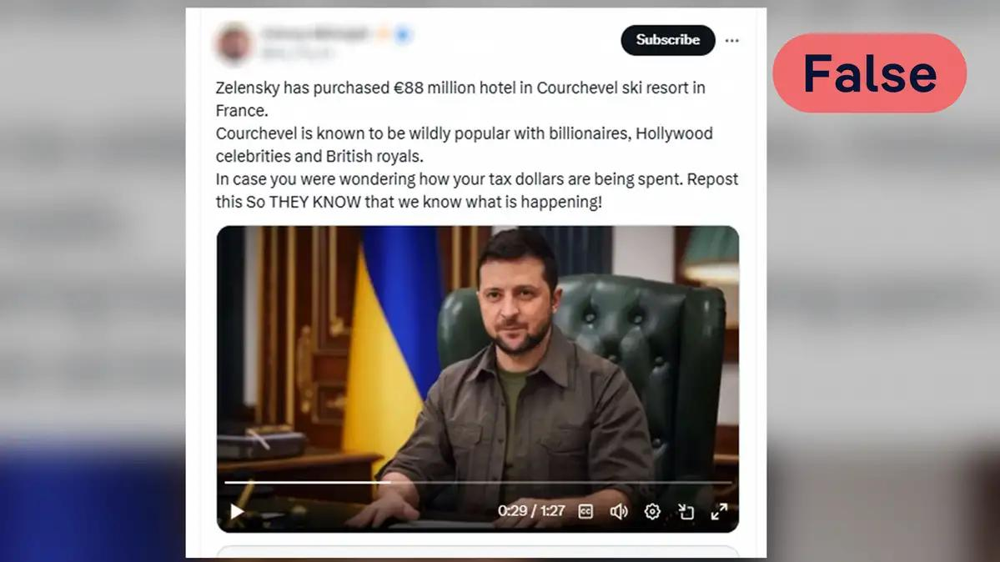
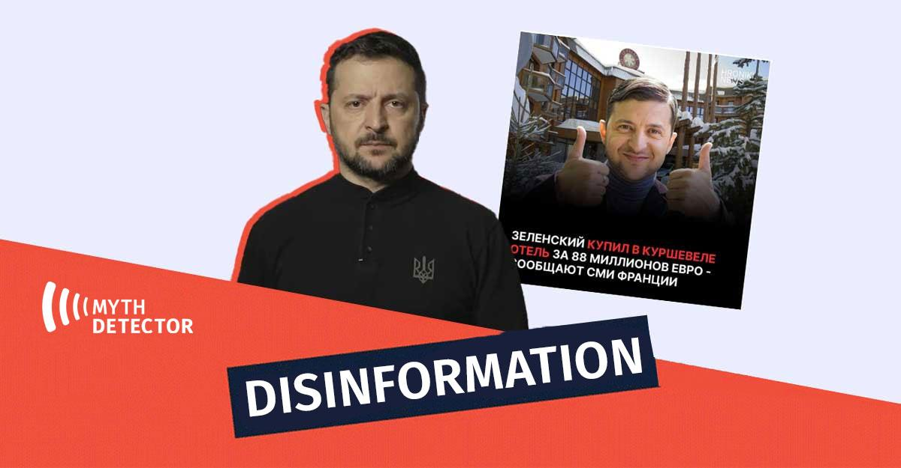

## Claim
Claim: "Ukrainian President Volodymyr Zelenskyy purchased an 88 million euro hotel in the Courchevel ski resort in France."

## Actions
```
image_search("Volodymyr Zelenskyy Courchevel hotel")
```

## Evidence
### Evidence from `image_search`
DW.com fact-checked the claim that Zelenskyy purchased an 88 million euro hotel in Courchevel, France, and labeled it as "False" (). Myth Detector also labeled the claim as disinformation ().

ABC News Australia published an article about the Courchevel ski resort ().


## Elaboration
The evidence directly contradicts the claim. Both DW.com and Myth Detector have fact-checked the claim and labeled it as "False" and "Disinformation," respectively.


## Final Judgement
The fact-check reveals that the claim about Volodymyr Zelenskyy purchasing an 88 million euro hotel in Courchevel is false. Both DW.com and Myth Detector have debunked the claim, labeling it as false and disinformation.

The most appropriate decision option is `false`.


### Verdict: FALSE

### Justification
The claim that Volodymyr Zelenskyy purchased an 88 million euro hotel in Courchevel is false. Fact-checks by both [DW.com](https://www.dw.com/) and Myth Detector have debunked the claim, labeling it as "False" and "Disinformation," respectively.
